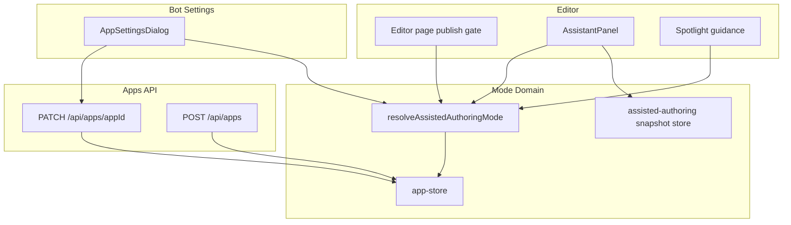
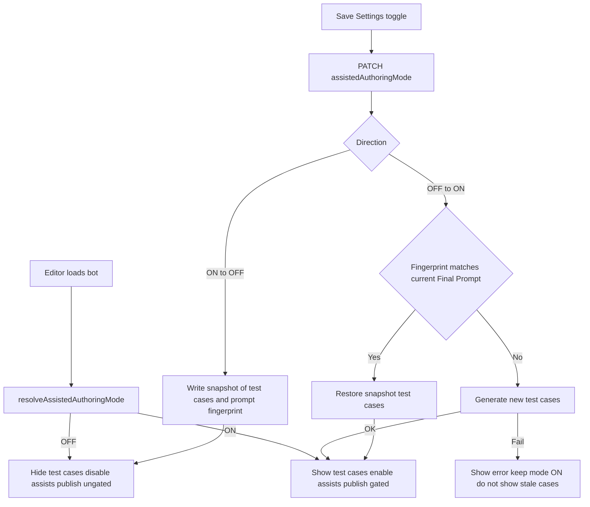
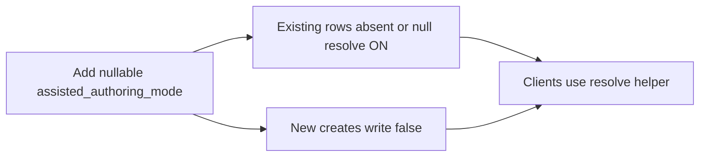

# Design Document: assisted-authoring-mode

## Overview

This feature adds a per-bot **Assisted Authoring Mode** so educator-builders can turn assisted authoring behaviors on or off. ON preserves today’s workflow: automatic test case generation, prompt revision from AI response edits, and publish blocked until all test cases pass. OFF supports AI training: educators write the Final Prompt manually, test cases stay hidden/preserved, response edits do not rewrite the prompt, and publish is not gated on test cases.

**Users**: Teachers and educator-builders editing bots in the editor and bot Settings.

**Impact**: Extends `AppConfig` with a mode flag (new bots default OFF; legacy bots resolve ON), adds a Settings control, and gates existing editor/publish/test-case behaviors—without redesigning prompt authoring or student chat.

### Goals

- Persist Assisted Authoring Mode per bot; Settings toggle; Create page unchanged (1.1–1.6).
- ON keeps current assisted generation, bubble-edit prompt revision, and all-pass publish gate (2.1–2.4).
- OFF disables those assists, hides preserved test cases, and allows ungated publish while Final Prompt editing remains (3.1–3.5).
- ON→OFF preserves/hides test cases; OFF→ON restores or regenerates based on Final Prompt fingerprint (4.1–4.5).
- OFF sessions do not require assisted-only onboarding steps (5.1–5.2).

### Non-Goals

- Create a new App page toggle.
- Server-side test-case domain / cross-device test-case sync.
- Redesigning InstructionDoc prompt-builder helpers unrelated to the three assisted behaviors.
- Student-facing chat, Community, Workspace permissions, or model Settings fields (name/model/variability/API key).

## Boundary Commitments

### This Spec Owns

- `AppConfig.assistedAuthoringMode` persistence, create defaults (`false`), and legacy read resolution (`?? true`).
- Bot Settings UI control and PATCH contract for the mode field.
- Editor/runtime gating of: test case auto-generation, bubble-edit → prompt revision, test case panel visibility, and publish all-pass gate.
- Client-scoped snapshot of test cases + Final Prompt fingerprint used for hide/preserve/restore/regenerate.
- Spotlight / guidance adjustments so OFF does not mandate assisted-only steps.

### Out of Boundary

- Create-app wizard UI for this toggle.
- Moving test cases to Postgres / shared server storage.
- Changing `/api/prompt-builder/chat-feedback` algorithms or student published chat.
- Workspace building permissions and Community sharing semantics.
- Broad InstructionDoc / template authoring redesign.

### Allowed Dependencies

- `lib/app-store` dual store (Postgres + JSON) and `/api/apps` create/patch/get.
- Existing editor surfaces: `AppSettingsDialog`, `AssistantPanel`, `InstructionDoc`, editor page publish handler, spotlight tour modules.
- `lib/prompt-storage/client.ts` Final Prompt resolution patterns for fingerprinting.
- Existing test-case generation APIs (`/api/test-cases/generate-dialogue`, related chat generation) as ON-mode backends—gated, not rewritten.

### Revalidation Triggers

- Test cases become server-persisted or leave `AssistantPanel` ownership.
- Final Prompt storage moves off the current client/server resolution order.
- Publish gains a server-side all-pass enforcement.
- Create-app flow is redesigned to collect assisted-mode preferences.

## Architecture

### Existing Architecture Analysis

- Bot settings and metadata live on `AppConfig` via `lib/app-store` + `/api/apps/[appId]`.
- Test cases and bubble-edit → prompt revision are editor client behaviors centered on `AssistantPanel`.
- Publish all-pass gate is client-side in `app/app/[appId]/editor/page.tsx` before `publish: true`.
- Final Prompt is resolved from editor text / scoped localStorage / `systemPrompt`.

### Architecture Pattern & Boundary Map

**Selected pattern**: Thin **mode domain helper** + **settings persistence** + **editor gating**. One resolved boolean drives UI and gates; preservation uses a small client snapshot module (same class of storage as prompt localStorage). No new evaluation service.



**Dependency direction** (imports only downward):

`assisted-authoring types/resolve/snapshot` → `app-store` / `prompt-storage` → route handlers → editor UI

Editor UI may call snapshot + resolve helpers; app-store must not import editor components.

**Steering compliance**: Store façade hides Postgres vs JSON; secrets stay server-side; Client Components own interactive gating; no new npm dependencies.

### Technology Stack

| Layer | Choice | Role in Feature | Notes |
|-------|--------|-----------------|-------|
| Frontend | Next.js 16 App Router, React 19, Tailwind 4 | Settings toggle, editor gating, spotlight | No new UI kit |
| Backend | Existing `/api/apps` handlers | Persist mode on create/patch/get | No new routes required |
| Data | Vercel Postgres or `.data/apps.json` via app-store | `assisted_authoring_mode` column / field | `ADD COLUMN IF NOT EXISTS` |
| Client storage | Scoped `localStorage` | Test-case snapshot + prompt fingerprint | Same device class as Final Prompt |
| New deps | None | — | Build on existing patterns |

## File Structure Plan

### Directory Structure

```
lib/assisted-authoring/
  types.ts              # Mode + snapshot types
  resolve.ts            # resolveAssistedAuthoringMode
  snapshot.ts           # Client snapshot read/write/clear + fingerprint compare
  resolve.selftest.ts   # Optional lightweight resolver/fingerprint checks if repo pattern fits

lib/app-store/
  types.ts              # Add assistedAuthoringMode?: boolean
  store.ts              # Column, rowToApp, create/update mapping
  fork.ts               # Copy field when forking

lib/prompt-storage/
  client.ts             # Reuse for current Final Prompt text when fingerprinting

app/api/apps/
  route.ts              # New creates set assistedAuthoringMode: false
  [appId]/route.ts      # GET expose + PATCH accept boolean

components/editor/
  AppSettingsDialog.tsx # Toggle UI + load/save
  AssistantPanel.tsx    # Gate generate / prompt-update / visibility
  editorSpotlightTourSteps.tsx  # OFF-safe guidance
  EditorChrome.tsx      # Pass mode / layout if rail visibility changes

app/app/[appId]/editor/
  page.tsx              # Load mode; publish gate; wire panel props
```

### Modified Files

| Path | Change |
|------|--------|
| `lib/app-store/types.ts` | Add `assistedAuthoringMode?: boolean` |
| `lib/app-store/store.ts` | Persist column/field; map defaults; create/update |
| `lib/app-store/fork.ts` | Copy mode when present |
| `app/api/apps/route.ts` | Set `assistedAuthoringMode: false` on create |
| `app/api/apps/[appId]/route.ts` | GET + PATCH boolean |
| `components/editor/AppSettingsDialog.tsx` | Toggle control |
| `components/editor/AssistantPanel.tsx` | Mode-aware generate, revision, hide/show, snapshot hooks |
| `app/app/[appId]/editor/page.tsx` | Mode load, publish gate, panel wiring |
| `components/editor/editorSpotlightTourSteps.tsx` | Skip/soften assisted-only mandatory steps when OFF |
| `components/editor/EditorChrome.tsx` / layout host | Hide test-case rail while OFF if owned here |

### New Files

| Path | Responsibility |
|------|----------------|
| `lib/assisted-authoring/types.ts` | Shared types for mode + snapshot payload |
| `lib/assisted-authoring/resolve.ts` | Legacy-ON / explicit OFF|ON resolution |
| `lib/assisted-authoring/snapshot.ts` | Client snapshot for preserved test cases + fingerprint |

## System Flows

### Mode toggle and editor gating



**Key decisions**: Mode persists on the server immediately on Settings save. Snapshot write happens on ON→OFF (and fingerprint association must match Requirement 4.5). Failed regenerate after OFF→ON does not roll mode back to OFF; it must not present stale preserved cases as current.

## Requirements Traceability

| Requirement | Summary | Components | Interfaces | Flows |
|-------------|---------|------------|------------|-------|
| 1.1 | Settings shows ON/OFF | AppSettingsDialog | Settings PATCH | — |
| 1.2 | Persist and reapply mode | app-store, resolve, editor page | AppConfig field, GET/PATCH | Mode toggle |
| 1.3 | New bots default OFF | POST /api/apps, createApp | create payload | — |
| 1.4 | Legacy missing → ON | resolveAssistedAuthoringMode | `?? true` | — |
| 1.5 | No Create-page control | Create UI unchanged | — | — |
| 1.6 | Save failure visible | AppSettingsDialog | PATCH errors | — |
| 2.1 | ON auto-generates test cases | AssistantPanel | existing generate APIs | — |
| 2.2 | ON prompt revision from edits | AssistantPanel | chat-feedback pipeline | — |
| 2.3 | ON publish blocked if not all pass | editor page | testCaseStatus | — |
| 2.4 | ON publish when all pass | editor page | publish PATCH | — |
| 3.1 | OFF no auto-generate | AssistantPanel | mode gate | — |
| 3.2 | OFF no revision from edits | AssistantPanel | mode gate | — |
| 3.3 | OFF hide preserved cases | AssistantPanel, snapshot | snapshot store | Mode toggle |
| 3.4 | OFF publish ungated by cases | editor page | mode gate | — |
| 3.5 | OFF still edit Final Prompt / settings | InstructionDoc, Settings | — | — |
| 4.1 | ON→OFF preserve + hide | snapshot, AssistantPanel | snapshot write | Mode toggle |
| 4.2 | OFF→ON restore if prompt same | snapshot, AssistantPanel | fingerprint compare | Mode toggle |
| 4.3 | OFF→ON regenerate if prompt changed | AssistantPanel, generate APIs | — | Mode toggle |
| 4.4 | Regen failure error; no stale show | AssistantPanel | error UI | Mode toggle |
| 4.5 | Fingerprint = Final Prompt association | snapshot + prompt resolve | fingerprint helper | Mode toggle |
| 5.1 | OFF no mandatory assisted steps | editor page, tour | mode gate | — |
| 5.2 | OFF spotlight not mandatory assisted | editorSpotlightTourSteps | mode-aware steps | — |

## Components and Interfaces

| Component | Domain/Layer | Intent | Req Coverage | Key Dependencies | Contracts |
|-----------|--------------|--------|--------------|------------------|-----------|
| resolveAssistedAuthoringMode | Domain | Legacy-safe mode resolution | 1.3, 1.4 | AppConfig | Service |
| AssistedAuthoringSnapshotStore | Domain / Client | Preserve test cases + prompt fingerprint | 3.3, 4.1–4.5 | prompt-storage, localStorage | State |
| AppConfig + apps API | Data / API | Persist mode | 1.2, 1.3, 1.6 | app-store | API, State |
| AppSettingsDialog | UI | Toggle + save errors | 1.1, 1.2, 1.6 | apps PATCH | State |
| EditorPublishGate | UI | Conditional all-pass gate | 2.3, 2.4, 3.4, 5.1 | resolve, testCaseStatus | State |
| AssistantPanelModeGate | UI | Generate / revise / visibility | 2.1, 2.2, 3.1–3.3, 4.1–4.4 | resolve, snapshot, generate APIs | State |
| SpotlightModeAdapt | UI | OFF-safe guidance | 5.1, 5.2 | resolve | State |

### Domain

#### resolveAssistedAuthoringMode

| Field | Detail |
|-------|--------|
| Intent | Single function for ON/OFF from stored app field |
| Requirements | 1.3, 1.4 |

**Responsibilities & Constraints**
- `undefined` / missing → ON
- Explicit `false` → OFF; explicit `true` → ON
- UI and gates must not interpret the raw field differently

**Contracts**: Service [x]

```typescript
type AssistedAuthoringMode = boolean; // true = ON, false = OFF

function resolveAssistedAuthoringMode(
  app: Pick<{ assistedAuthoringMode?: boolean }, "assistedAuthoringMode">
): AssistedAuthoringMode {
  return app.assistedAuthoringMode ?? true;
}
```

- Preconditions: none beyond a pick of the optional field
- Postconditions: always returns a concrete boolean
- Invariants: legacy apps without the field behave as ON

#### AssistedAuthoringSnapshotStore

| Field | Detail |
|-------|--------|
| Intent | Client-scoped preserve/restore of test cases with Final Prompt fingerprint |
| Requirements | 3.3, 4.1–4.5 |

**Responsibilities & Constraints**
- On ON→OFF: persist serializable test-case snapshot + fingerprint of resolved Final Prompt
- On OFF→ON: if current Final Prompt fingerprint equals stored fingerprint, restore snapshot; else signal regenerate
- Must not present restored cases when fingerprints differ
- Storage is per `appId`, browser-local (not a cross-device guarantee)

**Contracts**: State [x]

```typescript
type AssistedAuthoringSnapshot = {
  appId: string;
  promptFingerprint: string;
  testCases: unknown; // serializable TestCaseSet[] as used by AssistantPanel
  savedAt: string; // ISO
};

function fingerprintFinalPrompt(promptText: string): string;
function saveAssistedAuthoringSnapshot(snapshot: AssistedAuthoringSnapshot): void;
function readAssistedAuthoringSnapshot(appId: string): AssistedAuthoringSnapshot | null;
function clearAssistedAuthoringSnapshot(appId: string): void;

type OffToOnPlan =
  | { action: "restore"; snapshot: AssistedAuthoringSnapshot }
  | { action: "regenerate" }
  | { action: "regenerate"; reason: "missing-snapshot" };

function planOffToOnTransition(input: {
  appId: string;
  currentFinalPrompt: string;
}): OffToOnPlan;
```

**Implementation Notes**
- Integration: call from AssistantPanel / editor when Settings save flips mode or when editor loads after a persisted flip
- Validation: trim/normalize prompt text before fingerprint; prefer the same resolution order as the editor Final Prompt
- Risks: oversized localStorage payloads — keep snapshot JSON lean; if write fails, surface error and do not claim preservation succeeded

### Data / API

#### AppConfig mode field and apps API

| Field | Detail |
|-------|--------|
| Intent | Persist Assisted Authoring Mode with create/legacy defaults |
| Requirements | 1.2, 1.3, 1.4, 1.6 |

**Contracts**: API [x] / State [x]

| Method | Endpoint | Request | Response | Errors |
|--------|----------|---------|----------|--------|
| POST | `/api/apps` | existing create body | app includes `assistedAuthoringMode: false` | existing |
| GET | `/api/apps/[appId]` | — | includes `assistedAuthoringMode` (resolved or raw + client resolves) | 401/404 |
| PATCH | `/api/apps/[appId]` | `{ assistedAuthoringMode?: boolean, ... }` | updated app | 400 if non-boolean when present; 401/404; 5xx |

**Physical mapping**
- Postgres: `assisted_authoring_mode BOOLEAN` via `ADD COLUMN IF NOT EXISTS`
- JSON fallback: optional field on app objects
- Read path: expose stored value; clients/helpers apply `?? true`
- Create path: write `false`
- Fork: copy stored value when present; if missing on source, treat as ON when writing the fork copy (explicit `true` or omit + resolve)

### UI

#### AppSettingsDialog (summary)

- Add Assisted Authoring Mode control with clear ON/OFF labeling and short help text describing assisted vs training behavior.
- Load from GET; save with PATCH; on failure show error and keep prior UI state (1.6).
- Do not add this control to Create a new App (1.5).

#### EditorPublishGate (summary)

- While ON: keep existing `testCaseStatus.allPassed` gate and messages (2.3, 2.4).
- While OFF: skip that gate; other publish errors unchanged (3.4, 5.1).

#### AssistantPanelModeGate (summary)

- While ON: existing generate + Update prompt pipeline (2.1, 2.2).
- While OFF: do not auto-generate; do not run/offer prompt revision from bubble edits; do not render preserved cases (3.1–3.3).
- On transitions: snapshot / restore / regenerate per domain helpers (4.x). On regenerate failure: error UI; mode remains ON; no stale cases (4.4).

#### SpotlightModeAdapt (summary)

- While OFF: omit or mark non-mandatory any steps that require test cases or all-pass publish (5.2).

## Data Models

### Domain Model

- **AssistedAuthoringMode**: boolean ON/OFF after resolution.
- **AppConfig.assistedAuthoringMode**: optional stored boolean; missing means legacy ON.
- **AssistedAuthoringSnapshot**: client aggregate of fingerprint + test cases for an `appId`.

### Invariants

- New apps are stored OFF.
- Missing stored value resolves ON.
- Snapshot test cases are never shown while mode is OFF.
- Restore only when fingerprints match; otherwise regenerate path.

### Logical Data Model

| Field | Type | Notes |
|-------|------|-------|
| apps.assisted_authoring_mode | BOOLEAN NULL/optional | NULL/absent → resolve ON |
| localStorage snapshot key | per appId | opaque JSON; not part of AppConfig |

## Error Handling

### Error Strategy

- Settings PATCH failure: show dialog error; do not flip local mode optimistically without confirmation of success (or roll back on failure).
- Snapshot write failure on ON→OFF: show error; do not claim test cases are preserved.
- Regenerate failure on OFF→ON: show error; leave saved mode ON; show empty/error test-case state rather than mismatched preserved cases (4.4).

### Error Categories

| Category | Example | User-visible response |
|----------|---------|------------------------|
| User / validation | Non-boolean PATCH | 400; settings error |
| System | PATCH 5xx / localStorage quota | Error message; prior mode/UI retained where possible |
| Business | Regen required but generation fails | Error; mode ON; no stale cases |

## Testing Strategy

Repository has no formal test runner today; prefer focused selftests / manual E2E checklist aligned with steering.

### Unit / selftest

- `resolveAssistedAuthoringMode`: `undefined`→ON, `true`→ON, `false`→OFF
- `fingerprintFinalPrompt` / `planOffToOnTransition`: match → restore; mismatch → regenerate; missing snapshot → regenerate
- Create payload default OFF vs legacy read ON

### Integration (manual or scripted API)

- PATCH mode true/false persists across GET
- POST create returns/stores OFF
- Legacy app without field resolves ON in editor

### E2E / UI checklist

1. New bot: Settings shows OFF; no auto test cases; publish without all-pass succeeds (other rules permitting).
2. Legacy/ON bot: assisted generate + publish gate still work.
3. ON→OFF: test cases disappear; snapshot retained; publish ungated by cases.
4. OFF→ON without Final Prompt edit: same test cases return.
5. OFF→ON after Final Prompt edit: new generation; old cases not shown as current.
6. Regen failure path shows error and does not show stale cases.
7. Create page has no mode control.
8. OFF spotlight does not force assisted-only steps.

## Migration Strategy



- No mass backfill required.
- Rollback: ignore field and treat all as ON (previous product behavior) if feature flagged off—optional; default rollout is always-on field with resolver.

## Security Considerations

- Mode is an owner/editor bot setting; reuse existing apps GET/PATCH authz (no public exposure of new secrets).
- Snapshot stays in browser localStorage; do not put API keys into snapshots.
- Publish authorization remains existing owner-scoped PATCH; OFF only removes the client test-case gate, not authz.
