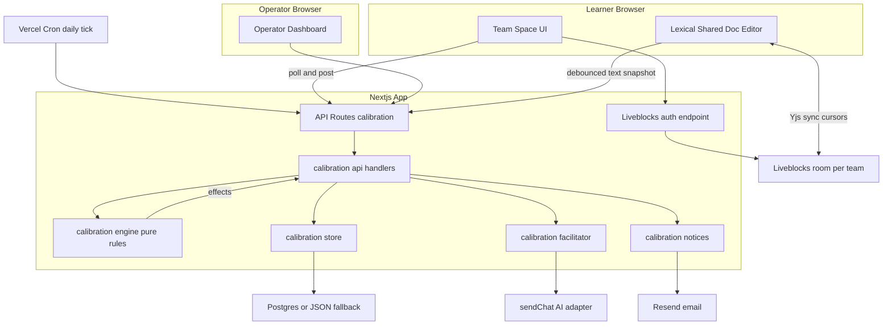
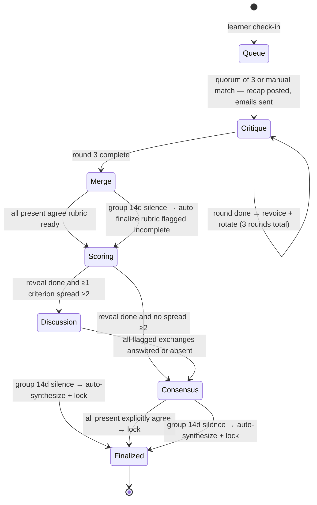
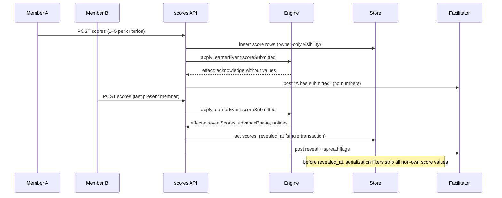

# Technical Design: async-rubric-calibration

## Overview

**Purpose**: This feature delivers a fully asynchronous Rubric Calibration Space — a persistent team room where three course-wide-matched learners critique a sample rubric in rotating rounds, merge critiques into a shared rubric with live co-editing cursors, blind-score a shared artifact with a gated reveal, discuss ≥2-point disagreements, and lock a final team rubric — without anyone needing to be online at the same time.

**Users**: Learners work in the activity space (queue → team room). Course operators configure offerings, unblock stuck queues via manual matching, and monitor every team with full read access. Educators keep preparing the sample bot in the existing Solo editor; this feature never grants learners edit rights on any bot.

**Impact**: Adds a new vertical feature domain (`calibration`) beside the existing authoring/publishing surfaces. Introduces the repository's first scheduled job (`vercel.json` cron), first email dependency (Resend), and first realtime dependency (Liveblocks + Yjs), each isolated behind a dedicated module. No existing editor, Workspace, publish, or chat-runtime code paths change behavior.

### Goals
- Run the seven-step async flow (queue → kickoff → 3 critique rounds → merge → blind scoring → discussion → consensus/lock) driven exclusively by deterministic rules.
- Enforce dual independent timeout clocks (per-person, group) with absence marking, nudges, and auto-finalization.
- Provide Google-Docs-style cursors and co-editing on exactly two documents per team (shared rubric, shared notes).
- Keep held scores unleakable until gated reveal, with operator viewing as the sole exception.
- Notify offline learners by account email for every turn-relevant event, deduplicated against retries.

### Non-Goals
- Any synchronous / live-session mode (explicitly excluded by 3.4, 16.4).
- Embedding or operating Bazaar as an external live room (16.3); Bazaar informs behavior only.
- A completion path for learners who never reach quorum even after manual matching (2.7).
- Realtime co-editing of anything other than the two team documents (7.5); the bot editor and system prompt remain out of collaborative scope (16.1).
- Sending mail for existing Workspace educator invites (13.4 keeps that behavior unchanged).

## Boundary Commitments

### This Spec Owns
- The `calibration` domain end to end: offerings, queue check-ins, teams, phases, clocks, absences, group chat, doc snapshots, scores, reveal, agreements, addenda, notices log.
- The phase-progression contract: only the deterministic engine advances phases (11.5); facilitator LLM output is presentation-only.
- The learner activity UI under `app/activity/**` and the API surface under `app/api/calibration/**`.
- Access rules for team spaces: member read/write, operator read-only, everyone else denied (15.1).
- The repository's cron entry (`vercel.json`), the email-notice module, and the Liveblocks auth endpoint.

### Out of Boundary
- The Solo bot editor, Publish flow, published student chat runtime, Workspaces, My bots, project share, Community (16.1–16.2). Try-chat links to the existing published chat; this spec does not modify it.
- Workspace email-invite semantics (13.4) and Workspace membership (15.5).
- Institution coach-check-in cohorts (1.4).
- Auth.js sign-in/account management (consumed as-is).
- The `sendChat` AI adapter internals (consumed as-is).

### Allowed Dependencies
- `auth()` from `auth.ts` for session identity (P0).
- `sendChat` from `lib/ai/providers.ts` for facilitator wording (P1 — failures degrade to scripted templates, never block progression).
- The store façade conventions from `lib/app-store`/`lib/workspace-store` (pattern reuse, no imports of their tables).
- External services: Liveblocks (doc sync/cursors, P1 — degradable), Resend (email, P1 — console fallback), Vercel Cron (P1 — opportunistic evaluation is the complement).
- Existing published-chat route `/chat/[slug]` for try-chat (P2, link-only).

### Revalidation Triggers
- Changing the phase set, phase-advancement rules, or the engine effect union → re-check facilitator templates, notices, operator dashboard, and all engine selftests.
- Changing score storage shape or reveal transaction → re-check API serialization filters and privacy selftests (8.2, 15.3).
- Replacing Liveblocks or the snapshot-authority rule → re-check lock semantics (10.4) and operator document view (14.5).
- Changing notice dedupe keys → re-check tick idempotency.
- Moving Vercel plan (Hobby ↔ Pro) → re-check cron schedule in `vercel.json`.

## Architecture

### Existing Architecture Analysis
The codebase (Next.js 16 App Router, React 19, Auth.js v5, Vercel Postgres with JSON-file fallback) has an established vertical-slice pattern: `lib/<domain>-store` (Postgres + `.data/` JSON fallback), `lib/<domain>-api` (handlers returning `{ status, body }`), thin route files calling `auth()` then the handler, and `*.selftest.ts` files run via `npx tsx`. This feature replicates that pattern as a new slice and adds three platform capabilities (cron, email, realtime) absent today. Constraints respected: learners never enter the Solo editor; teams are not Workspace membership; the published-chat path stays untouched.

### Architecture Pattern & Boundary Map

Selected pattern: **vertical feature slice with a pure decision engine**. All state mutations flow through one path: API handler → engine (pure functions producing effects) → store + effect executors (facilitator posts, notices). The engine is the single authority for phase advancement.



**Architecture Integration**:
- Existing patterns preserved: store façade with env-switched backend, `{ status, body }` handlers, selftest convention, invite-link-style landing page.
- New components rationale: `engine` isolates every rule from 2/4/6–10 into selftest-able pure functions; `facilitator` isolates LLM usage so it can never gate progression (11.5); `notices` isolates the first email dependency with a dev fallback.
- Dependency direction (imports only flow left→right violations are review errors):
  `types → store → engine → facilitator / notices → api → routes / UI components`

### Technology Stack

| Layer | Choice / Version | Role in Feature | Notes |
|-------|------------------|-----------------|-------|
| Frontend | Next.js 16 App Router, React 19, Lexical ^0.35 | Activity pages, group chat (polling), shared-doc editor | Lexical `CollaborationPlugin` for co-editing |
| Realtime | Liveblocks (`@liveblocks/client`, `@liveblocks/react`, `@liveblocks/yjs`, `@liveblocks/node`) + `yjs` + `@lexical/yjs` | Cursor presence, selection, CRDT sync for 2 docs/team | New deps; one room per team `calibration:{teamId}`; session-bridged access tokens |
| Backend | Next.js route handlers + `lib/calibration-*` modules | Queue, phases, scores, reveal, operator API, tick | Follows existing handler pattern |
| Data | Vercel Postgres (`sql` tagged templates) + `.data/calibration.json` fallback | All calibration entities + doc text snapshots | New `calibration_*` tables |
| Email | Resend (`resend` SDK) | Turn/nudge/reveal/finalize/queue notices | Console/`.data` fallback without `RESEND_API_KEY` |
| Scheduling | Vercel Cron (`vercel.json`, new file) | Daily tick → `/api/calibration/tick` | Hobby: daily max; switch to hourly on Pro. `CRON_SECRET` auth |
| AI | Existing `sendChat` (`lib/ai/providers.ts`) | Facilitator revoicing, doc comments, final synthesis | Provider/model configured per offering by operator |

Environment variables (names documented, never values): `LIVEBLOCKS_SECRET_KEY`, `RESEND_API_KEY`, `CALIBRATION_EMAIL_FROM`, `CRON_SECRET`.

## File Structure Plan

### Directory Structure
```
lib/
├── calibration-store/
│   ├── types.ts               # All domain types, phase/effect unions, constants (deadlines, ping cadence)
│   ├── store.ts               # Postgres + JSON-fallback persistence for all calibration_* entities
│   └── store.selftest.ts      # CRUD, ACL filtering, reveal transaction, dedupe-key uniqueness
├── calibration-engine/
│   ├── engine.ts              # Pure rules: evaluate(state, now), applyLearnerEvent(...); rotation, clocks, spread, reveal, lock
│   └── engine.selftest.ts     # Every timeout/rotation/reveal/auto-finalize rule as a case
├── calibration-facilitator/
│   ├── templates.ts           # Scripted announcement/prompt catalog (kickoff, turn, nudge, reveal, finalize, targeted ask)
│   └── facilitator.ts         # sendChat wording: revoice, follow-up, doc-aware comment, final synthesis; template fallback
├── calibration-notices/
│   └── notices.ts             # Resend send + console/.data fallback + dedupe via store notices log
└── calibration-api/
    ├── offerings.ts           # Create offering, gate info, artifact payloads
    ├── queue.ts               # Check-in, queue status, ping/expiry evaluation entry
    ├── space.ts               # Space state GET (opportunistic evaluate), chat post, doc snapshot, agreements, addenda
    ├── scores.ts              # Score submission + reveal-safe serialization
    ├── operator.ts            # Dashboard list, team inspect (read-only), manual match
    └── tick.ts                # Cron tick: evaluate all queues + unfinalized teams, execute effects

app/
├── activity/
│   ├── new/page.tsx                          # Operator: create offering form
│   └── [offeringId]/
│       ├── page.tsx                          # Course-gate landing: enter space / queue status
│       ├── team/[teamId]/page.tsx            # Team space (chat, docs, artifacts, scoring, recap)
│       └── operate/page.tsx                  # Operator dashboard + team inspector
└── api/calibration/
    ├── offerings/route.ts                    # POST create, GET list mine
    ├── offerings/[offeringId]/route.ts       # GET gate/queue status for current user
    ├── offerings/[offeringId]/checkin/route.ts  # POST check-in
    ├── offerings/[offeringId]/operate/route.ts  # GET operator dashboard data
    ├── offerings/[offeringId]/operate/match/route.ts  # POST manual match
    ├── teams/[teamId]/route.ts               # GET space state (runs opportunistic evaluation)
    ├── teams/[teamId]/messages/route.ts      # POST chat message
    ├── teams/[teamId]/docs/[docKind]/route.ts   # POST debounced text snapshot
    ├── teams/[teamId]/scores/route.ts        # POST private score sheet
    ├── teams/[teamId]/agreements/route.ts    # POST merge-complete / final-consensus agreement
    ├── teams/[teamId]/addenda/route.ts       # POST post-lock personal addendum
    ├── liveblocks-auth/route.ts              # POST Liveblocks access token from Auth.js session
    └── tick/route.ts                         # POST cron tick (CRON_SECRET)

components/calibration/
├── SpaceLayout.tsx            # Team space shell: phase banner, recap, panels
├── GroupChatPanel.tsx         # Polling chat: learner + facilitator messages
├── SharedDocEditor.tsx        # Lexical + CollaborationPlugin + LiveblocksYjsProvider + snapshot push
├── ArtifactsPanel.tsx         # Read-only system prompt / brief / transcript + try-chat link
├── ScoreSheet.tsx             # Private 1–5 per-criterion entry; revealed-scores matrix after reveal
├── QueueStatus.tsx            # Pre-quorum status (n of 3)
├── OperatorDashboard.tsx      # Stuck queue list + team progress table + manual match
└── OperatorTeamView.tsx       # Read-only full team inspection
```

### Modified Files
- `vercel.json` — **new file**: cron entry `{"path": "/api/calibration/tick", "schedule": "0 6 * * *"}` (hourly on Pro).
- `package.json` — add `@liveblocks/client`, `@liveblocks/react`, `@liveblocks/yjs`, `@liveblocks/node`, `yjs`, `@lexical/yjs`, `resend`.

No existing source file changes behavior; the feature is additive.

## System Flows

### Phase lifecycle (engine-owned)



Key flow decisions:
- Team formation immediately posts the recap and opens critique round 1 (no separate kickoff phase); a silent member is handled by the round's 48h per-person clock (5.3).
- Per-person clocks per phase: critique 48h (6.6), merge contribution nudge 3d (7.6), scoring 7d (8.5), discussion targeted-prompt 7d (9.5). Group clock 14d applies in merge, discussion, consensus (7.7, 9.6, 10.3). Queue: ping every 6d, expire after 2 missed pings, operator-listed at 10d (2.3–2.5).
- Any learner message or doc snapshot resets the group clock and only that learner's applicable per-person clock (4.3).

### Gated reveal (novel primitive)



Reveal fires when every present (non-absent) member has submitted (8.4), or when a 7-day per-person clock marks a non-submitter absent and ≥1 submission exists (8.5–8.6). Spread per criterion = max − min of revealed scores; ties to discussion flags (9.1–9.2).

### Tick execution
Daily cron POST (and every space/queue GET) runs: load unexpired queue check-ins + unfinalized teams → `evaluate(state, now)` per record → execute returned effects (mark absent, nudge, auto-finalize, post facilitator message, send deduped notice) → persist. All effects idempotent; re-running the same tick is a no-op.

## Requirements Traceability

| Requirement | Summary | Components | Interfaces / Flows |
|-------------|---------|------------|--------------------|
| 1.1, 1.2, 1.3, 1.4 | Offering config, course gate, artifacts, course-wide matching | offerings API, store, gate page, ArtifactsPanel | POST/GET offerings; check-in |
| 2.1, 2.2, 2.3, 2.4, 2.5, 2.6, 2.7 | Queue, quorum of 3, pings, expiry, stuck-list, manual match, no solo path | queue API, engine (queue rules), notices, OperatorDashboard | check-in; tick; manual match |
| 3.1, 3.2, 3.3, 3.4 | Persistent space, recap on return, no co-presence requirement, no live mode | store, space API, SpaceLayout | space GET (recap since last seen) |
| 4.1, 4.2, 4.3, 4.4, 4.5, 4.6 | Dual clocks, resets, absence, auto-finalize, rejoin | engine (clock rules), tick | evaluate(state, now); phase lifecycle |
| 5.1, 5.2, 5.3 | Formation emails, recap post, kickoff non-response | notices, facilitator templates, engine | team formation effects |
| 6.1, 6.2, 6.3, 6.4, 6.5, 6.6, 6.7 | 3 rotating rounds, prompts, revoice, absence, late return | engine (rotation), facilitator, GroupChatPanel | messages POST; phase lifecycle |
| 7.1, 7.2, 7.3, 7.4, 7.5, 7.6, 7.7 | Shared rubric + notes, cursors, cursor scope limits, merge nudge/auto-finalize | SharedDocEditor, Liveblocks auth, docs snapshot API, engine | Yjs sync; snapshot POST; tick |
| 8.1, 8.2, 8.3, 8.4, 8.5, 8.6, 8.7 | Blind 1–5 scoring, hold, ack, gated reveal, 7d absence, 2-scorer reveal | scores API, engine (reveal rule), ScoreSheet, store | gated reveal sequence |
| 9.1, 9.2, 9.3, 9.4, 9.5, 9.6, 9.7 | Spread calc, flags, targeted prompts, revoice, timeouts, skip | engine (spread), facilitator, GroupChatPanel | reveal → discussion flow |
| 10.1, 10.2, 10.3, 10.4, 10.5, 10.6 | Consensus, lock, auto-synthesize, reject edits, late return, addendum | engine (agreement/lock), facilitator (synthesis), agreements + addenda API | phase lifecycle; addenda POST |
| 11.1, 11.2, 11.3, 11.4, 11.5 | Facilitator participant, scripted posts, LLM revoice, doc-aware, rules-only advancement | facilitator, templates, engine | effect execution path |
| 12.1, 12.2, 12.3, 12.4 | Read-only prompt/brief/transcript, try-chat via published chat | ArtifactsPanel, offerings API | link to existing /chat/[slug] |
| 13.1, 13.2, 13.3, 13.4 | Email notices for all events, queue pings, deep links, invite-separation | notices, store (notices log) | NoticeService.send |
| 14.1, 14.2, 14.3, 14.4, 14.5, 14.6, 14.7 | Stuck list, manual match + validation, team progress, full read, viewer-only, no early reveal | operator API, OperatorDashboard, OperatorTeamView | operate GET; match POST |
| 15.1, 15.2, 15.3, 15.4, 15.5 | Team-scoped access, roles limited, score privacy, operator not queued, no Workspace membership | api ACL layer, store serialization filters | every route's auth guard |
| 16.1, 16.2, 16.3, 16.4 | Separation from editor/Workspaces/live platforms | boundary (no edits to those surfaces) | — (verified by absence of coupling) |

## Components and Interfaces

| Component | Domain/Layer | Intent | Req Coverage | Key Dependencies | Contracts |
|-----------|--------------|--------|--------------|------------------|-----------|
| calibration-store | Data | Persist all calibration entities, both backends | 1–15 (storage) | Postgres / `.data` (P0) | Service, State |
| calibration-engine | Domain rules | Pure phase/clock/reveal/rotation decisions | 2, 4, 5.3, 6, 7.6–7.7, 8.4–8.6, 9, 10, 11.5 | types only (P0) | Service |
| calibration-facilitator | AI presentation | Scripted + LLM facilitator messages | 5.2, 6.2–6.4, 7.1, 9.3–9.4, 10.1, 10.3, 11 | sendChat (P1), store (P0) | Service |
| calibration-notices | Integration | Email notices with dedupe + fallback | 2.3–2.4, 5.1, 13, 14.2 | Resend (P1), store (P0) | Service |
| calibration-api | Application | HTTP handlers, ACL, serialization filters | 1–3, 6–10, 12–15 | auth (P0), engine/store/facilitator/notices (P0) | API |
| tick route | Scheduling | Idempotent clock evaluation entry | 2.3–2.5, 4, 6.6, 7.6–7.7, 8.5, 9.5–9.6, 10.3 | calibration-api (P0), Vercel Cron (P1) | Batch |
| Liveblocks auth route | Realtime | Session→room token bridge | 7.2–7.4, 14.5–14.6, 15.1 | auth (P0), @liveblocks/node (P1) | API |
| SharedDocEditor | UI | Co-editing with cursors + snapshot push | 7.1–7.5, 10.4 | Liveblocks/Lexical (P1) | State |
| SpaceLayout / GroupChatPanel / ScoreSheet / ArtifactsPanel / QueueStatus | UI | Learner space presentation | 1.3, 3.2, 6, 8.1–8.3, 12 | calibration API (P0) | — |
| OperatorDashboard / OperatorTeamView | UI | Operator monitoring + manual match | 2.5–2.6, 14 | operator API (P0) | — |

### Data Layer

#### calibration-store

| Field | Detail |
|-------|--------|
| Intent | Single persistence façade for all calibration entities on Postgres or JSON fallback |
| Requirements | storage for 1–15 |

**Responsibilities & Constraints**
- Owns all `calibration_*` tables and the `.data/calibration.json` fallback; no other module touches storage.
- Enforces the reveal transaction: setting `scores_revealed_at` and reading cross-member scores happen through dedicated functions; generic reads never return non-own score values while unrevealed.
- Team state record (phase, round, presenter index, deadlines, flags) is stored as one JSONB column so the engine operates on a serializable value.

**Dependencies**
- External: `@vercel/postgres` `sql` — persistence (P0); filesystem `.data/` — dev fallback (P0).

**Contracts**: Service [x] / State [x]

##### Service Interface (representative)
```typescript
interface CalibrationStore {
  createOffering(input: OfferingInput, operatorUserId: string): Promise<Offering>;
  getOffering(offeringId: string): Promise<Offering | null>;
  checkIn(offeringId: string, userId: string): Promise<CheckIn>;
  listQueuedCheckIns(offeringId?: string): Promise<CheckIn[]>;
  formTeam(offeringId: string, memberUserIds: [string, string, string]): Promise<Team>;
  getTeamForMember(teamId: string, userId: string): Promise<TeamView | null>;
  saveTeamState(teamId: string, state: TeamStateRecord): Promise<void>;
  appendMessage(teamId: string, message: NewMessage): Promise<Message>;
  saveDocSnapshot(teamId: string, kind: DocKind, text: string, userId: string): Promise<void>;
  submitScores(teamId: string, userId: string, scores: CriterionScore[]): Promise<void>;
  revealScores(teamId: string, revealedAt: Date): Promise<RevealedScores>;
  recordAgreement(teamId: string, userId: string, subject: AgreementSubject): Promise<void>;
  recordAbsence(teamId: string, userId: string, stepKey: string): Promise<void>;
  recordNotice(notice: NoticeRecord): Promise<boolean>; // false if dedupeKey already exists
  addAddendum(teamId: string, userId: string, body: string): Promise<void>;
}
```
- Preconditions: callers have already passed the API ACL guard.
- Invariants: `submitScores` accepts integers 1–5 only (8.7); `revealScores` is the only reader of cross-member values before `scores_revealed_at`; `saveDocSnapshot` rejects writes on finalized teams (10.4).

### Domain Rules Layer

#### calibration-engine

| Field | Detail |
|-------|--------|
| Intent | Deterministic, side-effect-free rules for every phase, clock, rotation, spread, reveal, and lock decision |
| Requirements | 2.1–2.7, 4.1–4.6, 5.3, 6.1–6.7, 7.6–7.7, 8.4–8.6, 9.1–9.2, 9.5–9.7, 10.2–10.3, 11.5 |

**Responsibilities & Constraints**
- Pure functions over `TeamStateRecord` / queue records; returns a new state plus an ordered list of effects. Never performs I/O, never calls the LLM.
- Sole authority for phase advancement (11.5). Effect executors (in `calibration-api`) may fail on presentation (LLM, email) without affecting the committed state transition.
- Encodes fixed constants from research: critique 48h, merge nudge 3d, scoring 7d, discussion 7d, group 14d, queue ping 6d, queue expiry after 2 missed pings, operator stuck-listing 10d.

**Dependencies**
- Inbound: calibration-api, tick (P0). Outbound: calibration-store types only (P0).

**Contracts**: Service [x]

##### Service Interface
```typescript
type EngineEffect =
  | { kind: "postFacilitator"; message: FacilitatorMessageSpec }   // scripted or llm spec
  | { kind: "sendNotice"; notice: NoticeSpec }                     // includes dedupeKey
  | { kind: "markAbsent"; userId: string; stepKey: string }
  | { kind: "revealScores" }
  | { kind: "lockDeliverable"; auto: boolean; unresolved: string[] }
  | { kind: "expireCheckIn"; checkInId: string }
  | { kind: "listForOperator"; checkInId: string };

interface EngineResult { state: TeamStateRecord; effects: EngineEffect[]; }

interface CalibrationEngine {
  evaluateTeam(state: TeamStateRecord, now: Date): EngineResult;          // clock-driven
  applyLearnerEvent(state: TeamStateRecord, event: LearnerEvent, now: Date): EngineResult; // action-driven
  evaluateQueue(checkIns: CheckIn[], now: Date): QueueEffect[];           // pings, expiry, quorum, stuck-list
  computeSpread(scores: RevealedScores): CriterionSpread[];               // max − min per criterion
}

type LearnerEvent =
  | { kind: "message"; userId: string; body: string }
  | { kind: "docSnapshot"; userId: string; docKind: DocKind }
  | { kind: "scoresSubmitted"; userId: string }
  | { kind: "agreement"; userId: string; subject: AgreementSubject }
  | { kind: "memberReturned"; userId: string };
```
- Postconditions: every effect is idempotently executable; `evaluateTeam(evaluateTeam(s, t).state, t)` produces no new effects.
- Invariants: per-person and group clocks are separate fields, never merged (4.1); learner activity resets the group clock and only the actor's own step clock (4.3); rotation completes only after each member presented once (6.5).

### AI Presentation Layer

#### calibration-facilitator

| Field | Detail |
|-------|--------|
| Intent | Render facilitator chat posts: scripted announcements plus LLM-worded revoicing, follow-ups, doc-aware comments, and auto-synthesis |
| Requirements | 5.2, 6.2–6.4, 7.1, 9.3–9.4, 10.1, 10.3, 11.1–11.4 |

**Responsibilities & Constraints**
- The facilitator is one participant identity per team (author_kind `facilitator`), distinct from learners (11.1).
- Scripted templates (Bazaar ClimateChangeAgent-style) cover: kickoff recap, presenter announcement, critic prompt, rotation notice, submission ack, reveal announcement, targeted disagreement ask, nudges, finalization notices (11.2).
- LLM calls via `sendChat` (Bazaar LlmAgent-style) cover: revoicing critiques (6.4), follow-up questions (9.4), doc-aware comments quoting the latest snapshot and flagging vague criteria / missing rationale (11.4, 7.1), and best-available final synthesis on group-timeout lock (10.3).
- On `sendChat` failure: fall back to the scripted template variant; never retry in a way that blocks effect execution.

**Dependencies**
- Inbound: calibration-api effect executor (P0). Outbound: `sendChat` (P1), store for doc snapshots and offering AI config (P0).

**Contracts**: Service [x]

##### Service Interface
```typescript
interface FacilitatorService {
  renderScripted(kind: ScriptedKind, ctx: TemplateContext): string;
  revoice(critiqueText: string, ctx: TeamContext): Promise<string>;        // falls back to template
  askFollowUp(exchange: DisagreementExchange, ctx: TeamContext): Promise<string>;
  commentOnDocument(snapshot: DocSnapshot, ctx: TeamContext): Promise<string | null>;
  synthesizeFinal(state: TeamStateRecord, rubricSnapshot: string, chatExcerpt: string): Promise<string>;
}
```

#### calibration-notices

| Field | Detail |
|-------|--------|
| Intent | Send deduplicated email notices to account emails with a dev fallback |
| Requirements | 2.3–2.4, 5.1, 13.1–13.4, 14.2 |

**Responsibilities & Constraints**
- Notice kinds: `team_formed`, `your_turn`, `targeted_prompt`, `nudge`, `scores_revealed`, `finalized`, `queue_ping`, `queue_expired`, `manual_match`. Each carries a deep link to the team space or queue status (13.3).
- Dedupe: `store.recordNotice` with a deterministic `dedupeKey` (e.g. `teamId:userId:kind:stepKey`) must return `true` before sending; tick retries therefore never double-send.
- Without `RESEND_API_KEY`: log the rendered notice to console and `.data/calibration-notices.log` (store-fallback philosophy).
- Never includes numeric score values in any notice body (15.3).

**Contracts**: Service [x]

```typescript
interface NoticeService {
  send(spec: NoticeSpec): Promise<{ sent: boolean; deduped: boolean; channel: "email" | "console" }>;
}
```

### Application Layer

#### calibration-api (handlers) and routes

| Field | Detail |
|-------|--------|
| Intent | HTTP surface: ACL guard, engine invocation, effect execution, reveal-safe serialization |
| Requirements | 1.1–1.3, 2.1–2.2, 2.6, 3.2–3.3, 6.2–6.3, 7.3 (snapshot path), 8.1–8.3, 10.5–10.6, 12.4, 14.1–14.7, 15.1–15.4 |

**Responsibilities & Constraints**
- Every handler resolves the caller: team member (read/write), offering operator (read-only + operator actions), otherwise 403 (15.1, 14.6).
- Space GET runs opportunistic `evaluateTeam` before serving and computes the "since you left" recap from the member's last-seen marker (3.2).
- Serialization filter: while `scores_revealed_at` is null, member payloads contain only their own score values plus who-has-submitted booleans (8.2–8.3); operator payloads contain held values (14.5) without side effects (14.7).
- Manual match validates exactly three distinct queued learners of the same offering (14.3) and reuses the same `formTeam` path as automatic quorum (2.6).
- Effect executor: persists state first, then runs facilitator/notice effects; presentation failures are logged, not rolled back.

**Contracts**: API [x]

##### API Contract
| Method | Endpoint | Request | Response | Errors |
|--------|----------|---------|----------|--------|
| POST | /api/calibration/offerings | OfferingInput (title, sample bot id, sample rubric, brief, transcript, AI config) | Offering | 400, 401 |
| GET | /api/calibration/offerings/[offeringId] | — | Gate view: artifacts meta, my queue/team status | 401, 404 |
| POST | /api/calibration/offerings/[offeringId]/checkin | — | CheckIn + queue status (n of 3) | 401, 404, 409 |
| GET | /api/calibration/teams/[teamId] | — | SpaceState (phase, recap, messages, docs meta, my scores, reveal state) | 401, 403, 404 |
| POST | /api/calibration/teams/[teamId]/messages | { body } | Message + updated SpaceState | 400, 401, 403 |
| POST | /api/calibration/teams/[teamId]/docs/[docKind] | { text } | { savedAt } | 401, 403, 409 (locked) |
| POST | /api/calibration/teams/[teamId]/scores | { scores: {criterionKey, value 1–5}[] } | { submitted: true } | 400 (range), 401, 403, 409 (already/locked) |
| POST | /api/calibration/teams/[teamId]/agreements | { subject: "merge_complete" \| "final_consensus" } | updated SpaceState | 401, 403, 409 |
| POST | /api/calibration/teams/[teamId]/addenda | { body } | Addendum | 401, 403, 409 (not locked yet) |
| GET | /api/calibration/offerings/[offeringId]/operate | — | Dashboard: stuck queue, teams w/ phase, members, last activity, auto-finalized flag | 401, 403 |
| POST | /api/calibration/offerings/[offeringId]/operate/match | { userIds: [id, id, id] } | Team | 400 (invalid trio), 401, 403 |
| POST | /api/calibration/liveblocks-auth | { room } | Liveblocks access token (member: write until lock; operator: read) | 401, 403 |
| POST | /api/calibration/tick | header auth (CRON_SECRET) | { evaluatedTeams, evaluatedQueues, effects } | 401 |

### Realtime Layer

#### SharedDocEditor + Liveblocks auth

| Field | Detail |
|-------|--------|
| Intent | Yjs co-editing with cursors on the two team documents; push server-readable snapshots |
| Requirements | 7.1–7.5, 10.4, 14.5 (operator read), 15.1 |

**Responsibilities & Constraints**
- One Liveblocks room per team (`calibration:{teamId}`); two Yjs documents inside it keyed `rubric` and `notes` via Lexical `CollaborationPlugin` `providerFactory` (7.1, 7.4).
- Cursor color/name from the session identity through the auth endpoint (7.2). Cursors exist only in these two editors — no collaborative decoration on the prompt, brief, transcript, score sheet, or chat composer (7.5, all plain read-only/private components).
- Snapshot push: on idle debounce (≈3–5 s) the client POSTs plain text to the docs endpoint; this resets the group clock (4.3) and feeds facilitator/operator/finalize reads. Authority rule: Yjs doc is authoritative while unlocked; the stored snapshot is a server-readable projection; locking persists the final text and the auth endpoint stops issuing write tokens (10.4).
- Degradation: if Liveblocks is unreachable, the editor renders the last snapshot read-only with a banner; chat, scoring, and progression are unaffected.

**Implementation Notes**
- Integration: `LiveblocksYjsProvider` per Liveblocks' official Lexical guide; token endpoint uses `@liveblocks/node` with room-scoped permissions.
- Validation: selftest not possible for the hosted service — covered by E2E manual path; token scoping covered by API selftest.
- Risks: vendor dependency (accepted in research); snapshot lag (lock waits for a final snapshot).

### UI Layer (summary-only)

- `SpaceLayout` — phase banner, recap-since-last-visit, panel arrangement (3.2); polls space GET every ~10 s and on window focus (3.3 — no co-presence needed).
- `GroupChatPanel` — renders learner/facilitator messages with facilitator visually distinct (11.1); composer posts to messages endpoint (plain textarea, no collaborative cursors, 7.5).
- `ScoreSheet` — 1–5 integer inputs per criterion of the team rubric (8.1, 8.7); pre-reveal shows only own values + teammate submission checkmarks (8.2–8.3); post-reveal shows the full matrix with ≥2 spreads highlighted (9.2).
- `ArtifactsPanel` — read-only system prompt, brief, transcript (12.1, 12.2, 12.4); try-chat is a link to the existing published chat (12.3).
- `QueueStatus` — "n of 3 checked in" (2.1).
- `OperatorDashboard` / `OperatorTeamView` — stuck queue with wait duration (14.1), manual-match picker (14.2–14.3), team progress table (14.4), read-only full team inspection incl. held scores and absence marks (14.5) with no write affordances (14.6).
- `app/activity/new` — offering form: title, sample bot select (own bots), sample rubric text, brief, transcript, facilitator AI provider/model (1.1).

## Data Models

### Domain Model
- **Offering** (aggregate root, owned by operator): artifacts + facilitator AI config. Invariant: artifacts immutable once first team forms (teams judge a stable artifact, 12).
- **CheckIn**: one queued/matched/expired record per (offering, learner). Invariant: at most one active check-in per learner per offering.
- **Team** (aggregate root): exactly 3 members; carries `TeamStateRecord` (phase, round, presenter index, per-member step deadlines, group deadline, flagged criteria, absence step keys, agreement sets). All mutations flow through the engine.
- **Score sheet**: per (team, member): integer 1–5 per criterion; visibility gated by team-level `scores_revealed_at`.
- **Final deliverable**: locked rubric text + unresolved-criteria labels + optional per-member addenda (append-only after lock).

### Physical Data Model (Postgres; JSON fallback mirrors shapes)

| Table | Key columns |
|-------|-------------|
| `calibration_offerings` | id PK, operator_user_id, title, sample_app_id, sample_rubric TEXT, deployment_brief TEXT, transcript_excerpt TEXT, ai_provider, ai_model, created_at |
| `calibration_checkins` | id PK, offering_id FK, user_id, status (`queued`/`matched`/`expired`), checked_in_at, last_ping_at, missed_pings INT, team_id NULL; UNIQUE (offering_id, user_id) WHERE active |
| `calibration_teams` | id PK, offering_id FK, phase, state JSONB (TeamStateRecord), formed_at, last_activity_at, scores_revealed_at NULL, finalized_at NULL, auto_finalized BOOL, final_rubric TEXT NULL |
| `calibration_team_members` | team_id FK, user_id, member_index (0–2), last_seen_at; PK (team_id, user_id) |
| `calibration_messages` | id PK, team_id FK, author_kind (`learner`/`facilitator`), author_user_id NULL, kind (`chat`/`announcement`/`revoice`/`prompt`/`doc_comment`), body TEXT, phase, created_at; INDEX (team_id, created_at) |
| `calibration_docs` | team_id FK, doc_kind (`rubric`/`notes`), snapshot_text TEXT, updated_at, updated_by; PK (team_id, doc_kind) |
| `calibration_scores` | id PK, team_id FK, user_id, criterion_key, value INT CHECK 1–5, submitted_at; UNIQUE (team_id, user_id, criterion_key) |
| `calibration_absences` | team_id FK, user_id, step_key, marked_at; PK (team_id, user_id, step_key) |
| `calibration_agreements` | team_id FK, user_id, subject (`merge_complete`/`final_consensus`), agreed_at; PK (team_id, user_id, subject) |
| `calibration_notices` | id PK, offering_id, team_id NULL, user_id, kind, dedupe_key UNIQUE, channel, sent_at |
| `calibration_addenda` | id PK, team_id FK, user_id, body TEXT, created_at |

Consistency: reveal (`scores_revealed_at`) and lock (`finalized_at`, `final_rubric`) are single-row team updates — atomic on Postgres, single-file write on JSON fallback. Group clock = `last_activity_at`; per-person deadlines live inside `state` JSONB and are recomputed only by the engine.

### Data Contracts & Integration
- SpaceState payload (member view) never contains other members' score values pre-reveal; contains `submittedBy: string[]` booleans only.
- Notice emails contain event kind + deep link only; never document text or scores.
- Liveblocks carries only Yjs updates and presence (name, color, cursor); scores and chat never transit Liveblocks.

## Error Handling

### Error Strategy
Deterministic state is committed first; presentation effects (LLM wording, email) execute after and degrade independently. No user-visible operation depends on Liveblocks, Resend, or `sendChat` availability.

### Error Categories and Responses
- **User errors (4xx)**: out-of-range score → 400 field-level message; posting to a locked team doc → 409 with "final rubric is locked" guidance (10.4); non-member space access → 403 (15.1); invalid manual-match trio → 400 leaving queue unchanged (14.3); duplicate check-in → 409 returning current status.
- **System errors (5xx / degraded)**: `sendChat` failure → scripted-template fallback post, error logged; Resend failure → notice logged as unsent (retried by next tick because dedupe records only successful sends); Liveblocks unavailable → read-only snapshot editor banner; store unavailable → standard 500 with retry guidance.
- **Business logic (409/422)**: agreement posted in wrong phase → 409 with current-phase explanation; score resubmission after reveal → 409.

### Monitoring
Tick route returns and logs a structured summary (teams evaluated, effects executed, notices sent/deduped/failed). Facilitator LLM failures log provider + template fallback used. These logs are the primary async-flow observability surface.

## Testing Strategy

### Unit / Selftests (`npx tsx`, repo convention)
- `engine.selftest.ts` — the highest-leverage suite; cases map 1:1 to acceptance criteria: quorum forms team of exactly 3 (2.2); 6d ping and 2-missed-ping expiry (2.3–2.4); 10d stuck-listing (2.5); 48h critique absence continues round with 2 (6.6); rotation completes after each presented once, skipped turn = absent (6.5); learner activity resets group clock but not others' per-person clocks (4.3); merge 3d nudge (7.6) and 14d auto-finalize flagged incomplete (7.7); reveal only when all present submitted (8.4); 7d scoring absence reveals submitters' scores incl. exactly-two case (8.5–8.6); spread = max−min, flag at ≥2, skip discussion when none (9.1–9.2, 9.7); discussion 7d/14d timeouts (9.5–9.6); consensus lock on all-present agreement (10.2) and auto-synthesize lock on 14d (10.3); idempotency (double-evaluate yields no new effects).
- `store.selftest.ts` — score CHECK 1–5 (8.7); pre-reveal member read returns no foreign values (8.2, 15.3); reveal transaction flips visibility atomically; snapshot write rejected after lock (10.4); notice dedupe key uniqueness; JSON-fallback parity.
- `facilitator` — template rendering per ScriptedKind; `sendChat` failure falls back to template without throwing.

### Integration Tests
- Space GET as member A pre-reveal: payload contains A's values, only booleans for B/C (8.2–8.3).
- Operator GET on same team: held values present (14.5), and a subsequent member GET still shows them hidden (14.7).
- Non-member, non-operator GET → 403 (15.1); operator POST to messages/docs/scores → 403 (14.6).
- Manual match with 2 users, duplicate users, or cross-offering users → 400; valid trio forms team identically to quorum path (14.3, 2.6).
- Tick invoked twice with same clock state → second run sends zero notices (dedupe) and marks no new absences.

### E2E / Manual Paths (pilot checklist)
- Three browsers check in → team forms → recap + 3 formation emails (console fallback) → round 1 presenter prompt appears (2.2, 5.1–5.2, 6.2).
- Two browsers open the shared rubric simultaneously → both cursors with names visible; edit propagates without reload (7.2–7.3); notes doc behaves identically (7.4); no cursors on prompt/brief/score sheet/chat composer (7.5).
- Full happy path through lock: merge agree → blind scores (values hidden between browsers) → reveal fires on third submission → spread flags → targeted prompt names a scorer → consensus agree → lock rejects further doc edits, addendum accepted (8–10).
- Operator path: dashboard lists team phase/members/last activity; team view shows chat, docs, held scores read-only (14.4–14.5).

## Security Considerations
- ACL matrix enforced in `calibration-api` on every route: team member (read/write own team), offering operator (read + operator actions, never learner actions — 14.6, 15.4), all others denied (15.1). Learners gain no Workspace membership or bot edit rights (15.5, 16.1).
- Score privacy is server-side only: pre-reveal filtering happens in serialization, so no client ever receives foreign values (8.2, 15.3); facilitator prompts and notices are generated from submission facts, never values.
- Liveblocks tokens are issued per session per room with write permission only for unlocked-team members; operators receive read-only tokens; document content therefore inherits the same ACL (15.1, 14.5).
- `/api/calibration/tick` requires the `CRON_SECRET` bearer header; unauthenticated invocations are rejected.
- Offering artifacts (system prompt text, brief, transcript) are served read-only to team members only (12.1–12.4).

## Performance & Scalability
- Pilot scale is tiny (teams of 3, course-sized queues): chat polling at ~10 s intervals and a daily tick are far below any platform limit.
- Liveblocks free tier covers pilot MAR volume; rooms are created lazily on first document open and become read-only after lock.
- Tick cost is O(unfinalized teams + queued check-ins) with one query each; no fan-out concerns at course scale.

## Supporting References
- `research.md` — Design Discovery section: Liveblocks vs alternatives, Vercel cron limits (Hobby daily / Pro per-minute), Resend selection, Bazaar behavioral mapping, synthesis outcomes, fixed constants decision.
