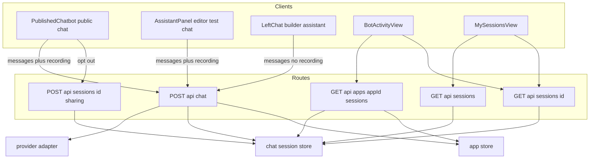
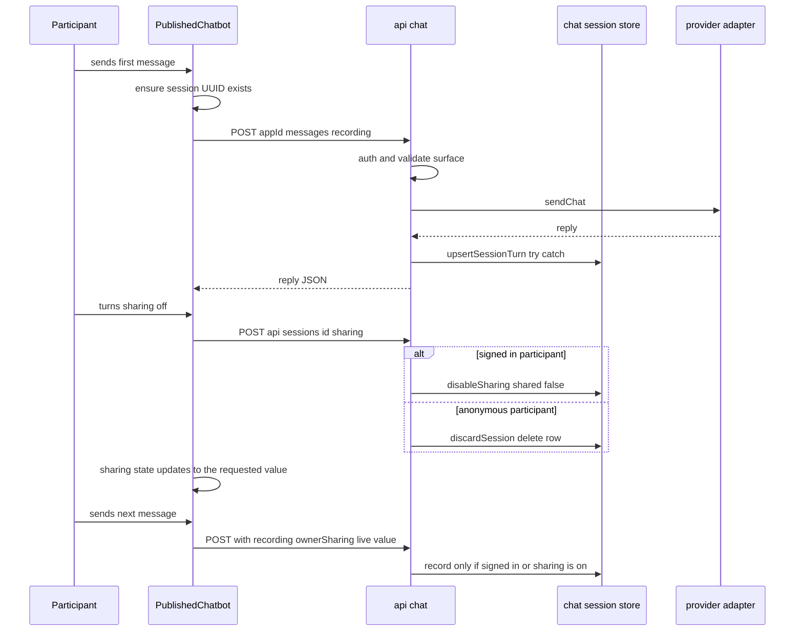

# Technical Design: bot-activity-sessions

## Overview

**Purpose**: This feature delivers conversation visibility to bot creators and chat participants. Creators see how their bots are used (per-bot activity view); every signed-in user can revisit their own conversations (My sessions); participants control whether their conversations are shared with the bot's owner.

**Users**: Bot creators (teachers) review sessions from the editor's activity view and the My bots card. Signed-in users browse their history from a new sidebar item. Anonymous learners on public chat pages get a recording notice and a sharing opt-out.

**Impact**: Introduces the platform's first chat-persistence capability. Conversations currently exist only in client React state; this design adds a `chat-session-store` domain, a recording step inside the existing `/api/chat` route, four read/control API endpoints, two new pages, and small modifications to the sidebar, My bots cards, editor chrome, and both chat clients.

### Goals

- Persist conversations from the public chat page and editor test chats as sessions, without ever blocking chat on persistence failure.
- Give bot owners a paginated, deep-linkable activity view with read-only transcripts.
- Give signed-in users a My sessions history across all bots, resilient to bot deletion.
- Enforce participant privacy: anonymous identity, a visible recording notice, and a participant-controlled owner-sharing toggle.
- Clean up navigation naming ("Collaborative activities") and My bots card actions ("Edit", activity entry, icon-based Delete).

### Non-Goals

- AI conversation analysis against goals/success paths (excluded by requirements).
- User-facing session deletion, retention/expiry policies, transcript export, aggregated analytics.
- Recording builder-assistant (`LeftChat`) conversations — authoring assistance is not a bot conversation.
- Changes to rubric calibration behavior or routes (label change only).
- Streaming chat, message-level sharing granularity, or workspace-level activity surfaces.

## Boundary Commitments

### This Spec Owns

- The `chat_sessions` data model and the `lib/chat-session-store/` façade (only writer/reader of session data).
- The recording contract added to `/api/chat` (the `recording` request field and its validation).
- Session read/control endpoints: owner list, participant list, transcript, sharing opt-out.
- The activity page (`/app/[appId]/activity`), My sessions page (`/sessions`), and their components.
- Sidebar label changes and My bots card action changes.

### Out of Boundary

- The chat inference flow itself (provider adapter, `sendChat`, visualization context) — recording is additive and must not alter reply behavior.
- `LeftChat` and any other `/api/chat` caller that does not opt into recording.
- Publishing/sharing flows (`ShareDialog`, `publishedAt` gating), auth flows, and the rubric calibration feature beyond its sidebar label.
- Workspace bot grids (`WorkspaceBotGrid`) — card cleanup applies to the My bots dashboard card only.

### Allowed Dependencies

- `@/auth` for session identity; `lib/app-store/store` for app resolution and ownership checks (read-only).
- The store façade convention (`shouldUsePostgres()`, `CREATE TABLE IF NOT EXISTS`, `.data/*.json` fallback) shared with existing stores.
- UI composes existing primitives (`ChatMessageBody` for transcript rendering, app-shell sidebar patterns).
- Dependency direction: `lib/chat-session-store` (types → store) → API routes → pages/components. UI never imports Postgres/file details; routes never bypass the store.

### Revalidation Triggers

- Any change to the `/api/chat` request contract (new callers must decide recording behavior explicitly).
- Schema changes to `chat_sessions` (columns, message JSON shape).
- Changes to sharing semantics (e.g., re-enable support, message-level granularity) or to anonymous capability rules.
- Bot deletion behavior changes in `app-store` (snapshot strategy depends on delete-time behavior).

## Architecture

### Existing Architecture Analysis

- All bot conversations flow through `POST /api/chat`, which authenticates, resolves the app, and distinguishes published requests (`!system?.trim()`, anonymous allowed) from editor requests (`system` present, signed-in owner required). Recording attaches at this choke point.
- Persistence follows feature-store façades (`lib/star-store`, `lib/calibration-store`): environment-switched Postgres/JSON-file backends behind exported domain functions, tables created lazily. The new store replicates this pattern.
- Route handlers follow `auth()` → ownership check → JSON with status codes; new endpoints follow the same convention.
- Constraint respected: clients resend the full message history each turn (non-streaming), which the recording contract exploits for idempotency.

### Architecture Pattern & Boundary Map



**Key decisions** (rationale in `research.md`):
- Recording is **server-side and opt-in**: only requests carrying a `recording` field are persisted, making `LeftChat` exclusion structural. Surface claims are validated against the existing published/editor branch.
- Session identity is a **client-generated UUID** reused across turns; for anonymous sessions the unguessable ID doubles as the capability to opt out.
- Transcripts are stored as a **JSONB column replaced per turn** (idempotent; clients already send full history). No separate messages table.
- `app_name`, `owner_id`, `participant_name` are **snapshotted** on the session so transcripts survive bot deletion and render without joins.
- The activity view is a **dedicated route** linked as a tab-like control in editor chrome (deep-linkable for the My bots card).

### Technology Stack

| Layer | Choice / Version | Role in Feature | Notes |
|-------|------------------|-----------------|-------|
| Frontend | Next.js 16 App Router, React 19, Tailwind CSS 4 | New pages, list/transcript components, toggle UI | No new dependencies |
| Backend | Next.js route handlers (Node.js runtime) | Recording step + 4 new endpoints | Follows existing `auth()`/ownership conventions |
| Data | Vercel Postgres (tagged SQL) with `.data/chat-sessions.json` fallback | `chat_sessions` table via store façade | `CREATE TABLE IF NOT EXISTS`; no migration framework |

## File Structure Plan

### Directory Structure (new files)

```
lib/chat-session-store/
├── types.ts                    # ChatSessionRecord, StoredChatMessage, SessionSurface, list/query input types
└── store.ts                    # Postgres/JSON façade: upsertSessionTurn, listSessionsForApp,
                                #   listSessionsForUser, getSessionById, disableSharing, discardSession
lib/chat-session-ui/
└── nav.ts                      # MY_SESSIONS_HREF, isMySessionsPath, activityHrefForApp helpers
app/api/apps/[appId]/sessions/
└── route.ts                    # GET owner-scoped session list (shared only, paginated)
app/api/sessions/
├── route.ts                    # GET participant-scoped session list (paginated)
└── [sessionId]/
    ├── route.ts                # GET single session transcript (owner-or-participant authorization)
    └── sharing/route.ts        # POST turn owner sharing off (flag or discard by participant kind)
app/app/[appId]/activity/
└── page.tsx                    # Server page: auth + ownership gate, renders BotActivityView
app/sessions/
└── page.tsx                    # Server page: auth gate (redirect to sign-in), renders MySessionsView
components/sessions/
├── SessionList.tsx             # Shared paginated session list (surface badge, name, time, empty state)
├── SessionTranscript.tsx       # Shared read-only transcript viewer (renders via ChatMessageBody)
├── BotActivityView.tsx         # Owner view: list + transcript master-detail for one bot
├── MySessionsView.tsx          # Participant view: list + transcript across bots
└── session-client.ts           # Client fetch helpers for the session APIs + shared client types
components/public/
└── ChatPrivacyControls.tsx     # Recording notice + sharing toggle for the public chat page
```

### Modified Files

- `app/api/chat/route.ts` — accept optional `recording` field; validate surface consistency; after a successful reply, upsert the session via the store inside try/catch (never fails the response).
- `components/public/PublishedChatbot.tsx` — generate session UUID per conversation; hold sharing state; attach `recording` to `/api/chat` calls; render `ChatPrivacyControls`; call the sharing endpoint on opt-out; strip image data URLs from recorded payloads.
- `components/editor/AssistantPanel.tsx` — attach `recording: { sessionId, surface: "editor-test" }` at both `/api/chat` call sites; one session UUID per test-case conversation, regenerated on case reset/switch.
- `components/editor/EditorChrome.tsx` — add an "Activity" navigation control linking to `/app/[appId]/activity`.
- `components/app-shell/WorkspaceSidebar.tsx` — rename "Activities" label to "Collaborative activities"; add "My sessions" link (`MY_SESSIONS_HREF`).
- `components/dashboard/AppCard.tsx` — CTA label "Edit"; new "Activity" action; Delete becomes a confirmation-preserving icon button with accessible label; Share unchanged.
- `components/dashboard/AppGrid.tsx` — pass updated labels and per-bot activity hrefs to `AppCard`.

## System Flows

### Recorded public chat turn with opt-out



Flow decisions: recording happens after the model reply so failed inference never creates half-turns; the sharing endpoint accepts `{ shared: boolean }` so the participant can turn sharing off and back on; anonymous turns with `ownerSharing: false` are never persisted.

## Requirements Traceability

| Requirement | Summary | Components | Interfaces |
|-------------|---------|------------|------------|
| 1.1 | Session created on first public-chat message | PublishedChatbot, ChatRecordingStep | `recording` field, `upsertSessionTurn` |
| 1.2 | Editor test session marked | AssistantPanel, ChatRecordingStep | `recording.surface = "editor-test"` |
| 1.3 | Messages persisted with content/role/timestamp in order | ChatRecordingStep, ChatSessionStore | `StoredChatMessage` |
| 1.4 | Session metadata (bot, times, surface, participant) | ChatSessionStore | `ChatSessionRecord` |
| 1.5 | Signed-in sessions linked to account | ChatRecordingStep | `participant_id` from `auth()` |
| 1.6 | Anonymous sessions without PII | ChatRecordingStep | `participant_id = null`, no IP/UA stored |
| 1.7 | One conversation = one session; new conversation = new session | PublishedChatbot, AssistantPanel | client UUID lifecycle |
| 1.8 | Persistence failure never blocks chat | ChatRecordingStep | try/catch + `console.error` only |
| 1.9 | Anonymous + sharing off → never recorded, prior portion discarded | ChatRecordingStep, SharingEndpoint | skip-record rule + `discardSession` |
| 2.1 | Activity view for the edited bot | ActivityPage, EditorChrome | `/app/[appId]/activity` + chrome tab |
| 2.2 | Owner list ordered by recency, excludes unshared | OwnerSessionsAPI, ChatSessionStore | `listSessionsForApp` (`shared = true`) |
| 2.3 | List shows name/Anonymous, start time, surface badge | SessionList | list item contract |
| 2.4 | Read-only transcript on selection | SessionTranscript, TranscriptAPI | `GET /api/sessions/[id]` |
| 2.5 | Card action deep-links to activity view | AppCard, AppGrid | `activityHrefForApp` |
| 2.6 | Empty state | SessionList | `emptyMessage` prop |
| 2.7 | Non-owner access denied | ActivityPage, OwnerSessionsAPI | ownership check → 404/403 |
| 2.8 | Incremental loading | OwnerSessionsAPI, SessionList | `limit`/`offset` + Load more |
| 3.1 | Sidebar "My sessions" for signed-in users | WorkspaceSidebar | `MY_SESSIONS_HREF` |
| 3.2 | Own sessions across bots by recency | MySessionsAPI, ChatSessionStore | `listSessionsForUser` |
| 3.3 | Bot name, start time, surface badge | SessionList | snapshotted `app_name` |
| 3.4 | Read-only transcript | SessionTranscript, TranscriptAPI | shared with 2.4 |
| 3.5 | Includes own bots, others' bots, editor tests | ChatSessionStore | participant-dimension query |
| 3.6 | Deleted-bot sessions remain viewable, labeled | ChatSessionStore, SessionList | `app_name` snapshot + existence flag |
| 3.7 | Anonymous sessions never in My sessions | ChatSessionStore | `participant_id IS NOT NULL` filter |
| 3.8 | Signed-out visitors required to sign in | MySessionsPage | server-side auth gate |
| 4.1 | Persistent recording notice | ChatPrivacyControls | notice copy |
| 4.2 | "Anonymous" label everywhere | SessionList, SessionTranscript | null participant rendering |
| 4.3 | Transcript visible to owner or participant only | TranscriptAPI | authorization rule |
| 4.4 | Read-only, no edit/delete UI | SessionTranscript, views | no mutation affordances |
| 4.5 | Toggle near notice, default on | ChatPrivacyControls | toggle contract |
| 4.6 | Toggle sharing off and back on; whole session excluded while off | SharingEndpoint, ChatSessionStore | `{ shared }` body |
| 4.7 | Unshared signed-in sessions stay in My sessions, labeled | SessionList | `shared` flag rendering |
| 4.8 | Sharing state visible on chat page | ChatPrivacyControls | state display |
| 5.1 | "Collaborative activities" label | WorkspaceSidebar | label change |
| 5.2 | Calibration behavior unchanged | — | no route/component changes |
| 5.3 | Distinct nav labels | WorkspaceSidebar | label set |
| 6.1 | CTA labeled "Edit" | AppGrid, AppCard | `ctaLabel` |
| 6.2 | Activity action on card | AppCard | activity link |
| 6.3 | Share/Delete retained, Delete confirmed | AppCard, DeleteBotDialog | existing dialog reused |
| 6.4 | Delete as visually distinct icon control | AppCard | destructive styling |
| 6.5 | Accessible labels for icon actions | AppCard | `aria-label` + tooltip |

## Components and Interfaces

| Component | Domain/Layer | Intent | Req Coverage | Key Dependencies | Contracts |
|-----------|--------------|--------|--------------|------------------|-----------|
| ChatSessionStore | lib (data) | Sole owner of session persistence | 1.3-1.4, 2.2, 3.2, 3.5-3.7, 4.6 | Postgres / JSON file (P0) | Service, State |
| ChatRecordingStep | API (in `/api/chat`) | Validate + persist recorded turns | 1.1-1.9 | ChatSessionStore (P0), app-store (P0) | API |
| OwnerSessionsAPI | API | Owner-scoped session list | 2.2, 2.7, 2.8 | ChatSessionStore (P0), app-store (P0) | API |
| MySessionsAPI | API | Participant-scoped session list | 3.2, 3.5-3.7 | ChatSessionStore (P0) | API |
| TranscriptAPI | API | Single-session transcript with authorization | 2.4, 3.4, 4.3 | ChatSessionStore (P0) | API |
| SharingEndpoint | API | Turn owner sharing off | 1.9, 4.6 | ChatSessionStore (P0) | API |
| ChatPrivacyControls | UI (public) | Notice + sharing toggle | 4.1, 4.5, 4.8 | PublishedChatbot (P0) | State |
| SessionList / SessionTranscript | UI (shared) | List + read-only transcript rendering | 2.3, 2.6, 3.3, 4.2, 4.4, 4.7 | session-client (P0), ChatMessageBody (P1) | — |
| BotActivityView / MySessionsView | UI (views) | Master-detail composition per audience | 2.1-2.4, 3.2-3.4 | SessionList, SessionTranscript (P0) | — |
| ActivityPage / MySessionsPage | routes | Auth/ownership gates + composition | 2.1, 2.7, 3.8 | `auth()`, app-store (P0) | — |
| WorkspaceSidebar / AppCard / AppGrid / EditorChrome (mods) | UI (chrome) | Naming, entry points, icon actions | 2.1, 2.5, 3.1, 5.1-5.3, 6.1-6.5 | nav constants (P1) | — |

### Data Layer

#### ChatSessionStore

| Field | Detail |
|-------|--------|
| Intent | Single façade owning all reads/writes of `chat_sessions` across Postgres and JSON-file backends |
| Requirements | 1.3, 1.4, 2.2, 3.2, 3.5, 3.6, 3.7, 4.6 |

**Responsibilities & Constraints**
- Owns table creation, upsert-with-identity-validation, dimension queries, sharing mutation, and discard.
- Invariants: `shared` can only transition `true → false`; an upsert must match the existing row's `app_id` and participant identity or be rejected; anonymous rows have `participant_id = null` and no other identity fields.
- Consumers never see storage details (per steering).

**Contracts**: Service [x] / State [x]

##### Service Interface

```typescript
export type SessionSurface = "public" | "editor-test";

export type StoredChatMessage = {
  role: "user" | "assistant";
  content: string;
  at: string;              // ISO timestamp (client-supplied, server-filled if absent)
  imageOmitted?: true;     // set when an image attachment was stripped
};

export type ChatSessionRecord = {
  id: string;              // client-generated UUID
  appId: string;
  appName: string;         // snapshot at recording time
  ownerId: string;         // bot owner snapshot
  participantId: string | null;   // null = anonymous
  participantName: string | null; // snapshot; null = anonymous
  surface: SessionSurface;
  shared: boolean;         // default true
  messages: StoredChatMessage[];
  createdAt: string;
  updatedAt: string;
};

export type SessionSummary = Omit<ChatSessionRecord, "messages"> & {
  messageCount: number;
  appExists: boolean;      // resolved at read time for deleted-bot labeling
};

export type UpsertSessionTurnInput = Omit<
  ChatSessionRecord, "createdAt" | "updatedAt" | "shared"
> & { shared?: boolean };

export type ListPage<T> = { items: T[]; hasMore: boolean };

// store.ts exports
upsertSessionTurn(input: UpsertSessionTurnInput): Promise<void>;   // throws on identity mismatch
listSessionsForApp(appId: string, opts: { limit: number; offset: number }): Promise<ListPage<SessionSummary>>;  // shared = true only
listSessionsForUser(userId: string, opts: { limit: number; offset: number }): Promise<ListPage<SessionSummary>>;
getSessionById(id: string): Promise<ChatSessionRecord | null>;
disableSharing(id: string): Promise<void>;   // signed-in opt-out: shared = false
discardSession(id: string): Promise<void>;   // anonymous opt-out: delete row
```

- Preconditions: callers (routes) have performed authentication/authorization.
- Postconditions: `upsertSessionTurn` replaces `messages` wholesale and bumps `updatedAt`; list functions order by `updatedAt DESC`.
- Invariants: `listSessionsForApp` filters `shared = true` — this is the single enforcement point for owner visibility.

##### State Management
- Persistence: Postgres table `chat_sessions` (below) or `.data/chat-sessions.json`.
- Concurrency: last-write-wins per session (single writer per conversation in practice).

**Implementation Notes**
- Integration: mirror `lib/star-store/store.ts` structure (`shouldUsePostgres`, `ensurePostgresStore`, `...InPostgres`/`...InFile` pairs).
- Validation: identity check on upsert prevents cross-session writes via guessed IDs.
- Risks: JSONB size growth per turn is bounded by conversation length; images are stripped before storage.

### API Layer

#### ChatRecordingStep (modification of `POST /api/chat`)

| Field | Detail |
|-------|--------|
| Intent | Accept an opt-in `recording` payload, validate it against the request's auth branch, persist after a successful reply |
| Requirements | 1.1-1.9 |

**Responsibilities & Constraints**
- Extends the request contract additively; requests without `recording` behave exactly as today (LeftChat unaffected — 5.2-style backward safety).
- Validation rules: `surface: "public"` requires `isPublishedRequest`; `surface: "editor-test"` requires `system` present and the authenticated user to own the app. Mismatches skip recording (never fail the chat).
- Skip rules: no `recording` field; anonymous participant with `ownerSharing === false` (1.9); validation mismatch.
- Persistence runs after `sendChat` succeeds, inside try/catch; errors are logged and swallowed (1.8).
- Participant fields: signed-in → `session.user.id` + display name; anonymous → nulls, no PII (1.6). Image data URLs are replaced with `imageOmitted: true`.

**Contracts**: API [x]

##### API Contract

| Method | Endpoint | Request (additions) | Response | Errors |
|--------|----------|---------------------|----------|--------|
| POST | /api/chat | `recording?: { sessionId: string; surface: SessionSurface; ownerSharing?: boolean; messageTimes?: string[] }` | unchanged `{ reply, provider, model }` | unchanged (recording never adds errors) |

#### Session read/control endpoints

All follow the repo convention: `auth()` → authorization → store call → JSON.

| Method | Endpoint | Authorization | Response | Errors |
|--------|----------|---------------|----------|--------|
| GET | /api/apps/[appId]/sessions?limit&offset | signed-in owner of app (`getAppById(appId, userId)`) | `{ sessions: SessionSummary[]; hasMore: boolean }` (shared only) | 401, 404 |
| GET | /api/sessions?limit&offset | signed-in; `participantId = userId` | `{ sessions: SessionSummary[]; hasMore: boolean }` | 401 |
| GET | /api/sessions/[sessionId] | participant (`participantId === userId`), or bot owner (`ownerId === userId` AND `shared === true`) | `{ session: ChatSessionRecord }` | 401, 403, 404 |
| POST | /api/sessions/[sessionId]/sharing | signed-in participant → `disableSharing` / `enableSharing` from `{ shared }`; anonymous request on an anonymous session → `discardSession` when turning off (UUID knowledge = capability) | `{ ok: true }` | 403 (signed-in session, non-participant caller), 404 |

- The sharing endpoint accepts `{ shared: boolean }` so the participant can turn sharing off and back on (4.6).
- Owner transcript access re-checks `shared` so an unshared session is invisible to the owner even with a known ID (4.3, 4.6).

### UI Layer

UI components are summary-only (no new boundaries beyond fetching the APIs above).

- **ChatPrivacyControls** (`components/public/ChatPrivacyControls.tsx`): renders the persistent notice ("Your conversation may be viewed by this bot's creator") and the sharing toggle (default on; the participant can turn it off and back on). Props: `{ sharing: boolean; onToggle: () => void; busy?: boolean }`. Placed within `PublishedChatbot` near the composer/header (4.1, 4.5, 4.8).
- **SessionList**: presentational paginated list; props include `sessions: SessionSummary[]`, `hasMore`, `onLoadMore`, `onSelect`, `emptyMessage`, `nameMode: "participant" | "bot"` (owner view shows participant names, My sessions shows bot names). Renders surface badges ("Public chat" / "Editor test"), "Anonymous" for null participants, "Not shared with owner" badge when `shared === false` in participant mode, and "Bot no longer available" when `appExists === false` (2.3, 2.6, 3.3, 4.2, 4.7, 3.6).
- **SessionTranscript**: read-only transcript rendered with `ChatMessageBody`; shows `(image attached)` placeholders for `imageOmitted` messages; no mutation affordances (2.4, 3.4, 4.4).
- **BotActivityView / MySessionsView**: client master-detail views composing SessionList + SessionTranscript over their respective APIs via `session-client.ts` helpers.
- **ActivityPage** (`app/app/[appId]/activity/page.tsx`): server page; `auth()` + `getAppById(appId, userId)`; unauthenticated or non-owner → `notFound()` (2.7). Renders app name header + BotActivityView.
- **MySessionsPage** (`app/sessions/page.tsx`): server page; unauthenticated → redirect to sign-in (3.8).
- **Chrome modifications**: `EditorChrome` gains an "Activity" link (2.1); `WorkspaceSidebar` renames "Activities" → "Collaborative activities" and adds "My sessions" (3.1, 5.1, 5.3); `AppCard`/`AppGrid` relabel CTA to "Edit", add an Activity action, and convert Delete to an icon button with `aria-label` and tooltip while reusing `DeleteBotDialog` (6.1-6.5).

## Data Models

### Domain Model

- Aggregate: **ChatSession** (root) containing its transcript. One session = one continuous conversation with one bot on one surface by one participant.
- Invariants: sharing follows the participant's latest toggle (`true ↔ false`); anonymous sessions carry no identity; transcripts are append-observed but stored as whole-replacements; snapshots (`appName`, `ownerId`, `participantName`) are immutable after creation.

### Physical Data Model (Postgres)

```sql
CREATE TABLE IF NOT EXISTS chat_sessions (
  id               TEXT PRIMARY KEY,
  app_id           TEXT NOT NULL,
  app_name         TEXT NOT NULL,
  owner_id         TEXT NOT NULL,
  participant_id   TEXT,
  participant_name TEXT,
  surface          TEXT NOT NULL CHECK (surface IN ('public', 'editor-test')),
  shared           BOOLEAN NOT NULL DEFAULT TRUE,
  messages         JSONB NOT NULL DEFAULT '[]',
  created_at       TIMESTAMPTZ NOT NULL DEFAULT NOW(),
  updated_at       TIMESTAMPTZ NOT NULL DEFAULT NOW()
);
CREATE INDEX IF NOT EXISTS idx_chat_sessions_app ON chat_sessions (app_id, updated_at DESC);
CREATE INDEX IF NOT EXISTS idx_chat_sessions_participant ON chat_sessions (participant_id, updated_at DESC);
```

- No foreign keys to `apps` (sessions intentionally survive bot deletion; `appExists` resolved at read time).
- JSON-file fallback stores the same records in `.data/chat-sessions.json`.

## Error Handling

- **Recording failures** (store/db errors during `/api/chat`): caught, logged with `console.error`, chat response unaffected (1.8). No retry queue — the next turn re-sends the full transcript, self-healing missed turns.
- **User errors**: 401 for unauthenticated list/transcript access; 403 for non-participant sharing calls or non-owner/non-participant transcript access; 404 for unknown sessions/apps and non-owner activity pages (via `notFound()`).
- **Client list/transcript fetch failures**: views show a retry-able inline error state; never crash the page.
- **Sharing endpoint failure on the chat page**: toggle reverts to on and shows a brief error; the client does not falsely display an off state (4.8).

## Testing Strategy

No automated test runner exists in this repository (per steering); verification is manual scenarios plus `npm run build` as the static integration check.

**Manual verification scenarios** (map to acceptance criteria):
1. Anonymous public chat: chat as signed-out user → session appears in owner's activity view as "Anonymous" with "Public chat" badge (1.1, 1.6, 2.2, 2.3, 4.2).
2. Signed-in public chat: session appears in both owner activity and participant My sessions; transcript matches, read-only (1.5, 3.2, 3.4, 4.4).
3. Editor test chat: run a test case → session marked "Editor test" in activity view and creator's My sessions; LeftChat builder conversation produces no session (1.2, 3.5, boundary).
4. Opt-out signed-in: toggle off mid-conversation → session vanishes from owner activity (including earlier messages), remains in My sessions with "Not shared" badge; toggle cannot be re-enabled (4.5-4.7).
5. Opt-out anonymous: toggle off mid-conversation → no session exists anywhere afterward; continued chat still works (1.9, 1.8 path).
6. Persistence failure: with store misconfigured, chat still replies normally (1.8).
7. Access control: non-owner opening `/app/{id}/activity` gets not-found; signed-out `/sessions` redirects to sign-in; transcript API rejects third parties (2.7, 3.8, 4.3).
8. Bot deletion: delete a bot after chatting → session still listed in My sessions with "Bot no longer available" (3.6).
9. Pagination: >20 sessions → Load more works and ordering is by recency (2.8, 2.2).
10. Chrome: sidebar shows "Collaborative activities" + "My sessions"; card shows Edit / Activity / Share / icon Delete with tooltip; delete confirmation still required (5.1-5.3, 6.1-6.5).

## Security Considerations

- **Authorization matrix** is enforced server-side in each endpoint (owner-or-participant transcript rule; owner-only lists; participant-only sharing mutation for signed-in sessions). UI affordances are not the security boundary.
- **Anonymous capability**: the unguessable session UUID is the only handle for anonymous opt-out; it is never listed by any API, only known to the originating client. Accepted risk: someone holding the UUID can discard that anonymous session.
- **PII minimization**: anonymous sessions store no identifier (no IP, UA, or cookie); participant names are display snapshots only (1.6).
- **Upsert identity validation** prevents writing into another session: an existing row's `app_id`/participant must match the recording request, otherwise the turn is dropped.
- **Image stripping** keeps base64 image data out of persistent storage, limiting both privacy exposure and row size.
