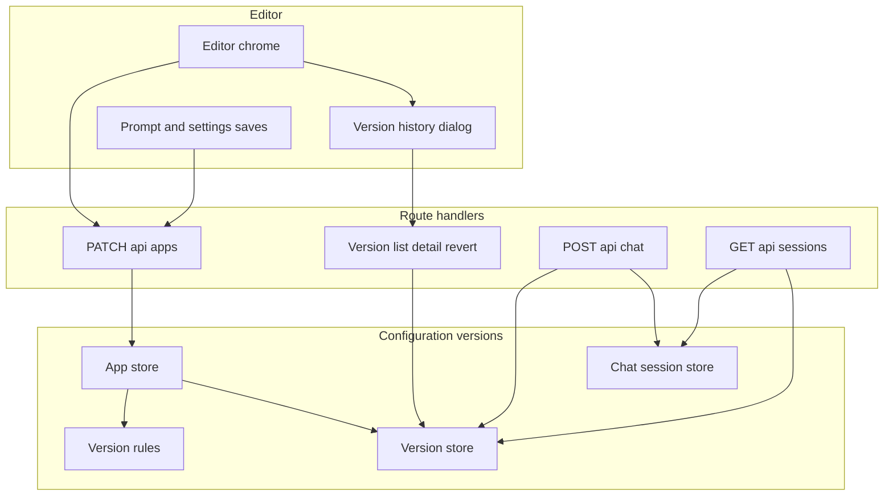
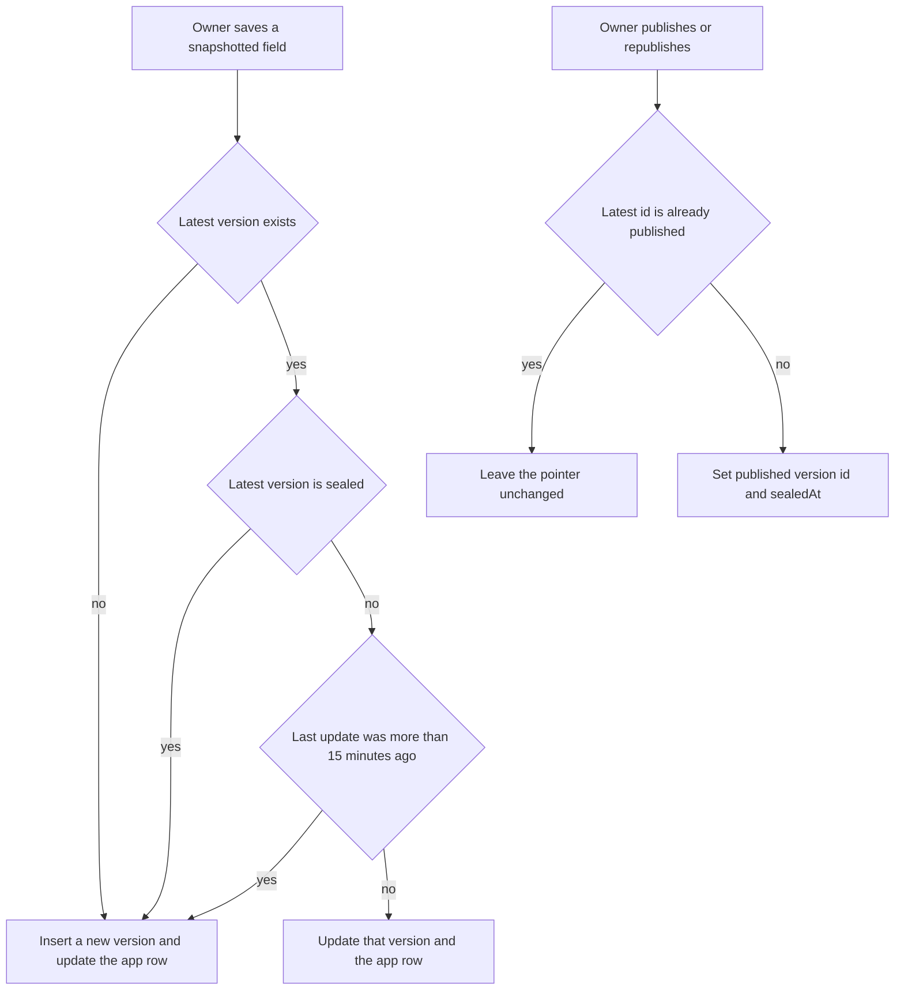
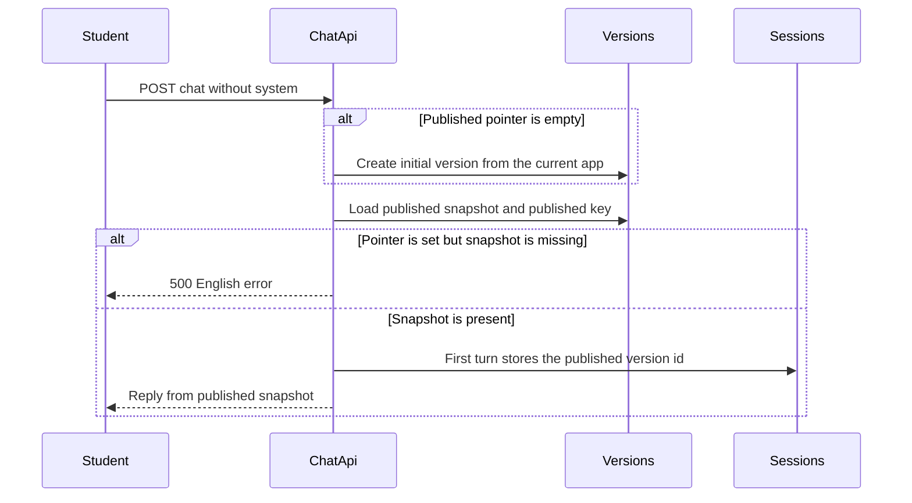
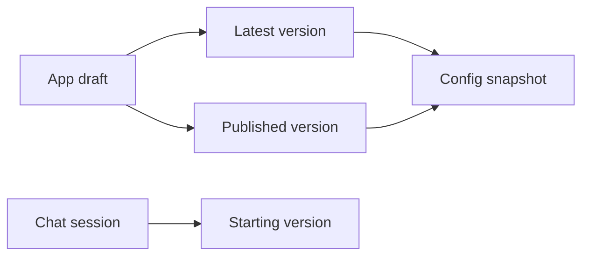
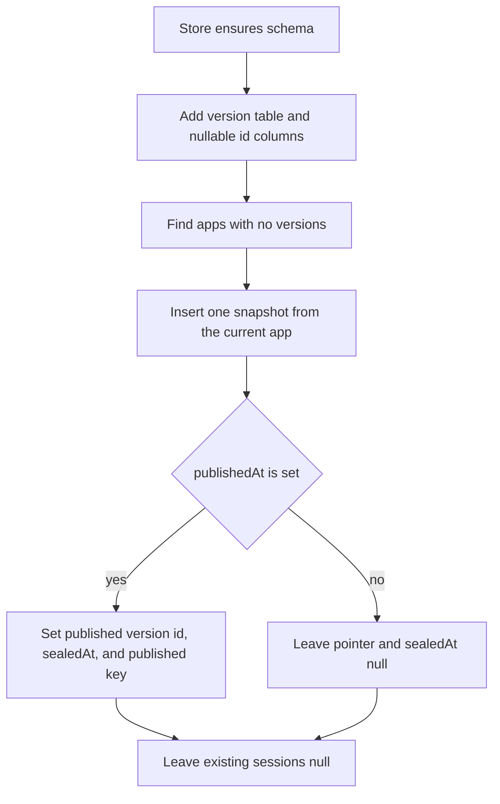

# Design Document: bot-config-versioning

## Overview

**Purpose**: This feature keeps an append-only history of a bot's tutoring configuration, lets the owner read and revert that history, and changes the student-facing bot only when the owner publishes or republishes.

**Users**: The owner edits the draft, inspects versions, and republishes. Students keep using the published snapshot. Researchers see which configuration a new conversation started on.

**Impact**: The app row remains the latest saved draft. A new version history stores snapshots. Public chat and the public page read the published snapshot. New chat sessions gain a nullable starting version id. Existing sessions stay unlabeled.

### Goals

- Save snapshotted settings as versions, coalescing edits to the unsealed draft that are no more than 15 minutes apart.
- Freeze the published version. When an editor test records an unsealed draft, store a sealed copy for that session and leave the draft editable.
- Show history, a creation-order diff, and an append-only revert from the editor.
- Publish the latest version on first publish, and show Republish only when a newer draft exists.
- Serve public chat from the published snapshot and editor test from the draft.
- Backfill one initial version per existing bot without labeling old sessions.

### Non-Goals

- Change notes, generated summaries, per-message version ids, co-editing.
- API keys, public links, sharing, community listing, stars, fork credit, or test-case progress inside a snapshot.
- Deleting or rewriting past version rows.
- New analytics, or new columns on activity downloads.
- Moving the assisted-authoring publish check onto the server.

## Boundary Commitments

### This Spec Owns

- Snapshot type, 15-minute write rule, session-copy rule, and field diff.
- `app_config_versions`, `apps.published_version_id`, and `apps.published_api_key`. `published_api_key` is not a snapshot field and is never returned to the client.
- Owner APIs for list, detail, and revert.
- Publish and republish pointer updates on the existing app PATCH.
- Public-chat resolution of the published snapshot, including name, prompt, provider, model, and variability.
- `chat_sessions.config_version_id`, set once at session creation.
- The editor history dialog, unpublished-changes notice, and Republish action.
- The starting-version label on the existing session transcript.
- Idempotent backfill of one version for every existing bot.

### Out of Boundary

- Test-case storage and the assisted-authoring gate implementation. This spec only calls the existing client check for republish.
- Activity lists, My sessions, downloads, sharing, and deletion, except the transcript label.
- Peer preview and shared-project pages. They keep reading the app row.
- Workspace activity events, stars, and public-chat identity.
- Inference, visualization context, and editor-test prompt construction.

### Allowed Dependencies

- `lib/app-store` façade: `createApp`, `updateApp`, `getAppById`, `forkApp`, `shouldUsePostgres()`, `sql` from `@vercel/postgres`, `.data/apps.json`.
- `lib/chat-session-store` `applyTurn` and `lib/chat-session-api/transcript` `getSessionTranscript`.
- `shouldBlockPublishForTestCases` in `lib/assisted-authoring/publish-gate.ts`.
- `crypto.randomUUID()` and `Intl.DateTimeFormat("en-US", { dateStyle: "medium", timeStyle: "short" })`.
- Dependency direction: `lib/app-config-versions` types and pure rules, then version store, then `lib/app-store` write paths, then route handlers, then editor and transcript UI. UI does not import Postgres. The client does not choose the version id.

### Revalidation Triggers

- Adding or removing a snapshotted field.
- Changing `publishedVersionId`, `publishedApiKey`, `sealedAt`, or the 15-minute comparison.
- Changing public-chat resolution to read the app row again.
- Changing `applyTurn` so later turns overwrite `configVersionId`.
- Changing fork so it copies version rows.

## Architecture

### Existing Architecture Analysis

- One `apps` row is both the editor document and the published bot. `publishedAt` only gates access.
- `updateApp` overwrites that row. Prompt, settings, and publish all arrive as PATCH `/api/apps/[appId]`.
- Public chat omits `system` and loads the app. Editor test sends `system` and still uses the app row for model settings.
- Sessions record through `recordChatTurn` → `upsertSessionTurn` → `applyTurn`. The client supplies `sessionId` only.
- Non-owners fail `getAppById(appId, userId)` and the app route returns 404 `{ error: "App not found" }`.
- Postgres schema is created lazily. JSON files mirror the TypeScript records for local development.

### Architecture Pattern & Boundary Map

**Selected pattern**: The app row stays the draft cache. Version rows are the history. Public chat reads the sealed snapshot selected by `publishedVersionId`.



**Architecture Integration**:

- Existing patterns preserved: owner-scoped 404, store façade, additive columns, client publish gate, peer and share reads of the app row.
- New modules exist because the coalesce and seal rules must be pure, and public chat must not keep reading the draft prompt.
- Steering: secrets stay on the server; the version payload has no API key; `"use client"` is limited to the history dialog and the existing editor chrome.

### Technology Stack

| Layer | Choice / Version | Role in Feature | Notes |
|-------|------------------|-----------------|-------|
| Frontend | React 19, existing editor chrome | History dialog, Republish, transcript label | No new UI library |
| Backend | Next.js 16 route handlers | List, detail, revert, publish pointer, chat resolution | Existing `{ error: string }` bodies |
| Data | Vercel Postgres and `.data` JSON | `app_config_versions`, two new nullable ids | No new dependency and no migration runner |
| Runtime | Node.js `crypto.randomUUID` | Version ids | Same generator as session ids |

## File Structure Plan

### Directory Structure

```
lib/app-config-versions/
├── types.ts                 # Snapshot, version record, diff entry
├── rules.ts                 # Window, seal decision, snapshot copy, diff
└── rules.selftest.ts        # Pure assertions via npx tsx
lib/app-config-versions/store.ts   # Postgres and JSON persistence, backfill
```

Component files: Version rules in `rules.ts`; Version store in `store.ts`; App store sync in `lib/app-store/store.ts`; Version routes in the `config-versions` route files; App PATCH in `app/api/apps/[appId]/route.ts`; Chat resolution in `app/api/chat/route.ts`; Session stamp in `lib/chat-session-store/store.ts`; Transcript label in `SessionTranscript.tsx`; Editor history in `VersionHistoryDialog.tsx`.

### Modified Files

- `lib/app-store/types.ts` — `publishedVersionId` and server-only `publishedApiKey` on `AppConfig`
- `lib/app-store/store.ts` — call version sync from `createApp` and `updateApp`; expose published-config read
- `lib/app-store/fork.ts` — no version-row copy; `createApp` inserts the new bot's first version
- `app/api/apps/[appId]/route.ts` — publish seals the latest version; GET returns version ids
- `app/api/apps/[appId]/config-versions/route.ts` — owner list
- `app/api/apps/[appId]/config-versions/[versionId]/route.ts` — owner detail and diff
- `app/api/apps/[appId]/config-versions/[versionId]/revert/route.ts` — owner revert
- `app/api/chat/route.ts` — public replies use the published snapshot; stamp the server-resolved version id
- `app/chat/[appId]/page.tsx` — public title uses the published snapshot name
- `lib/chat-session-store/types.ts` — nullable `configVersionId`
- `lib/chat-session-store/store.ts` — column, insert-only assignment
- `lib/chat-session-store/record-chat-turn.ts` — accept the server-supplied version id
- `lib/chat-session-api/transcript.ts` — attach `configVersionCreatedAt` for the label
- `components/sessions/session-display.ts` — English label helper
- `components/sessions/SessionTranscript.tsx` — render the label when present
- `components/sessions/BotActivityView.tsx` — pass the label timestamp through
- `components/editor/EditorChrome.tsx` — History, Publish, Republish, published status
- `components/editor/VersionHistoryDialog.tsx` — list, detail, diff, revert
- `app/app/[appId]/editor/page.tsx` — version ids, shared publish gate, apply reverted draft
- `components/editor/InstructionDoc.tsx` — keep unsaved text and show the English PATCH error
- `components/editor/AppSettingsDialog.tsx` — show the English PATCH error

## System Flows

### Edit, seal, and publish



In-place update changes `updatedAt` and snapshot fields and leaves `createdAt` unchanged. Insert and revert set both timestamps to server now. Publish does not change snapshot fields. It sets `publishedVersionId`, `sealedAt` on that edit version, and `publishedApiKey` from the current draft key. The draft is the single edit version with `sealedAt` null. Inserting a new edit version seals the previous edit version so only one draft remains. A session copy does not become the draft.

### Public reply



Later turns on that session do not change `configVersionId`. A republish changes the snapshot used by the next public reply, including a chat that is already open. An editor test of an unsealed draft inserts a sealed `session` copy and stamps that copy. The draft row stays unsealed. An editor test of an already sealed draft stamps that same id and does not insert a copy.

## Requirements Traceability

| Requirement | Summary | Components | Interfaces | Flows |
|-------------|---------|------------|------------|-------|
| 1.1 | Snapshot field set | Version rules, Version store | Service | Edit flow |
| 1.2 | Excluded fields | Version rules | Service | |
| 1.3 | Created and updated times | Version store | Service | Edit flow |
| 1.4 | Update inside 15 minutes | Version rules | Service | Edit flow |
| 1.5 | Insert after 15 minutes | Version rules | Service | Edit flow |
| 1.6 | Insert when latest is published | Version rules | Service | Edit flow |
| 1.7 | Latest version is the draft | Version store, App store | Service | Edit flow |
| 1.8 | Failed save leaves history | App store, InstructionDoc, AppSettingsDialog | API | |
| 2.1 | History list | Version history dialog | API | |
| 2.2 | Read-only detail | Version history dialog | API | |
| 2.3 | Diff against previous created version | Version rules | API | |
| 2.4 | Earliest version has no previous | Version rules | API | |
| 2.5 | Non-owner denied | Version routes | API | |
| 3.1 | Revert appends inside the window | Version store | API | |
| 3.2 | Revert keeps old rows | Version store | API | |
| 3.3 | Revert does not publish | Version store | API | |
| 3.4 | No revert on the draft | Version history dialog | API | |
| 3.5 | Failed revert is a no-op | Version routes | API | |
| 3.6 | Non-owner cannot revert | Version routes | API | |
| 4.1 | First publish selects latest | App PATCH | API | Publish flow |
| 4.2 | Unpublished bot keeps Publish | Editor chrome | State | |
| 4.3 | Unpublished notice and Republish | Editor chrome | State | |
| 4.4 | Republish moves the pointer only | App PATCH | API | Publish flow |
| 4.5 | Hide Republish when ids match | Editor chrome | State | |
| 4.6 | Same client publish gate | Editor page | State | |
| 4.7 | Failed publish keeps the old pointer | App PATCH | API | |
| 4.8 | Non-owner cannot publish | App PATCH | API | |
| 5.1 | Public reply uses published snapshot | Chat route | API | Public reply |
| 5.2 | Editor test uses the draft | Chat route, App store | API | |
| 5.3 | Shared project and peer preview use the draft row | App store | Service | |
| 5.4 | Unpublished bot has no public chat | Chat route, public page | API | |
| 5.5 | Open public chats stay on the published snapshot | Chat route | API | Public reply |
| 6.1 | Public session stamps the published version | Record chat turn | Service | Public reply |
| 6.2 | Editor-test session stamps the draft version | Record chat turn | Service | |
| 6.3 | Later edits do not rewrite the stamp | Chat session store, seal rule | Service | |
| 6.4 | Transcript identifies the starting version | Transcript API, SessionTranscript | API | |
| 6.5 | No per-message version | Chat session store | Service | |
| 7.1 | Backfill one version per existing bot | Version store | Batch | |
| 7.2 | Published bots point at that version | Version store | Batch | |
| 7.3 | Old sessions stay unlabeled | Chat session store | Service | |
| 7.4 | Fork starts a new one-version history | App store, fork | Service | |

## Components and Interfaces

| Component | Domain/Layer | Intent | Req Coverage | Key Dependencies | Contracts |
|-----------|--------------|--------|--------------|------------------|-----------|
| Version rules | Domain | Decide insert versus update, copy, and diff | 1.1, 1.2, 1.4, 1.5, 1.6, 2.3, 2.4 | None | Service |
| Version store | Data | Persist versions, backfill, seal | 1.3, 1.7, 3.1, 3.2, 3.3, 7.1, 7.2 | Version rules P0, Postgres P0 | Service, Batch |
| App store sync | Data | Keep the draft row aligned and publish the pointer | 1.7, 1.8, 4.1, 4.4, 4.7, 5.3, 7.4 | Version store P0 | Service |
| Version routes | HTTP | Owner list, detail, revert | 2.1, 2.2, 2.5, 3.4, 3.5, 3.6 | App store P0, Version store P0 | API |
| App PATCH | HTTP | First publish and republish | 4.1, 4.4, 4.7, 4.8 | App store P0 | API |
| Chat resolution | HTTP | Pick draft or published config and stamp sessions | 5.1, 5.2, 5.4, 5.5, 6.1, 6.2 | Version store P0, Sessions P0 | API |
| Session stamp | Data | Store the starting version once | 6.3, 6.5, 7.3 | Chat session store P0 | Service |
| Transcript label | UI | Show the starting version time | 6.4 | Transcript API P0 | State |
| Editor history | UI | List, inspect, revert, republish | 1.8, 2.1, 2.2, 3.4, 3.5, 4.2, 4.3, 4.5, 4.6 | Version routes P0, App PATCH P0 | State |

### Domain

#### Version rules

| Field | Detail |
|-------|--------|
| Intent | Pure version decisions and snapshot comparison |
| Requirements | 1.1, 1.2, 1.4, 1.5, 1.6, 2.3, 2.4 |

**Contracts**: Service [x]

##### Service Interface

```typescript
export const CONFIG_VERSION_WINDOW_MS = 15 * 60 * 1000;

export type ConfigSnapshot = {
  name: string;
  provider: string;
  model: string;
  variability: number | null;
  systemPrompt: string;
  assistedAuthoringMode: boolean;
  builderState: PromptBuilderState | null;
};

export type VersionWriteDecision =
  | { action: "insert" }
  | { action: "update"; versionId: string };

export function decideVersionWrite(input: {
  latest: { id: string; updatedAt: string; sealed: boolean } | null;
  now: string;
  windowMs?: number;
}): VersionWriteDecision;

export type ConfigFieldDiff = {
  field: string;
  earlier: string;
  later: string;
};

export function diffConfigSnapshots(
  earlier: ConfigSnapshot,
  later: ConfigSnapshot
): ConfigFieldDiff[];

export function snapshotFromApp(app: AppConfig): ConfigSnapshot;
```

- Preconditions: `now` and `updatedAt` are ISO timestamps. `windowMs` defaults to `CONFIG_VERSION_WINDOW_MS`.
- Postconditions: `decideVersionWrite` returns `update` only when `latest` exists, `sealed` is false, and `now - updatedAt` is less than or equal to the window. Otherwise it returns `insert`.
- Invariants: The snapshot has no API key, slug, publication field, share field, community field, star, or fork field. `assistedAuthoringMode` is the effective boolean already used by the app. Diff walks `name`, `systemPrompt`, `provider`, `model`, `variability`, `assistedAuthoringMode`, and each `PromptBuilderState` leaf. Unchanged leaves are omitted. Display strings use the stored text, `on` or `off`, and `unset` for null variability.

**Implementation Notes**

- Integration: The caller passes the unsealed edit version as `latest`. A sealed published version is passed with `sealed: true`, which forces `insert`. Session copies are never passed as `latest`.
- Validation: Self-check the exact 15-minute boundary, a sealed latest version, an empty previous diff, and a prompt change.
- Risks: A new builder-state leaf that is not listed will not appear in the diff.

#### Version store

| Field | Detail |
|-------|--------|
| Intent | Authoritative history for one app |
| Requirements | 1.3, 1.7, 3.1, 3.2, 3.3, 7.1, 7.2 |

**Contracts**: Service [x] / Batch [x]

##### Service Interface

```typescript
export type ConfigVersionKind = "edit" | "session";

export type ConfigVersionRecord = ConfigSnapshot & {
  id: string;
  appId: string;
  kind: ConfigVersionKind;
  createdAt: string;
  updatedAt: string;
  sealedAt: string | null;
};

export async function listConfigVersionSummaries(appId: string): Promise<ConfigVersionSummary[]>;
export async function getConfigVersion(appId: string, versionId: string): Promise<ConfigVersionRecord | null>;
export async function syncDraftVersion(input: {
  app: AppConfig;
  now: string;
}): Promise<{ latest: ConfigVersionRecord }>;
export async function sealConfigVersion(appId: string, versionId: string, now: string): Promise<void>;
export async function pinSessionSnapshot(input: {
  appId: string;
  versionId: string;
  now: string;
}): Promise<{ configVersionId: string }>;
export async function ensurePublishedVersion(app: AppConfig, now: string): Promise<ConfigVersionRecord>;
export async function revertToConfigVersion(input: {
  app: AppConfig;
  sourceVersionId: string;
  now: string;
}): Promise<
  | { ok: true; created: ConfigVersionRecord; draft: ConfigSnapshot }
  | { ok: false; code: "not-found" | "is-draft" }
>;
```

- Preconditions: `syncDraftVersion` runs inside the same Postgres transaction as the app-row write. Revert rejects the unsealed edit version and every `session` row.
- Postconditions: `syncDraftVersion` updates the unsealed edit row or appends a new `edit` row and seals the previous edit row. Revert appends an `edit` copy with a new id, `sealedAt: null`, and both timestamps equal to `now`. It does not set `publishedVersionId` or `publishedApiKey`. `pinSessionSnapshot` returns the same id when that version is already sealed. When it is the unsealed draft, it inserts a sealed `session` copy and leaves the draft unsealed. `ensurePublishedVersion` returns the existing published snapshot, or inserts the initial sealed `edit` version and sets the pointer and `publishedApiKey` when the bot is published and the pointer is null.
- Invariants: Rows are never deleted or squashed. At most one `edit` version has `sealedAt` null, and that row is the draft. `session` rows are sealed at insert and are omitted from history list, detail, and revert. `updatedAt` moves only for an in-place draft update.

##### Batch / Job Contract

- Trigger: `ensurePostgresStore` and the JSON store load.
- Input / validation: Every app with zero version rows.
- Output / destination: One `edit` version copied from the current snapshotted fields. `createdAt` and `updatedAt` equal `app.updatedAt`. If `publishedAt` is set, `publishedVersionId` is that version, `sealedAt` is `app.updatedAt`, and `publishedApiKey` is the current `apiKey`. Otherwise the pointer, `sealedAt`, and `publishedApiKey` stay null.
- Idempotency & recovery: Apps that already have a version are skipped. Existing `configVersionId` values are not backfilled.

**Implementation Notes**

- Integration: Postgres table `app_config_versions` with a primary key on `id` and an index on `(app_id, created_at)`. JSON file `.data/app-config-versions.json` stores `{ versions: ConfigVersionRecord[] }`. No foreign keys, matching the current stores.
- Validation: After backfill, a published app's pointer loads a snapshot equal to that app's current tutoring fields.
- Risks: JSON writes are not transactional. Write the versions file before the apps file and surface a thrown error to the editor.

### Data and HTTP

#### App store sync

| Field | Detail |
|-------|--------|
| Intent | One write path for draft fields, create, fork, and publish |
| Requirements | 1.7, 1.8, 4.1, 4.4, 4.7, 5.3, 7.4 |

**Contracts**: Service [x]

**Responsibilities & Constraints**

- `createApp` inserts the app and one unsealed initial version in the same transaction.
- `updateApp` applies non-snapshot fields as it does today. If the patch changes any snapshot field, it calls `syncDraftVersion` and writes those fields onto the app row from the resulting latest snapshot.
- `forkApp` still calls `createApp` with the copied tutoring fields and does not read the source version list.
- Publish sets `publishedAt` and `publicSlug` as today, then sets `publishedVersionId` to the latest edit version, seals it, and copies `apiKey` into `publishedApiKey`. If the pointer already matches, the publish write leaves version rows, the pointer, and `publishedApiKey` unchanged.
- A settings save that changes `apiKey` while the draft provider still equals the published snapshot provider updates `publishedApiKey` immediately. A save that leaves the draft provider different from the published snapshot provider leaves `publishedApiKey` unchanged. Unpublished bots have no published key.
- `getAppById` remains the draft read used by the editor, peer snapshot, and shared project page.

**Implementation Notes**

- Integration: A PATCH that changes prompt and sets `publish: true` syncs the version first, then publishes that latest id.
- Validation: On any thrown store error, the route returns 500 and the client must not mark the editor clean or published.
- Risks: Partial JSON failure. Production rollback is the Postgres transaction via `sql.begin`.

#### Version routes

| Field | Detail |
|-------|--------|
| Intent | Owner reads and reverts history |
| Requirements | 2.1, 2.2, 2.5, 3.4, 3.5, 3.6 |

**Contracts**: API [x]

##### API Contract

| Method | Endpoint | Request | Response | Errors |
|--------|----------|---------|----------|--------|
| GET | `/api/apps/{appId}/config-versions` | none | `{ versions: ConfigVersionSummary[] }` sorted by `updatedAt` descending | 401, 404 |
| GET | `/api/apps/{appId}/config-versions/{versionId}` | none | `{ version, previousVersionId, diff }` | 401, 404 |
| POST | `/api/apps/{appId}/config-versions/{versionId}/revert` | empty | `{ version, draft }` | 400, 401, 404, 500 |

```typescript
export type ConfigVersionSummary = {
  id: string;
  createdAt: string;
  updatedAt: string;
  isDraft: boolean;
  isPublished: boolean;
};

export type ConfigVersionDetail = {
  version: ConfigVersionRecord;
  previousVersionId: string | null;
  diff: ConfigFieldDiff[];
};
```

- List order uses `updatedAt`, then `createdAt`, then `id`, and includes `edit` versions only. `isDraft` means the unsealed `edit` version. `isPublished` means the id equals `publishedVersionId`. `session` copies are not listed.
- Detail loads the previous row by the greatest `createdAt` strictly less than the selected version. `diff` is empty and `previousVersionId` is null when none exists (2.4). Detail does not change the draft (2.2).
- Revert of the draft returns 400 `{ error: "The current draft cannot be reverted." }`. Missing app or version, and any non-owner, return 404 `{ error: "App not found" }` or `{ error: "Version not found" }` with no snapshot body.
- Failed revert returns 500 `{ error: "Failed to revert this version." }` and does not change rows or `publishedVersionId`.

#### App PATCH

| Field | Detail |
|-------|--------|
| Intent | Existing settings write plus the publish pointer |
| Requirements | 4.1, 4.4, 4.7, 4.8 |

**Contracts**: API [x]

##### API Contract

| Method | Endpoint | Request | Response | Errors |
|--------|----------|---------|----------|--------|
| PATCH | `/api/apps/{appId}` | Existing body. `publish: true` publishes the latest edit version. | `{ app }` including `publishedVersionId` and `latestVersionId`, without `apiKey` or `publishedApiKey` | 400, 401, 404, 500 |
| GET | `/api/apps/{appId}` | none | Same id fields on `app` | 401, 404 |

- First publish and republish both use `publish: true`. The server writes the pointer only after the draft sync succeeds.
- A failed PATCH leaves the previous `publishedVersionId` in place and returns `{ error: string }`.
- Non-owners receive the existing 404.

#### Chat resolution

| Field | Detail |
|-------|--------|
| Intent | Students receive the published snapshot; the owner tests the draft |
| Requirements | 5.1, 5.2, 5.4, 5.5, 6.1, 6.2 |

**Contracts**: API [x]

**Responsibilities & Constraints**

- If the client omits `system`, require `publishedAt` as today. When `publishedVersionId` is null, call `ensurePublishedVersion` and then load that snapshot. Use the snapshot for `systemPrompt`, `provider`, `model`, `variability`, and the recorded `appName`. Use `publishedApiKey` for the provider call. Do not use the draft `apiKey`.
- If `publishedVersionId` is set and that row is missing, return 500 `{ error: "Published configuration is unavailable." }` and do not fall back to the draft.
- If the client sends `system`, keep the current editor-test path: that system prompt plus the app row's provider, model, variability, and draft `apiKey`. Stamp the id from `pinSessionSnapshot` for the current draft.
- Do not cache the published prompt in the browser.
- The public page renders the published snapshot name. An unpublished bot still `notFound()`s.

**Implementation Notes**

- Integration: `recordChatTurn` receives `configVersionId` from the route. The recording JSON cannot set it.
- Validation: A published bot with a newer draft still answers an already-open chat from the published snapshot and `publishedApiKey`. Changing only the draft provider does not change that key. Changing the key while the provider still matches the published snapshot does.
- Risks: A dangling `publishedVersionId` fails closed. A null pointer on a published bot is repaired by `ensurePublishedVersion` instead.

#### Session stamp

| Field | Detail |
|-------|--------|
| Intent | One starting version on each new session |
| Requirements | 6.3, 6.5, 7.3 |

**Contracts**: Service [x]

##### Service Interface

```typescript
export type ChatSessionRecord = {
  // existing fields unchanged
  configVersionId?: string | null;
};
```

- `applyTurn` sets `configVersionId` only when `existing` is null.
- Updates do not change `configVersionId`, `createdAt`, or `appName`.
- `StoredChatMessage` does not gain a version field.
- `normalizeSessionRecord` maps a missing value to null. Backfill does not invent ids for old rows (7.3).
- Public chat stamps the published edit version. Editor test stamps `pinSessionSnapshot`. That copy keeps requirement 6.3 without sealing the draft, so requirement 1.4 still applies to the next edit.

#### Transcript label

| Field | Detail |
|-------|--------|
| Intent | The owner can see the starting version on the session already open |
| Requirements | 6.4 |

**Contracts**: API [x] / State [x]

##### API Contract

| Method | Endpoint | Request | Response | Errors |
|--------|----------|---------|----------|--------|
| GET | `/api/sessions/{sessionId}` | none | `{ session, configVersionCreatedAt: string \| null }` | Existing 401, 403, 404 |

- `getSessionTranscript` looks up `createdAt` for `session.configVersionId` when the session belongs to that app. A missing version yields `configVersionCreatedAt: null` and the label `Bot version unavailable`.
- A null id omits the label. Otherwise `SessionTranscript` shows `Bot version from {formatted createdAt}` beside the existing start time and surface badge, using the same `en-US` medium date and short time format as session start times.
- Download column lists are unchanged.

### Editor UI

#### Editor history

| Field | Detail |
|-------|--------|
| Intent | History, revert, and republish from the bot editor |
| Requirements | 1.8, 2.1, 2.2, 3.4, 3.5, 4.2, 4.3, 4.5, 4.6 |

**Contracts**: State [x]

##### State Management

- Editor state adds `latestVersionId` and `publishedVersionId` from GET and PATCH. `latestVersionId` is the unsealed edit version, or the published edit version when the draft is already sealed.
- Header states:
  - `publishedAt` empty: button `Publish`. No Republish.
  - Both ids set and different: English notice `You have unpublished changes.` and button `Republish`.
  - Both ids set and equal: status text `Published`. No Publish and no Republish.
- `History` opens `VersionHistoryDialog`. Rows show the formatted `updatedAt`, badge `Current draft` when `isDraft`, and badge `Published` when `isPublished`.
- Selecting a row loads detail. The dialog shows created time, updated time, and the snapshot. It does not write the editor draft.
- Changed fields render as `Previous` and `This version`. The earliest version shows `No previous version.`
- Revert is omitted on the draft row. Success replaces local name, model, variability, assisted-authoring mode, and prompt with `draft`, then refreshes version ids. The prompt component must receive the new text before its debounce runs.
- Publish and Republish both call the existing `handlePublish` path. That path still calls `shouldBlockPublishForTestCases` and shows the existing English block. The PATCH body stays `{ systemPrompt, publish: true }`.
- Save, publish, and revert failures show the response `error` string and leave the previous published ids and local dirty state in place.

**Implementation Notes**

- Integration: `EditorChrome` only receives labels and callbacks. The page owns requests.
- Validation: Revert of the draft is not offered. A 400 from a stale client still shows the English error.
- Risks: Debounced prompt save after revert. Apply server text first.

## Data Models

### Domain Model

- **ConfigSnapshot**: value object of the tutoring configuration. It is the only content a version stores.
- **ConfigVersion**: entity. Identity is a UUID. `kind` is `edit` or `session`. `createdAt` is immutable. `updatedAt` changes only on the unsealed edit draft. `sealedAt` makes that row immutable.
- **App draft**: the app row's snapshotted fields mirror the unsealed edit version. `publishedVersionId` selects the student-facing edit version. `publishedApiKey` is the key for that published provider and is not part of any snapshot.
- **ChatSession**: gains an optional starting version id. Messages stay unversioned.



Invariants:

- An app has at least one version after create, fork, or backfill.
- The unsealed `edit` version is the only row whose snapshot can change, and only inside the 15-minute window.
- `publishedVersionId` is null exactly when the bot has never been published. `publishedApiKey` is null in that same case.
- Revert and edit never change `publishedVersionId` or `publishedApiKey`, except a same-provider key update, which changes `publishedApiKey` only.
- Session `configVersionId` is null, a published edit version id, or a sealed `session` copy id.

### Logical Data Model

- One app has many versions. One version has one previous version, defined by the next-older `createdAt`, or none.
- `publishedVersionId` references one version of the same app or is null.
- One session references at most one version. Many sessions may reference one version.
- There is no message-to-version relationship.

**Consistency & Integrity**

- Postgres transaction covers the app update, the version insert or update, and any `publishedApiKey` change.
- A session pin inserts the sealed copy before the session insert. If the session insert fails, the extra sealed copy remains and the draft stays editable.
- No database foreign keys. The routes check `appId` on every version read.
- Old sessions remain valid with a null version id.

### Physical Data Model

`app_config_versions`

| Column | Type | Notes |
|--------|------|-------|
| id | TEXT primary key | `crypto.randomUUID()` |
| app_id | TEXT not null | Indexed with `created_at` |
| name | TEXT not null | |
| provider | TEXT not null | |
| model | TEXT not null | |
| variability | DOUBLE PRECISION null | Null means unset |
| system_prompt | TEXT null | Includes attached reference text |
| builder_state | JSONB null | `PromptBuilderState` or null |
| assisted_authoring_mode | BOOLEAN not null | Effective value |
| kind | TEXT not null | `edit` or `session` |
| created_at | TIMESTAMPTZ not null | Immutable |
| updated_at | TIMESTAMPTZ not null | In-place draft only |
| sealed_at | TIMESTAMPTZ null | Null only on the current edit draft |

`apps.published_version_id TEXT` null. `apps.published_api_key TEXT` null. `chat_sessions.config_version_id TEXT` null.

List queries select summary columns for `edit` rows only. Detail reads one edit version and its predecessor among edit versions. Neither response includes `published_api_key` or `api_key`.

## Error Handling

### Error Strategy

Version and publish routes return the existing `{ error: string }` JSON. They do not include snapshots on errors. Store failures throw before either side of a Postgres transaction commits. The editor shows `error` and does not clear dirty state.

### Error Categories and Responses

**User Errors**

- 401 `{ error: "Unauthorized" }` when the session is missing.
- 404 `{ error: "App not found" }` for a missing app or a non-owner.
- 404 `{ error: "Version not found" }` when the id is not on that app.
- 400 `{ error: "The current draft cannot be reverted." }` for revert of the draft.
- 400 from the existing publish-gate message before PATCH, for both Publish and Republish.

**System Errors**

- 500 `{ error: "Failed to update app settings" }` on save or publish failure.
- 500 `{ error: "Failed to revert this version." }` on revert failure.
- 500 `{ error: "Published configuration is unavailable." }` when `publishedVersionId` points at a missing row. A published bot with a null pointer is repaired and served.

**Business Logic Errors**

- Republish when the pointer already matches is a successful no-op, not an error.
- Missing `configVersionCreatedAt` renders `Bot version unavailable` and does not invent a time.

### Monitoring

Log store and backfill failures with the app id and without prompt text or API keys. Do not log snapshot bodies.

## Testing Strategy

### Unit Tests

Run with `npx tsx lib/app-config-versions/rules.selftest.ts`.

- Elapsed time equal to 15 minutes updates; one millisecond beyond inserts (1.4, 1.5).
- A sealed or published latest version inserts at any age (1.6).
- A null latest inserts (7.1 shape).
- Diff reports a system-prompt change and a model change, and returns no rows when snapshots match (2.3).
- Diff of a first version is not requested; previous-id selection is covered by an ordered-id fixture (2.4).
- Snapshot objects have no API key or slug (1.2).

### Integration Tests

No new runner. Cover these with a JSON-store self-check only if one is added beside the store; otherwise they are manual:

- `createApp` yields one version and a null pointer.
- An in-window PATCH updates one row and preserves `createdAt` (1.3, 1.7).
- Publish then edit inserts a second edit version and leaves the first snapshot byte-for-byte (4.4, 5.5).
- An editor test of an unsealed draft inserts a `session` row, leaves the draft unsealed, and a following in-window edit updates that same draft (1.4, 6.2, 6.3).
- A same-provider API key change updates `publishedApiKey`. A provider change leaves it unchanged until republish (1.2, 5.1).
- A published app with a null pointer receives one version on the next public read and answers with that snapshot (7.1, 7.2).
- Revert appends and leaves `publishedVersionId` (3.1, 3.2, 3.3).
- Fork of a bot with several versions yields one version on the new id (7.4).
- A second `applyTurn` does not change `configVersionId` (6.3, 6.5).

### E2E/UI Tests

Manual pass on the running editor and a published chat:

- Edit the prompt, run an editor test, edit again within 15 minutes, and confirm the history still has one draft row.
- Change the provider without republishing and confirm public chat still uses the previous provider and published key. Change only the API key for that same provider and confirm public chat uses the new key.
- Wait more than 15 minutes, save, and confirm a new row and a prompt diff.
- Publish, edit, and confirm the notice `You have unpublished changes.` Public chat still answers with the old prompt and old name.
- Republish and confirm the next public reply, including an already-open chat, uses the new prompt.
- Revert an older row and confirm the draft changes, the published chat does not, and the old row remains.
- Open an old activity session and confirm it has no version label. Open a new public session and confirm `Bot version from {time}`.
- With assisted authoring on and a failing test, confirm Republish is blocked with the existing English message.

### Performance/Load

- History list does not return `system_prompt` or `builder_state`.
- Detail reads two rows. The `(app_id, created_at)` index supports list, previous-version, and latest lookups.

## Security Considerations

- Every version route loads the app with the signed-in user id and returns 404 for anyone else, with an empty body.
- Version JSON and app JSON responses never include `apiKey` or `publishedApiKey`.
- `configVersionId` is taken from the server resolution, never from `recording`.
- Public chat uses `publishedApiKey` with the published provider. It fails closed only when the published version id points at a missing row.
- Logs exclude prompt text and keys.

## Migration Strategy



- The backfill is idempotent and runs on store startup for Postgres and on JSON load. A later public read calls `ensurePublishedVersion` when a published bot still has a null pointer.
- Rollback trigger: if the pointer is set but the version row is missing, public chat returns 500 and does not serve the draft. A null pointer is repaired from the current app instead.
- Checkpoint: every previously published bot loads a snapshot whose prompt, model, and provider match the pre-migration row, `publishedApiKey` matches that row's key, and an existing session still opens with no version label.

## Supporting References

Discovery notes, the rejected draft-only model, and the Playlab changelog citation are in `.kiro/specs/bot-config-versioning/research.md`.
