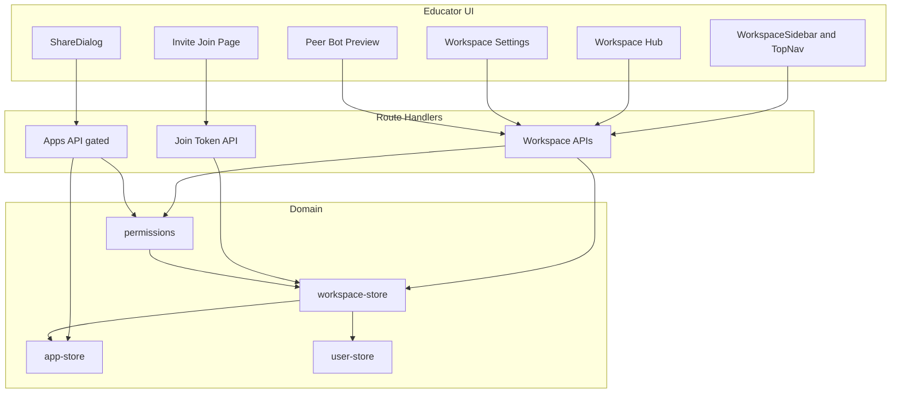
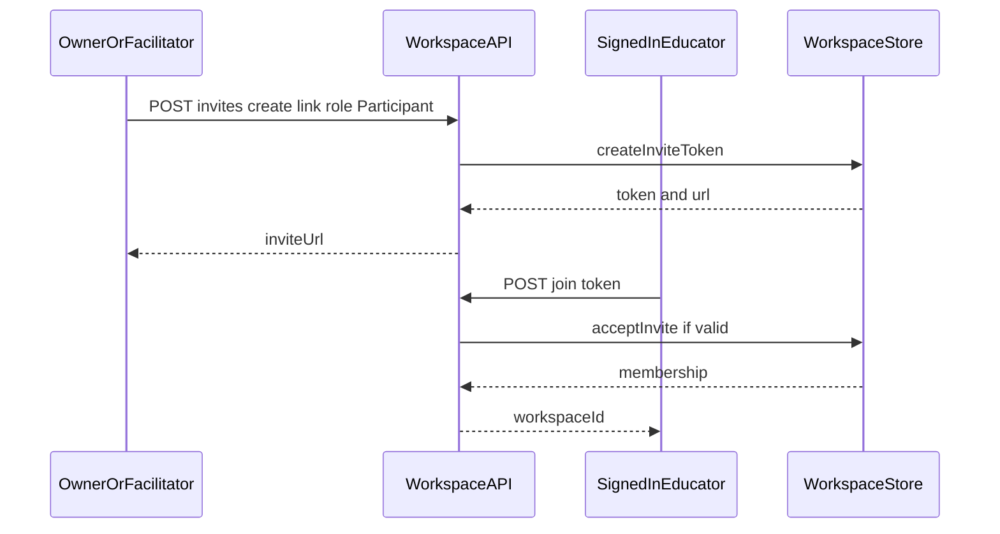
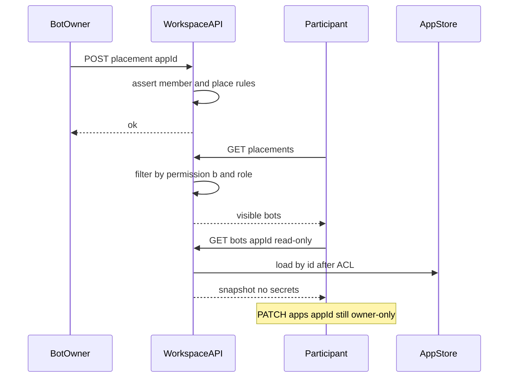
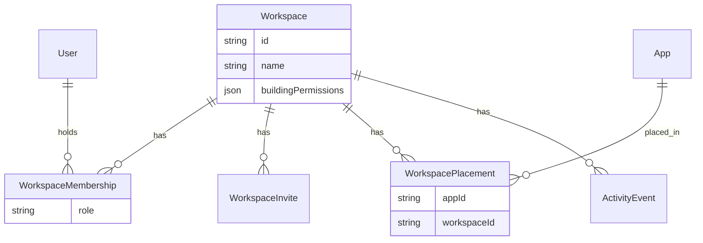

# Design Document: educator-workspaces

## Overview

This feature adds Playlab-like **Workspaces** so educators in professional-learning courses (100+ participants) can collaborate in named spaces without replacing personal bot ownership. Educators create Workspaces, invite peers (email-targeted pending invites and invite links), assign roles (Owner / Facilitator / Participant), place personally owned bots into one or more Workspaces, configure building permissions, and review lightweight activity.

**Users**: Teachers and educator-builders who author bots; course Operators/Facilitators who run cohorts. Students of published tutoring chats remain outside Workspace membership.

**Impact**: Extends the product from a flat personal bot list plus Community/project-share into a membership-scoped collaboration layer. Existing My bots, student Publish, Community, and project share continue; Workspace placement does not by itself publish or Community-list a bot.

### Goals

- Deliver Workspace CRUD, membership, roles, multi-Workspace bot placement, building permissions, and lightweight activity as specified in requirements 1–9.
- Preserve single-owner bot authoring; membership never grants co-edit.
- Scale invite-link joins for course cohorts without an Organization layer.
- Leave a clean seam for later Collections / Org / deep insights (`workspace-collections`).

### Non-Goals

- Organization hierarchy, Collections, deep analytics/exports/moderation queues.
- Student Workspace membership or replacing `/chat` Publish delivery.
- Co-editing another educator’s bot via Workspace role.
- Starred / Recently Used library features.
- Outbound SMTP/email provider integration in this phase (pending invites are in-app).

## Boundary Commitments

### This Spec Owns

- Workspace aggregate: identity, name, building permissions, lifecycle (create/rename/delete).
- Membership and roles (Owner, Facilitator, Participant), including transfer of ownership.
- Invites: email-targeted pending invites and revocable/expiring invite links; signed-in join.
- Bot↔Workspace placements (many-to-many) without changing `AppConfig.ownerId`.
- Authorization matrix: role × building permission × action, including gates on educator outward share and self-delete when a bot is constrained by Workspace policy.
- Lightweight activity event log and role-filtered reads.
- Educator UI: Workspace navigation, hub, settings, invites, members, activity, peer non-edit inspect.
- Auth proxy coverage for private Workspace routes and APIs.

### Out of Boundary

- Bot prompt authoring, simulated testing, model credentials (`/app/[appId]/editor` internals).
- Student Publish/chat runtime and Community gallery ranking/algorithms (except explicit non-side-effects and permission (c) gates on educator share).
- Organization, Collections, cross-Workspace insights (`workspace-collections`).
- Transactional email delivery infrastructure.
- Starred / Recently Used persistence.

### Allowed Dependencies

- Auth.js session (`auth()`, `session.user.id`) and `lib/auth/user-store` (`getUserByEmail`, user id/email).
- `lib/app-store` for bot ownership, create/delete, Publish, project share, duplicate/fork patterns—without transferring bot ownership into the Workspace store.
- Existing UI patterns: dashboard grids, `ShareDialog`, `SharedProjectEditor` / duplicate.
- Dual persistence pattern (Vercel Postgres or `.data` JSON) already used by apps/users stores.
- Next.js App Router pages and route handlers.

### Revalidation Triggers

- Change to placement cardinality or ownership rules (e.g., Workspace-owned bots).
- Change to role set or building-permission semantics affecting Publish or Community.
- Introduction of outbound email as a hard dependency for invites.
- Organization or Collections contracts that assume different Workspace identity shapes.
- Relaxing editor PATCH to non-owners based on Workspace membership.

## Architecture

### Existing Architecture Analysis

- **Pattern**: Next.js App Router + `lib/*` store façades; owner-scoped private APIs; explicit public exceptions for published chat and public project share.
- **Constraint**: `getAppById(id, ownerId)` returns the bot only when `ownerId` matches—peer edit is already impossible via current editor APIs; peer inspect needs a **Workspace-scoped read** that does not open PATCH.
- **Debt**: `WorkspaceSidebar` is a non-functional placeholder; `proxy.ts` matcher omits Workspace paths; no mailer; no automated tests.

### Architecture Pattern & Boundary Map

**Selected pattern**: Hybrid domain extension — new **Workspace domain module** + thin integration hooks into apps APIs and educator shell.



**Dependency direction** (imports only downward):

`types` → `permissions` / `activity` → `workspace-store` → route handlers → UI

Apps route handlers may import `permissions` (Workspace policy) but Workspace store must not own bot authoring fields.

**Steering compliance**: Server-side authz; store façades hide Postgres vs JSON; public paths remain explicit; UI grouped under `components/workspace/`.

### Technology Stack

| Layer | Choice | Role in Feature | Notes |
|-------|--------|-----------------|-------|
| Frontend | Next.js 16 App Router, React 19, Tailwind 4 | Workspace hub, settings, invites, activity | No new UI framework |
| Backend | Next.js route handlers | REST JSON for Workspace domain + gated apps mutations | Same as existing apps APIs |
| Auth | Auth.js / NextAuth JWT | Signed-in membership and joins | Invite join requires session |
| Data | Vercel Postgres or `.data/*.json` via façade | Workspaces, members, invites, placements, activity | Mirror app-store bootstrap |
| Messaging | None | Invites are in-app pending + link copy | Email provider deferred |
| New deps | None required | Crypto for invite tokens via Node `crypto` | Avoid mail SDK this phase |

## File Structure Plan

### Directory Structure

```
lib/workspace-store/
  types.ts           # Domain types and enums
  permissions.ts     # Role x building-permission evaluation
  activity.ts        # Append and list activity events
  store.ts           # Dual-store façade CRUD and queries

app/api/workspaces/
  route.ts                              # GET list mine, POST create
  [workspaceId]/route.ts                # GET, PATCH, DELETE
  [workspaceId]/members/route.ts        # GET list/search, PATCH role, DELETE remove
  [workspaceId]/invites/route.ts        # GET, POST email/link, DELETE revoke
  [workspaceId]/placements/route.ts     # GET list, POST place, DELETE unplace
  [workspaceId]/bots/[appId]/route.ts            # GET read-only peer snapshot
  [workspaceId]/bots/[appId]/duplicate/route.ts  # POST duplicate into caller My bots
  [workspaceId]/activity/route.ts                # GET activity feed
  join/[token]/route.ts                          # POST accept invite

lib/app-store/
  fork.ts            # NEW: shared fork helper used by project duplicate and Workspace peer duplicate

app/workspace/
  [workspaceId]/page.tsx                # Hub
  [workspaceId]/settings/page.tsx       # Settings permissions rename delete
  [workspaceId]/bots/[appId]/page.tsx   # Peer non-edit preview
  invite/[token]/page.tsx               # Join landing

components/workspace/
  CreateWorkspaceDialog.tsx
  WorkspaceHub.tsx
  WorkspaceBotGrid.tsx
  WorkspaceMemberList.tsx
  WorkspaceInvitePanel.tsx
  WorkspacePermissionsForm.tsx
  WorkspaceActivityFeed.tsx
  PeerBotPreview.tsx
```

### Modified Files

| Path | Change |
|------|--------|
| `proxy.ts` | Add matchers for `/workspace/:path*`, `/api/workspaces`, `/api/workspaces/:path*` (all require auth; unauthenticated users redirect home with `callbackUrl`) |
| `auth.ts` | After session establishment (JWT/session callback or equivalent signed-in bootstrap), when `session.user.email` is present, call `acceptPendingEmailInvitesForUser(userId, email)` so pending email invites become memberships |
| `lib/app-store/store.ts` | No ownership model change; load-by-id without owner filter only via Workspace peer/duplicate paths after ACL |
| `lib/app-store/fork.ts` | **New** shared helper: clone bot into caller-owned app with `forkedFrom*` metadata and empty `apiKey` (extract logic from `app/project/[projectId]/page.tsx` duplicate action) |
| `app/project/[projectId]/page.tsx` | Refactor duplicate server action to call `fork.ts` (behavior unchanged) |
| `app/api/apps/route.ts` | Optional `workspaceId` on create: create bot then place when permission (a) or role allows |
| `app/api/apps/[appId]/route.ts` | Before educator outward share (see gated field list) and before owner DELETE, call Workspace permission helper with **explicit workspace context when provided**; **never** gate `publish` with permission (c) |
| `app/page.tsx` | Entry to Workspaces list / create |
| `components/app-shell/WorkspaceSidebar.tsx` | Live membership list, create, navigate |
| `app/create/page.tsx` | Wire sidebar to real data; optional place-into-Workspace after create |
| `components/dashboard/DashboardTabs.tsx` | Link or tab affordance to Workspaces |
| `components/dashboard/ShareDialog.tsx` | When opened from a Workspace context, send `workspaceId` on share PATCH so (c) can apply; surface 403 when blocked |
| `components/dashboard/AppGrid.tsx` / `DeleteBotDialog.tsx` / `AppCard.tsx` | Surface permission (d) denial when applicable |
| `components/forms/CreateAppForm.tsx` | Pass optional `workspaceId` |

## System Flows

### Invite link join



### Place bot and peer inspect



### Permission evaluation (summary)

- Evaluate **role** first (Owner/Facilitator bypass Participant-facing toggles for facilitation actions listed in requirements).
- Then apply building permissions (a–d) to **Participant** actions.
- Permission (c) is **Playlab-aligned and Workspace-scoped** (see Permissions component): it gates sharing/placing *beyond that Workspace*; sharing with members *inside* the same Workspace is always allowed; student `publish` is never gated by (c).
- Permission (d) gates Participant remove-placement and bot DELETE; Owners/Facilitators may remove placements.

Default for **new** Workspaces: permissions (a)–(d) **off** (conservative course start; matches Playlab “safest default”). Owners/Facilitators can open them later.

## Requirements Traceability

| Requirement | Summary | Components | Interfaces | Flows |
|-------------|---------|------------|------------|-------|
| 1.1 | Create Workspace as Owner | WorkspaceStore, WorkspacesAPI, CreateWorkspaceDialog | POST `/api/workspaces` | — |
| 1.2 | Primary nav of memberships | WorkspaceSidebar, app/page | GET `/api/workspaces` | — |
| 1.3 | Workspace bot list vs My bots | WorkspaceHub, WorkspaceBotGrid | GET placements | Place/inspect |
| 1.4 | Rename visible to members | Settings, WorkspaceStore | PATCH workspace | — |
| 1.5 | My bots without Workspace | Existing dashboard | GET `/api/apps` | — |
| 2.1 | Email invite Facilitator/Participant | InvitePanel, InvitesAPI | POST invites | — |
| 2.2 | Invite link join | Invite page, JoinAPI | POST join | Invite join |
| 2.3 | Existing account email accept | WorkspaceStore + user-store | POST invites / accept | — |
| 2.4 | Revoked/expired link reject | JoinAPI | POST join 410/404 | Invite join |
| 2.5 | Leave/remove drops access | MembersAPI, Store | DELETE member | — |
| 2.6 | No Org required | Architecture boundary | — | — |
| 3.1 | Three roles | types, permissions | — | — |
| 3.2 | Owner powers | permissions, Settings | PATCH/DELETE workspace | — |
| 3.3 | Facilitator powers sans delete | permissions | — | — |
| 3.4 | Participant limits | permissions | — | — |
| 3.5 | Ownership transfer | MembersAPI | PATCH transfer | — |
| 3.6 | Deny unauthorized | All Workspace APIs | 403 | — |
| 4.1 | Single personal owner | AppStore unchanged | — | — |
| 4.2–4.5 | Place / multi-place / remove | PlacementsAPI | POST/DELETE placements | Place/inspect |
| 4.6 | No co-edit via membership | AppsAPI owner check retained | PATCH apps 404/403 | — |
| 4.7 | Non-edit inspect + duplicate | PeerBotPreview, bots GET, duplicate API, fork.ts | GET bot + POST duplicate | Place/inspect |
| 5.1–5.10 | Building permissions a–d; Publish ungated by c | permissions, Settings, AppsAPI gates | PATCH settings; gated share/delete | — |
| 6.1–6.5 | Lightweight activity | activity, ActivityAPI, Feed UI | GET activity | — |
| 7.1–7.5 | Coexist My bots/Publish/Community/share | Boundary + AppsAPI publish path | publish ungated | — |
| 8.1–8.4 | Non-member deny; signed-in joins | proxy, all Workspace APIs | 401/403 | Invite join |
| 9.1–9.3 | 100+ members; burst joins; searchable list | Store indexes, MemberList | GET members `q=` | Invite join |

## Components and Interfaces

| Component | Domain/Layer | Intent | Req Coverage | Key Dependencies | Contracts |
|-----------|--------------|--------|--------------|------------------|-----------|
| WorkspaceStore | Domain | Persist Workspace aggregates | 1–9 | user-store P0, app-store P0 | Service |
| Permissions | Domain | Evaluate role × toggles × action | 3, 5, 8 | WorkspaceStore P0 | Service |
| ActivityLog | Domain | Append/list events | 6 | WorkspaceStore P0 | Service |
| WorkspacesAPI | API | HTTP for Workspace domain | 1–9 | Store/Perms P0 | API |
| AppsAPIGates | API | Gate share/delete; never publish | 5.5–5.9, 7 | Perms P0, app-store P0 | API |
| Workspace UI | UI | Hub, settings, invites, activity | 1–9 | WorkspacesAPI P0 | State |
| PeerBotPreview | UI | Non-edit inspect; calls POST duplicate | 4.6, 4.7 | WorkspacesAPI + fork.ts P0 | State |
| AppForkHelper | Domain | Shared createApp fork for project + Workspace | 4.7 | app-store P0 | Service |

### Domain

#### WorkspaceStore

| Field | Detail |
|-------|--------|
| Intent | Authoritative persistence for workspaces, memberships, invites, placements, activity |
| Requirements | 1.1–1.4, 2.*, 3.5, 4.2–4.5, 6.*, 8.*, 9.* |

**Responsibilities & Constraints**
- Owns Workspace rows and related join tables/collections.
- Does not mutate `AppConfig` authoring fields; may read bots via app-store after ACL.
- On Workspace delete: remove memberships, invites, placements, activity; **do not** delete owned bots.
- Invite tokens: high-entropy (`crypto.randomBytes`), optional expiry, revocable; role frozen on invite record.

**Dependencies**
- Outbound: `user-store` — resolve email → user id (P0)
- Outbound: `app-store` — load bot metadata for placements/peer read (P0)
- External: Postgres or filesystem JSON (P0)

**Contracts**: Service [x] / API [ ]

##### Service Interface

```typescript
type WorkspaceRole = "owner" | "facilitator" | "participant";

type BuildingPermissions = {
  canCreateBots: boolean;      // (a)
  canSeeOthersBots: boolean;   // (b)
  canShareOutside: boolean;    // (c) educator outward + place to other WS
  canManageOwnBots: boolean;   // (d)
};

type Workspace = {
  id: string;
  name: string;
  buildingPermissions: BuildingPermissions;
  createdAt: string;
  updatedAt: string;
};

type WorkspaceMembership = {
  workspaceId: string;
  userId: string;
  role: WorkspaceRole;
  joinedAt: string;
};

type WorkspaceInvite = {
  id: string;
  workspaceId: string;
  kind: "email" | "link";
  email?: string;
  role: "facilitator" | "participant";
  token: string;
  expiresAt?: string;
  revokedAt?: string;
  createdByUserId: string;
  createdAt: string;
};

type WorkspacePlacement = {
  workspaceId: string;
  appId: string;
  placedByUserId: string;
  placedAt: string;
};

interface WorkspaceStoreService {
  createWorkspace(input: { name: string; ownerUserId: string }): Promise<Workspace>;
  listWorkspacesForUser(userId: string): Promise<Workspace[]>;
  getWorkspace(workspaceId: string): Promise<Workspace | null>;
  updateWorkspace(
    workspaceId: string,
    patch: Partial<Pick<Workspace, "name" | "buildingPermissions">>
  ): Promise<Workspace>;
  deleteWorkspace(workspaceId: string): Promise<void>;

  listMembers(workspaceId: string, query?: string): Promise<WorkspaceMembership[]>;
  setMemberRole(workspaceId: string, userId: string, role: WorkspaceRole): Promise<void>;
  removeMember(workspaceId: string, userId: string): Promise<void>;
  transferOwnership(workspaceId: string, toUserId: string, demoteTo: "facilitator" | "participant"): Promise<void>;

  createInvite(input: Omit<WorkspaceInvite, "id" | "token" | "createdAt" | "revokedAt"> & { token?: string }): Promise<WorkspaceInvite>;
  revokeInvite(workspaceId: string, inviteId: string): Promise<void>;
  acceptInviteByToken(token: string, userId: string): Promise<{ workspaceId: string }>;
  acceptPendingEmailInvitesForUser(userId: string, email: string): Promise<string[]>;

  placeApp(workspaceId: string, appId: string, placedByUserId: string): Promise<void>;
  removePlacement(workspaceId: string, appId: string): Promise<void>;
  listPlacements(workspaceId: string): Promise<WorkspacePlacement[]>;
}
```

- **Invariants**: Exactly one Owner after transfer; placement does not change `ownerId`; deleted Workspace leaves bots intact.
- **Idempotency**: `placeApp` and `acceptInviteByToken` are safe to retry (no duplicate membership/placement).

#### Permissions

| Field | Detail |
|-------|--------|
| Intent | Pure evaluation of whether an actor may perform a Workspace or gated apps action |
| Requirements | 3.*, 5.*, 8.1 |

```typescript
type WorkspaceAction =
  | "workspace.view"
  | "workspace.rename"
  | "workspace.delete"
  | "workspace.updatePermissions"
  | "members.manage"
  | "activity.viewFacilitation"
  | "activity.viewParticipant"
  | "bots.createIntoWorkspace"
  | "bots.viewOthers"
  | "bots.place"
  | "bots.removeOwnPlacement"
  | "bots.removeAnyPlacement"
  | "bots.shareEducatorOutside"
  | "bots.deleteOwn"
  | "bots.inspectPeer";

function assertWorkspaceAction(input: {
  membership: WorkspaceMembership | null;
  permissions: BuildingPermissions;
  action: WorkspaceAction;
  isBotOwner?: boolean;
}): { ok: true } | { ok: false; code: "unauthorized" | "forbidden" };
```

**Permission (c) — Playlab-aligned, Workspace-scoped**

Playlab: members may always share with others *inside* the Workspace; the toggle only controls sharing *beyond* that Workspace. Permissions are per Workspace, not a global lock across every placement.

| Action | How (c) applies |
|--------|-----------------|
| Share / place visible to members of the **same** Workspace W | Always allowed for members of W (not gated by (c)) |
| Place bot from Workspace W into a **different** Workspace | Participant needs W.`canShareOutside`; Owners/Facilitators of W bypass |
| Educator outward share **with Workspace context W** (request includes `workspaceId=W`, or action started from W hub/share UI) | Participant needs W.`canShareOutside`; Owners/Facilitators of W bypass |
| Educator outward share from personal My bots / editor **without** Workspace context | (c) does **not** apply (no Workspace building-permission context) |
| Student-facing `publish` | Never gated by (c) |

**Gated educator-outward PATCH fields** (only when Workspace context W is present and actor is Participant in W with `canShareOutside === false`):

- `shareProject` (enabling/updating project share)
- `projectShareVisibility`
- `communitySubject`, `communityTags`, `shareAuthorName` when used to surface the bot for educator Community discovery

**Never gated by (c)**: `publish`, `publishedAt`, `publicSlug`, and other authoring fields.

Do **not** use the earlier “any placement Workspace with (c) off blocks all outward share” rule — that is stricter than Playlab and is rejected.

#### ActivityLog

Append-only events: `member.joined`, `member.left`, `member.removed`, `bot.placed`, `bot.unplaced`, `workspace.renamed`, `permissions.updated`. Facilitators/Owners see all; Participants see only `bot.placed` / `bot.unplaced` for bots they can view.

### API Layer

#### WorkspacesAPI

| Method | Endpoint | Request | Response | Errors |
|--------|----------|---------|----------|--------|
| GET | `/api/workspaces` | — | `{ workspaces: Workspace[] }` | 401 |
| POST | `/api/workspaces` | `{ name }` | `{ workspace }` | 400, 401 |
| GET | `/api/workspaces/:id` | — | `{ workspace, role }` | 401, 403, 404 |
| PATCH | `/api/workspaces/:id` | `{ name?, buildingPermissions? }` | `{ workspace }` | 400, 403 |
| DELETE | `/api/workspaces/:id` | — | `{ ok: true }` | 403 |
| GET | `/api/workspaces/:id/members?q=` | — | `{ members: [...] }` | 403 |
| PATCH | `/api/workspaces/:id/members` | `{ userId, role }` or `{ transferToUserId, demoteTo }` | `{ ok: true }` | 403, 422 |
| DELETE | `/api/workspaces/:id/members` | `{ userId }` | `{ ok: true }` | 403 |
| POST | `/api/workspaces/:id/invites` | `{ kind, email?, role, expiresAt? }` | `{ invite, inviteUrl? }` | 403 |
| DELETE | `/api/workspaces/:id/invites` | `{ inviteId }` | `{ ok: true }` | 403 |
| POST | `/api/workspaces/join/:token` | — | `{ workspaceId }` | 401, 404, 410 |
| GET/POST/DELETE | `/api/workspaces/:id/placements` | place/unplace body | list or ok | 403 |
| GET | `/api/workspaces/:id/bots/:appId` | — | read-only snapshot (no apiKey) | 403, 404 |
| POST | `/api/workspaces/:id/bots/:appId/duplicate` | — | `{ app: { id, name, ... } }` owned by caller | 403, 404 |
| GET | `/api/workspaces/:id/activity` | — | `{ events }` | 403 |

**Peer snapshot**: Omit `apiKey` and any provider secrets; include name, description, systemPrompt/builderState as read-only for inspect.

**Peer duplicate (chosen approach)**: Dedicated `POST .../duplicate` after Workspace ACL (`bots.inspectPeer` / visible under permission (b)). Implementation calls shared `lib/app-store/fork.ts` (same semantics as project-page duplicate: new `ownerId` = caller, copy authoring fields, set `forkedFrom*`, `apiKey: ""`). Do **not** use `POST /api/apps` (apiKey required). Project page is refactored to the same helper so fork behavior stays one place.

Rationale vs “only reuse project page action”: Workspace peer bots may not be publicly project-shared; a Workspace-scoped endpoint enforces membership + visibility correctly and gives tasks a clear contract.

#### AppsAPIGates

- `POST /api/apps` with `workspaceId`: after create, place if allowed (5.2 / Owners/Facilitators).
- `PATCH` with `publish: true`: **no** Workspace (c) check.
- `PATCH` with gated educator-outward fields: run (c) **only when** request carries Workspace context `workspaceId` (body or agreed header); evaluate that Workspace alone (Playlab-scoped).
- Share UI opened from a Workspace hub/settings must send that `workspaceId` so (c) can apply.
- `DELETE`: run (d) in Workspace context when the delete is constrained by a Workspace where the actor is Participant with `canManageOwnBots === false` (evaluate the Workspace(s) relevant to the action context; prefer explicit `workspaceId` when provided).

### UI Layer (summary)

- **WorkspaceSidebar**: lists memberships; create dialog; navigates to hub (replaces placeholder).
- **WorkspaceHub**: bots grid (filtered), members entry, activity panel for Facilitators/Owners.
- **WorkspaceMemberList**: client filter/search over members payload (9.3); supports ≥100 rows.
- **PeerBotPreview**: read-only page; Duplicate action; no edit controls.
- **Invite join page**: if signed out, rely on proxy redirect with `callbackUrl`; if signed in, call join API.

**Email invites (2.1, 2.3)**: Creating an email invite stores pending membership-by-email (no SMTP). **Integration point**: `auth.ts` session/JWT callbacks (or the first authenticated server layout that runs per session) MUST call `acceptPendingEmailInvitesForUser(userId, email)` when email is available, so pending invites become memberships without a separate “accept” click. Invite links remain the burst-join path (9.2). UI copy for email kind: “Invite recorded for {email}. They join automatically on next sign-in with that address.”

## Data Models

### Domain Model



**Invariants**
- One Owner per Workspace after any transfer (multiple Facilitators/Participants allowed).
- Placement uniqueness on `(workspaceId, appId)`.
- Bot `ownerId` authoritative in app-store only.

### Physical Data Model

**Postgres tables** (bootstrap via `CREATE TABLE IF NOT EXISTS`, same style as apps/users):

- `workspaces (id PK, name, building_permissions JSONB/text, created_at, updated_at)`
- `workspace_members (workspace_id, user_id, role, joined_at, PRIMARY KEY (workspace_id, user_id))` + index `(user_id)`
- `workspace_invites (id PK, workspace_id, kind, email NULL, role, token UNIQUE, expires_at, revoked_at, created_by, created_at)` + index `(token)`
- `workspace_placements (workspace_id, app_id, placed_by, placed_at, PRIMARY KEY (workspace_id, app_id))` + index `(app_id)`
- `workspace_activity (id PK, workspace_id, type, actor_user_id, payload JSON, created_at)` + index `(workspace_id, created_at DESC)`

**JSON fallback**: `.data/workspaces.json` (or split files) containing arrays for the same entities; acceptable for local/dev; course deployments with 100+ members should use Postgres.

## Error Handling

| Case | HTTP | User-visible behavior |
|------|------|------------------------|
| Unauthenticated Workspace API | 401 | Redirect/sign-in via proxy for pages |
| Non-member | 403 | Generic access denied; no existence leak beyond 404 when preferred |
| Participant forbidden action | 403 | Explain missing permission |
| Invalid/expired/revoked invite | 404/410 | Invite no longer valid |
| Place non-owned bot | 403 | Only owner can place |
| Share blocked by (c) | 403 | Educator share blocked by Workspace policy |
| Delete blocked by (d) | 403 | Manage-own disabled |
| Transfer to non-member | 422 | Must be existing member |
| Last Owner delete self without transfer | 422 | Transfer first |

## Testing Strategy

No automated runner exists today; treat the following as a **manual / future automated** checklist mapped to components.

### Unit (permissions / store pure logic)

1. Role matrix: Owner can delete Workspace; Facilitator cannot (3.2, 3.3).
2. Permission (b) off: Participant list hides others’ placements; Facilitator sees all (5.3, 5.4).
3. Permission (c) off blocks `shareProject`, never blocks `publish` (5.5, 5.7).
4. Permission (d) off blocks Participant DELETE; Facilitator can unplace (5.8).
5. Invite accept idempotent; revoked token rejected (2.2, 2.4).

### Integration

1. Create Workspace → creator is Owner; appears in GET list (1.1, 1.2).
2. Place same bot in two Workspaces; `ownerId` unchanged (4.1, 4.3).
3. Apps PATCH publish succeeds while (c) false (5.7, 7.2).
4. Non-member GET hub/API → 403 (8.1).
5. Email pending invite accepted via `auth.ts` session bootstrap on matching sign-in (2.1, 2.3).
6. Peer `POST .../duplicate` creates caller-owned fork via `fork.ts` without exposing source `apiKey` (4.7).

### E2E / UI critical paths

1. Operator creates Workspace, copies invite link, second user joins as Participant, sees hub (2.2, 9.2).
2. Participant with (b) on opens peer preview, cannot edit, can duplicate (4.6, 4.7).
3. Facilitator toggles permissions and sees activity entries (5.10, 6.*).
4. Member list search filters a large roster (9.3).
5. Regression: My bots and Community unchanged for users with no Workspace (1.5, 7.1, 7.3).

### Performance

1. Membership list for ≥100 members returns in interactive time with Postgres indexes (9.1).
2. Burst sequential joins via same valid link succeed without manual account provisioning (9.2).

## Security Considerations

- All Workspace pages/APIs require authenticated educator sessions; invite pages use `callbackUrl` round-trip.
- Invite tokens: unguessable, single-purpose, revocable, optional expiry; do not put long-lived tokens in server logs.
- Peer bot snapshot must strip `apiKey` and secrets.
- Non-members must not receive member lists, activity, or placement inventories.
- Placement alone must not mark bots published or Community-visible (7.3, 8.2).

## Performance & Scalability

- Target: single Workspace ≥100 members (9.1) on Postgres with indexed `workspace_members`.
- Activity feed: recent N events (e.g. 100), not full export product.
- JSON store is for local/dev; production course use assumes Postgres.

## Migration Strategy

1. Bootstrap new tables/collections on first Workspace store access (same pattern as apps/users).
2. No backfill of existing bots into Workspaces.
3. Replace `WorkspaceSidebar` placeholder content with live data; remove hard-coded example names.
4. Rollback: feature is additive; disable routes/UI if needed without migrating bots.

## Supporting References

- Gap analysis and decision log: `.kiro/specs/educator-workspaces/research.md`
- Related deferred spec: `.kiro/specs/workspace-collections/`
- Playlab role semantics (Owner / Facilitator / Participant): https://learn.playlab.ai/features/Workspace%20Roles%20and%20Permissions
