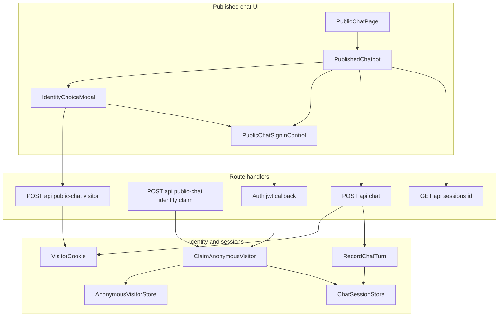
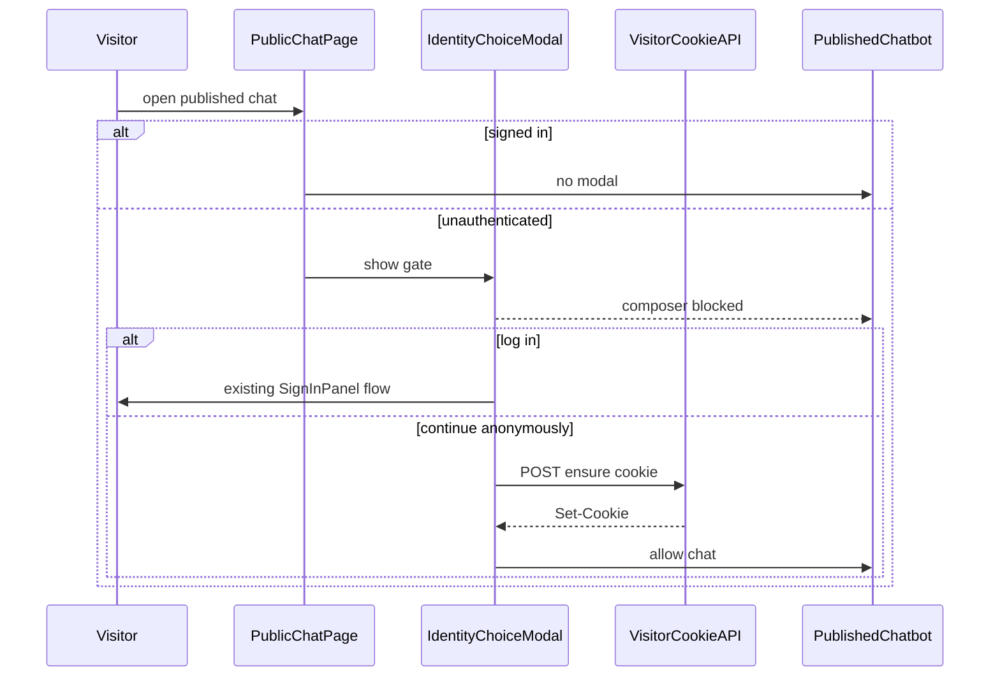
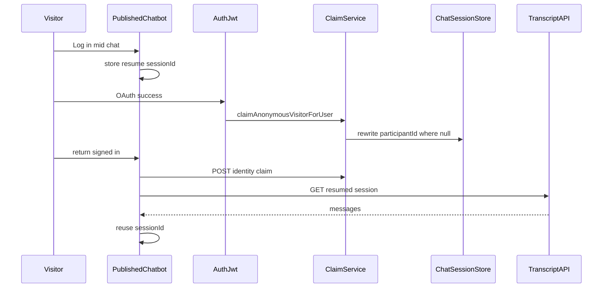
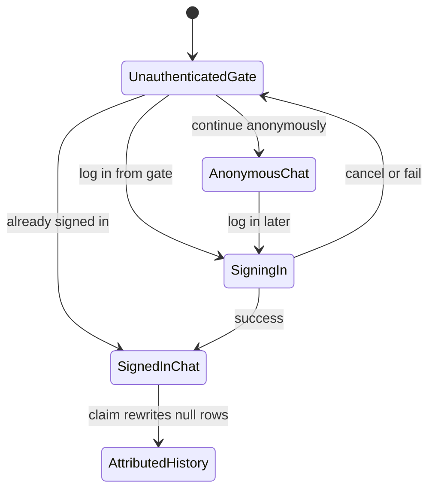

# Design Document: public-chat-identity

## Overview

**Purpose**: This feature identifies public-chat visitors as either a signed-in account or a distinct anonymous visitor remembered on that browser, so researchers can tell anonymous people apart and so a later login on the same browser can attach still-unattributed chats to that account.

**Users**: Unauthenticated learners see a login-first identity gate on published chat. Educators and researchers see attributed names in My sessions, bot activity, workspace activity, and downloads.

**Impact**: Extends `bot-activity-sessions` identity: anonymous public-chat rows gain `anonymousVisitorId`; a claim step may promote `participantId` from null to a user id. Sharing, recording-notice, editor-test, and inference behavior stay as they are.

### Goals

- Gate unauthenticated published-chat visits with an English, non-dismissible modal (login primary, anonymous secondary) on every open or reload.
- Remember an anonymous visitor id on that browser, stamp it onto recorded public sessions without name or email, and keep unattributed labels as `Anonymous`.
- On later sign-in, record the visitor-to-user link, rewrite still-unattributed sessions, and keep an in-progress conversation as one session.
- Expose distinct unattributed visitor ids in activity downloads.

### Non-Goals

- Forced login; identity gates on editor tests or educator surfaces.
- Cross-device anonymous identity; unique-visitor dashboards.
- New auth providers; changes to sharing/opt-out/deletion except who a session belongs to.
- Replacing activity/My sessions/export products owned by `bot-activity-sessions`.

## Boundary Commitments

### This Spec Owns

- The published-chat identity gate, post-anonymous login control, and English privacy copy.
- Cookie `tp_anonymous_visitor_id` and APIs that issue or claim it.
- Mapping rows `(anonymousVisitorId, userId, linkedAt)`.
- Additive `anonymousVisitorId` on public-chat `ChatSessionRecord`s and the one-way promotion of still-unattributed rows.
- CSV/JSON export field `anonymousVisitorId`.
- Tab-local resume of `sessionId` across the sign-in round-trip.

### Out of Boundary

- Chat inference, visualization, sharing toggle semantics, anonymous-unshared skip/discard, editor-test recording.
- Activity/My sessions/workspace list UI except that they consume rewritten `participantId` / `participantName`.
- Auth providers, `SignInPanel` internals, and `proxy.ts` matchers (`/chat` stays public).
- IP, user-agent, or other PII on anonymous rows.

### Allowed Dependencies

- Auth.js `auth()`, `signIn`, jwt on-sign-in side effects; `SignInPanel` + `callbackUrl`.
- `lib/chat-session-store` and `lib/chat-session-api` (transcript + export).
- Display-name resolution already used by `recordChatTurn`.
- Store façade: `shouldUsePostgres()`, `ADD COLUMN IF NOT EXISTS`, `.data/*.json`.
- Dependency direction: `lib/public-chat-identity` (types → cookie → store → claim) → chat-session-store/record-chat-turn → route handlers → `PublishedChatbot`. UI never reads Postgres; clients never send the visitor id.

### Revalidation Triggers

- Change to `ChatSessionRecord` identity fields or upsert `identitiesMatch`.
- Change to Auth.js callback cookie availability or `callbackUrl` behavior.
- Change to owner export CSV columns.
- Change to anonymous sharing-off discard (nothing to attribute).

## Architecture

### Existing Architecture Analysis

- `/chat/[appId]` is public, has no `auth()` props, and enables the composer immediately.
- Identity for recording comes only from the Auth.js session. Anonymous is `participantId: null`. Upsert requires matching `participantId`; Postgres updates do not rewrite participant columns.
- Sign-in already supports `callbackUrl=/chat/...`. On-sign-in work already lives in the jwt callback.
- No app cookie helpers exist. Dialogs are feature-local overlays.

### Architecture Pattern & Boundary Map

**Selected pattern**: New public-chat identity domain plus additive session identity. Claim rewrites still-unattributed rows so existing readers stay unchanged.



**Architecture Integration**:

- Existing patterns preserved: store façade, swallowed recording failures, `SignInPanel` OAuth, `Anonymous` label for null names.
- New components exist because visitor cookie, mapping, and claim are not session-list concerns.
- Steering: server-only persistence and cookies; `"use client"` only for the gate and resume helpers.

### Technology Stack

| Layer | Choice / Version | Role in Feature | Notes |
|-------|------------------|-----------------|-------|
| Frontend | Next.js 16 App Router, React 19 | Gate, sign-in CTA, sessionStorage resume | No new UI library |
| Auth | next-auth 5.0.0-beta.30 | Existing OAuth + jwt claim hook | No new providers |
| Cookies | `next/headers` `cookies()` | HttpOnly visitor id | No new dependency |
| Data | `@vercel/postgres` + JSON fallback | Session column + mapping table | Same façade as other stores |

## File Structure Plan

```
lib/public-chat-identity/
  types.ts                 # Visitor id and claim result types
  copy.ts                  # English modal strings
  cookie.ts                # Cookie name, options, read/ensure
  store.ts                 # anonymous_visitor_links façade
  claim.ts                 # Map + reattribute orchestration
components/public/
  IdentityChoiceModal.tsx  # Non-dismissible gate
  PublicChatSignInControl.tsx
  conversation-resume.ts   # sessionStorage resume helper
app/api/public-chat/visitor/route.ts
app/api/public-chat/identity/claim/route.ts
scripts/verify-public-chat-identity-claim.ts
scripts/verify-public-chat-identity-cookie.ts
scripts/verify-public-chat-identity-gate.ts
```

### Modified Files

- `app/chat/[appId]/page.tsx` — pass `isSignedIn`, `chatCallbackUrl`, OAuth flags from `auth()` and env.
- `components/public/PublishedChatbot.tsx` — host gate, block composer, anonymous login CTA, resume hydration.
- `components/public/chat-recording.ts` — optional initial `sessionId` for resume.
- `lib/chat-session-store/types.ts` — optional `anonymousVisitorId`.
- `lib/chat-session-store/store.ts` — column, `attributeSessionsForVisitor`, one-way identity promotion on upsert.
- `lib/chat-session-store/record-chat-turn.ts` — stamp visitor id from server cookie input.
- `app/api/chat/route.ts` — ensure/read visitor cookie; pass id into recording; never take it from the body.
- `auth.ts` — jwt on-sign-in calls `claimAnonymousVisitorForUser`.
- `lib/chat-session-api/export.ts` — CSV/JSON `anonymousVisitorId`.
- `scripts/verify-activity-export.ts`, `verify-chat-session-store-write.ts`, `verify-chat-session-recording.ts`, `verify-published-chat-recording.ts` — identity cases.

## System Flows

### Identity gate and anonymous start



Key decisions: the gate runs on every unauthenticated open or reload even if the cookie already exists. Overlay click and Escape do not count as a choice. Login uses existing `SignInPanel` with `callbackUrl` equal to the current public-chat path.

### Claim and conversation resume



Key decisions: jwt claim and page claim share one idempotent function. Resume is tab `sessionStorage` only. Ordinary reload without a sign-in round-trip still starts a new conversation.

### Visitor identity lifecycle



Already-attributed rows stay with the earlier user when another person later signs in on the same browser.

## Requirements Traceability

| Requirement | Summary | Components | Interfaces | Flows |
|-------------|---------|------------|------------|-------|
| 1.1 | Modal before chat | IdentityChoiceModal, PublishedChatbot | State | Identity gate |
| 1.2 | No modal when signed in | PublicChatPage, PublishedChatbot | `isSignedIn` prop | Identity gate |
| 1.3 | Modal every unauthenticated visit | PublishedChatbot | State | Identity gate |
| 1.4 | English primary login, quiet anonymous | IdentityChoiceModal, copy.ts | State | Identity gate |
| 1.5 | Block participation while modal open | PublishedChatbot | State | Identity gate |
| 1.6 | No dismiss without a choice | IdentityChoiceModal | State | Identity gate |
| 2.1 | Existing sign-in flow | PublicChatSignInControl, SignInPanel | `callbackUrl` | Identity gate |
| 2.2 | Return to same chat signed in | PublicChatPage | `chatCallbackUrl` | Claim and resume |
| 2.3 | No modal after success | PublishedChatbot | `isSignedIn` | Claim and resume |
| 2.4 | Cancel returns to gate | IdentityChoiceModal | State | Identity gate |
| 3.1 | Anonymous chat without account | PublishedChatbot | Visitor API | Identity gate |
| 3.2 | Create visitor id | VisitorCookie, Visitor API | Cookie | Identity gate |
| 3.3 | Reuse visitor id | VisitorCookie | Cookie | Identity gate |
| 3.4 | Stamp sessions without profile PII | RecordChatTurn, Chat API | Service | Identity gate |
| 3.5 | Different browsers are distinct | VisitorCookie | Cookie | Visitor lifecycle |
| 3.6 | Forgotten cookie is a new visitor | VisitorCookie | Cookie | Visitor lifecycle |
| 4.1 | Login after anonymous | PublicChatSignInControl | State | Claim and resume |
| 4.2 | Return to same chat | PublicChatSignInControl | `callbackUrl` | Claim and resume |
| 4.3 | One continuous conversation | conversation-resume, ChatSessionStore | Transcript API | Claim and resume |
| 5.1 | Record visitor-user link | AnonymousVisitorStore, Claim | Service | Claim and resume |
| 5.2 | Treat unattributed sessions as that user | Claim, ChatSessionStore | Service | Claim and resume |
| 5.3 | Appear in My sessions | ChatSessionStore | existing list | Claim and resume |
| 5.4 | Activity shows display name | Claim | existing lists | Claim and resume |
| 5.5 | Do not steal claimed sessions | Claim, ChatSessionStore | Service | Visitor lifecycle |
| 5.6 | No cross-browser attach | VisitorCookie | Cookie | Visitor lifecycle |
| 6.1 | Unattributed label Anonymous | existing session-display | State | — |
| 6.2 | Unattributed stay out of My sessions | existing `participant_id` filter | Service | — |
| 6.3 | Download distinct visitor ids | export.ts | CSV/JSON | — |
| 6.4 | Attributed downloads match signed-in | export.ts, Claim | CSV/JSON | Claim and resume |
| 7.1 | Disclose remembered visitor id | copy.ts, IdentityChoiceModal | State | Identity gate |
| 7.2 | Disclose later linking | copy.ts, IdentityChoiceModal | State | Identity gate |

## Components and Interfaces

| Component | Domain/Layer | Intent | Req Coverage | Key Dependencies | Contracts |
|-----------|--------------|--------|--------------|------------------|-----------|
| IdentityChoiceModal | UI | Non-dismissible English gate | 1.1–1.6, 2.4, 3.1, 7.1, 7.2 | copy.ts P0, Visitor API P0, PublicChatSignInControl P0 | State |
| PublicChatSignInControl | UI | Start existing OAuth with chat callbackUrl | 2.1–2.3, 4.1, 4.2 | SignInPanel P0, conversation-resume P0 | State |
| PublishedChatbot | UI | Host gate, block composer, resume | 1.1–1.5, 3.1, 4.3 | Modal P0, claim API P0, transcript P1 | State |
| PublicChatPage | Route | Pass signed-in flag and callback path | 1.2, 2.2 | auth() P0 | State |
| VisitorCookie | Domain | Issue and read HttpOnly visitor cookie | 3.2–3.6, 5.6 | next/headers P0 | Service |
| AnonymousVisitorStore | Data | Persist visitor-user links | 5.1 | store façade P0 | Service |
| ClaimAnonymousVisitor | Domain | Link + rewrite unattributed sessions | 5.1–5.5, 6.4 | cookie, links, sessions, display name P0 | Service API |
| ChatSessionStore | Data | anonymousVisitorId + promotion | 3.4, 4.3, 5.2–5.5 | types P0 | Service |
| RecordChatTurn | Domain | Stamp cookie id, never body id | 3.4 | ChatSessionStore P0 | Service |
| Owner export | API | CSV/JSON visitor column | 6.3, 6.4 | ChatSessionRecord P0 | API |

### UI

#### IdentityChoiceModal

| Field | Detail |
|-------|--------|
| Intent | Force an English login-or-anonymous choice before public chat |
| Requirements | 1.1, 1.3, 1.4, 1.5, 1.6, 3.1, 7.1, 7.2 |

**Responsibilities & Constraints**

- Render only when `isSignedIn` is false.
- Primary button label: `Log in to continue`. Secondary text-style action: `Continue anonymously`.
- Copy from `lib/public-chat-identity/copy.ts` (privacy sentences required).
- Do not close on overlay click or Escape. No close control.
- Continue anonymously calls `POST /api/public-chat/visitor` and only then signals the parent to unlock chat.

**Implementation Notes**

- Follow existing `fixed inset-0` overlay styling; do not add a shared dialog primitive.
- Keep composer, attachments, voice, and sharing controls disabled while open.

#### PublicChatSignInControl

| Field | Detail |
|-------|--------|
| Intent | Reuse SignInPanel so login returns to this public chat |
| Requirements | 2.1, 2.2, 4.1, 4.2 |

**Implementation Notes**

- `callbackUrl` is the path the visitor opened (`/chat/{id-or-slug}` plus search).
- Before `signIn()`, write the resume record.
- After anonymous choice, a quieter `Log in` control on the chat chrome uses this same control.

#### PublishedChatbot

**Implementation Notes**

- New props: `isSignedIn`, `chatCallbackUrl`, `googleEnabled`, `microsoftEnabled`.
- Signed-in mount: skip modal; `POST` claim; if resume matches `appId`, hydrate transcript and reuse `sessionId`.
- Unauthenticated mount: always show the modal, even when a visitor cookie exists.

### Domain

#### VisitorCookie

| Field | Detail |
|-------|--------|
| Intent | Remember one anonymous visitor id on this browser |
| Requirements | 3.2, 3.3, 3.5, 3.6, 5.6 |

**Contracts**: Service [x]

##### Service Interface

```typescript
export const ANONYMOUS_VISITOR_COOKIE = "tp_anonymous_visitor_id";

export type VisitorCookieOptions = {
  httpOnly: true;
  sameSite: "lax";
  path: "/";
  maxAge: number;
  secure: boolean;
};

export function visitorCookieOptions(secure: boolean): VisitorCookieOptions;

export function isAnonymousVisitorId(value: string): boolean;

export async function readAnonymousVisitorId(): Promise<string | null>;

export async function ensureAnonymousVisitorCookie(): Promise<string>;
```

- Preconditions: `ensureAnonymousVisitorCookie` runs in a route handler or Server Action.
- Postconditions: a UUID v4 cookie is present; existing valid ids are reused.
- Invariants: never logs the id in client responses other than `Set-Cookie`; never accepts a client-supplied id.

Cookie `Max-Age` is 34_560_000 seconds (400 days). `secure` is true on HTTPS.

#### AnonymousVisitorStore

| Field | Detail |
|-------|--------|
| Intent | Record that a visitor id was used by a user account |
| Requirements | 5.1 |

**Contracts**: Service [x]

##### Service Interface

```typescript
export type AnonymousVisitorLink = {
  anonymousVisitorId: string;
  userId: string;
  linkedAt: string;
};

export async function rememberAnonymousVisitorLink(
  anonymousVisitorId: string,
  userId: string
): Promise<void>;
```

- Postconditions: a row for that pair exists; repeats are no-ops.
- Invariants: the same visitor id may link to multiple users over time; that does not move already-attributed sessions.

#### ClaimAnonymousVisitor

| Field | Detail |
|-------|--------|
| Intent | On sign-in, link the cookie visitor and promote still-anonymous sessions |
| Requirements | 5.1, 5.2, 5.3, 5.4, 5.5, 6.4 |

**Contracts**: Service [x] / API [x]

##### Service Interface

```typescript
export type ClaimAnonymousVisitorResult =
  | { status: "claimed"; visitorId: string; attributedCount: number }
  | { status: "no-visitor" };

export async function claimAnonymousVisitorForUser(
  userId: string
): Promise<ClaimAnonymousVisitorResult>;

export async function attributeSessionsForVisitor(input: {
  anonymousVisitorId: string;
  userId: string;
  participantName: string;
}): Promise<{ attributedCount: number }>;
```

- Preconditions: `userId` is a signed-in account id.
- Postconditions: mapping remembered; rows with that `anonymousVisitorId` and `participantId === null` receive `userId` and display name; rows with a non-null `participantId` are unchanged.
- Invariants: claim is idempotent; missing cookie yields `no-visitor` without error to the user.

##### API Contract

| Method | Endpoint | Request | Response | Errors |
|--------|----------|---------|----------|--------|
| POST | /api/public-chat/visitor | empty | `{ ok: true }` plus Set-Cookie | 500 |
| POST | /api/public-chat/identity/claim | empty | `{ ok: true, status: "claimed" \| "no-visitor" }` | 401, 500 |

Claim route: `auth()` required; visitor id taken only from the cookie.

Jwt callback: when `user` and `token.userId` are present, call `claimAnonymousVisitorForUser` inside try/catch like invite accept. Failure logs and does not block sign-in.

#### ChatSessionStore identity extension

| Field | Detail |
|-------|--------|
| Intent | Store visitor id and allow one-way anonymous to signed-in promotion |
| Requirements | 3.4, 4.3, 5.2, 5.5 |

**Contracts**: Service [x]

Identity match after this spec:

1. Same `appId` and same `participantId` (existing).
2. Or same `appId`, existing `participantId` is null, incoming `participantId` is the signed-in user, and both sides share the same non-null `anonymousVisitorId` (cookie-derived). Then persist the new participant fields.

Editor-test rows keep `anonymousVisitorId` null. `listSessionsForUser` stays `participant_id = userId` (5.3, 6.2).

#### RecordChatTurn

**Implementation Notes**

- `RecordChatTurnInput` gains `anonymousVisitorId?: string | null` supplied by `/api/chat` from the cookie.
- Ignore any visitor id on the recording JSON body.
- Anonymous public persist still skips when sharing is off (`anonymous-unshared`).
- Signed-in public turns may still stamp `anonymousVisitorId` when the cookie exists (lineage) without changing `participantId`.

## Data Models

### Domain Model

- **AnonymousVisitorId**: UUID v4, not a user id, not a display name.
- **AnonymousVisitorLink**: many-to-many over time; audit of who signed in on a browser that held that id.
- **ChatSession**: still the activity aggregate. Attribution changes participant fields on the session; messages stay on the same `id`.

Invariants:

- Unattributed public anonymous: `participantId` and `participantName` null, `anonymousVisitorId` set, UI label `Anonymous`.
- Attributed: `participantId` / `participantName` like any signed-in session; `anonymousVisitorId` retained when known.
- Signed-in from the first message with no cookie: `anonymousVisitorId` null.

### Logical Data Model

- `anonymous_visitor_links`: primary key `(anonymous_visitor_id, user_id)`; `linked_at`.
- `chat_sessions.anonymous_visitor_id`: nullable text; index for claim updates.

JSON fallback: `.data/anonymous-visitor-links.json` plus optional field on `.data/chat-sessions.json` records (missing means null).

### Physical Data Model

```sql
ALTER TABLE chat_sessions
  ADD COLUMN IF NOT EXISTS anonymous_visitor_id TEXT;

CREATE INDEX IF NOT EXISTS idx_chat_sessions_anonymous_visitor
  ON chat_sessions (anonymous_visitor_id)
  WHERE anonymous_visitor_id IS NOT NULL;

CREATE TABLE IF NOT EXISTS anonymous_visitor_links (
  anonymous_visitor_id TEXT NOT NULL,
  user_id TEXT NOT NULL,
  linked_at TIMESTAMPTZ NOT NULL DEFAULT NOW(),
  PRIMARY KEY (anonymous_visitor_id, user_id)
);
```

Claim update:

```sql
UPDATE chat_sessions
SET participant_id = $userId,
    participant_name = $name
WHERE anonymous_visitor_id = $visitorId
  AND participant_id IS NULL;
```

Postgres session UPDATE on promotion also writes `participant_id` and `participant_name` (today those columns are insert-only).

### Data Contracts & Integration

**Recording**: client payload unchanged. Server attaches `anonymousVisitorId` from the cookie.

**Export CSV columns** (additive):

`sessionId, appId, appName, surface, participantId, participantName, anonymousVisitorId, createdAt, updatedAt, messageIndex, role, content, messageAt, imageOmitted`

Unattributed: `participantId` empty, `participantName` `Anonymous`, `anonymousVisitorId` filled. Attributed: account id and display name, visitor id filled when present. Native signed-in with no cookie: visitor column empty.

**JSON export**: `ChatSessionRecord` includes `anonymousVisitorId: string | null`.

**Resume storage** (tab only):

```typescript
type PublicChatResume = { appId: string; sessionId: string };
```

Key: `tp_public_chat_resume`. Not a visitor id.

## Error Handling

### Error Strategy

Identity failures must not block model replies once chatting is allowed. The gate may stay closed if the visitor cookie cannot be issued.

### Error Categories and Responses

- **Visitor POST fails**: keep the modal open; English retry is the anonymous action again. Do not unlock the composer.
- **Sign-in cancel/fail**: visitor returns to `/chat` unsigned; modal shows again (2.4).
- **Claim fails**: log server-side; signed-in chat still proceeds as that user; unattributed history may remain until a later successful claim.
- **Transcript resume fails**: start a fresh welcome thread; do not show a blocking error; later turns use a new `sessionId`.
- **Recording failure**: existing swallow; chat continues.
- **Forged visitor id in JSON**: ignored.

### Monitoring

Log claim failures next to invite-accept logging. Do not print visitor ids in client-visible error JSON.

## Testing Strategy

Project tests remain `npx tsx scripts/verify-*.ts` (JSON-file stores). No new test runner.

### Unit Tests

- Cookie helpers: reuse valid UUID; reject invalid; options are HttpOnly, Lax, Path `/`.
- `copy.ts` includes remembered-visitor and later-linking sentences (7.1, 7.2).
- `attributeSessionsForVisitor`: promotes null `participantId` rows; leaves another user’s rows unchanged (5.2, 5.5).
- Upsert promotion: null → user id allowed when visitor ids match; other mismatches still throw.
- Recording ignores body visitor ids; stamps cookie id; stores no name/email for anonymous (3.4).

### Integration Tests

- Claim with cookie: mapping row + session rewrite; My sessions filter would include the row (`participantId` set).
- Claim without cookie: `no-visitor`.
- Export CSV header includes `anonymousVisitorId`; unattributed vs attributed cells (6.3, 6.4).
- `createPublicChatRecording({ sessionId })` reuses the id (4.3).

### E2E / UI (manual)

- Unsigned `/chat/{id}`: modal, composer dead, overlay does not dismiss.
- Signed-in `/chat/{id}`: no modal.
- Reload while unsigned: modal again despite existing cookie.
- Continue anonymously then send a message: activity shows `Anonymous`; download has a stable visitor id.
- Log in from the gate: return to the same path, no modal.
- Continue anonymously, chat, Log in: same transcript continues; My sessions and activity show the user name; a second user on that browser does not take the first user’s sessions.

## Security Considerations

- Visitor id is a tracker, not an account. Modal copy discloses memory and later linking.
- HttpOnly + server-only read; UUID v4; do not put the id in recording JSON.
- Claim requires a signed-in session; it cannot reassign rows that already have a `participantId`.
- `/api/public-chat/visitor` is public by design and only sets a cookie.
- Do not store IP or user-agent. This spec supersedes `bot-activity-sessions` “no cookie” for this cookie only.

## Migration Strategy

- Runtime `ADD COLUMN IF NOT EXISTS` and `CREATE TABLE IF NOT EXISTS` (no migration framework).
- Existing anonymous rows keep `anonymousVisitorId` null; they stay indistinguishable and are not retroactively grouped.
- CSV header change is forward-only; update `verify-activity-export`.
- Rollback: stop writing the cookie and claim; leftover column/table are unused. Rows already promoted stay attributed.
