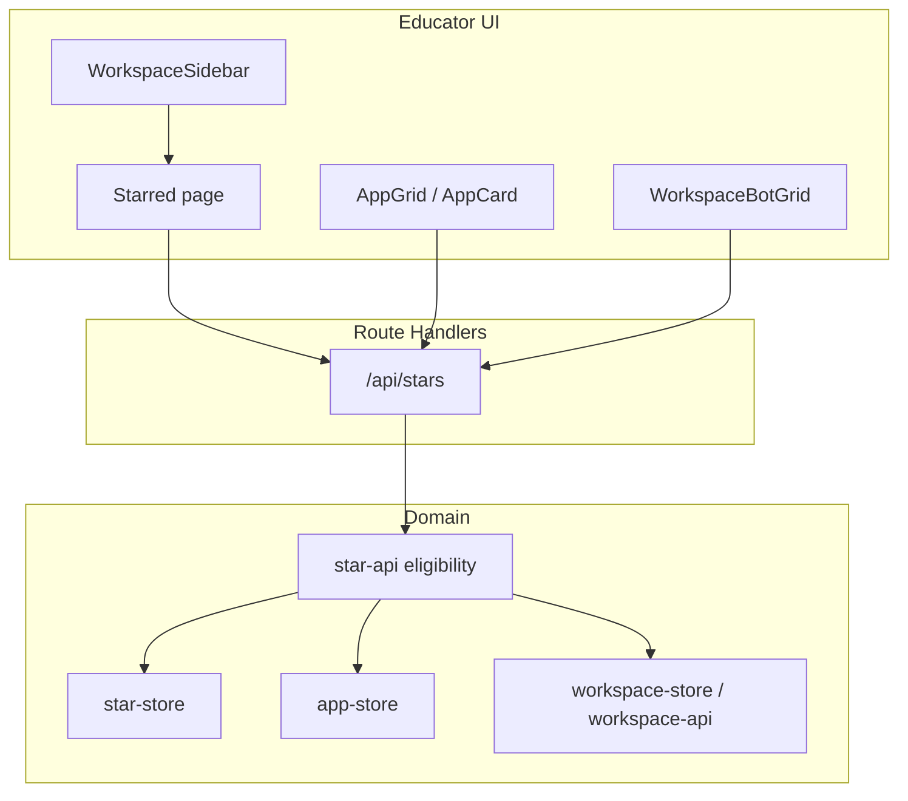
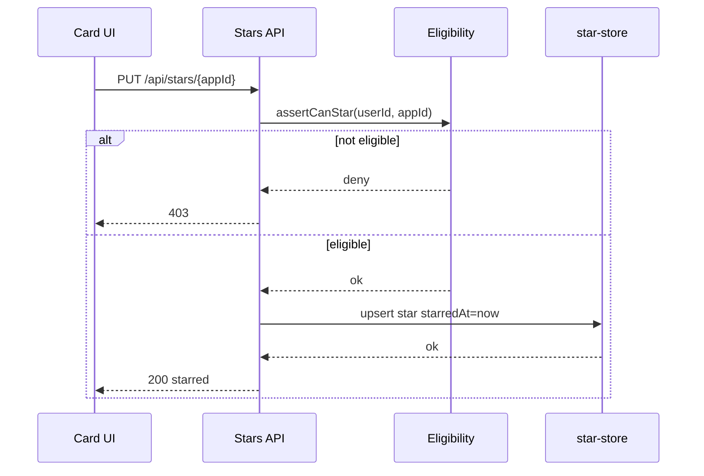
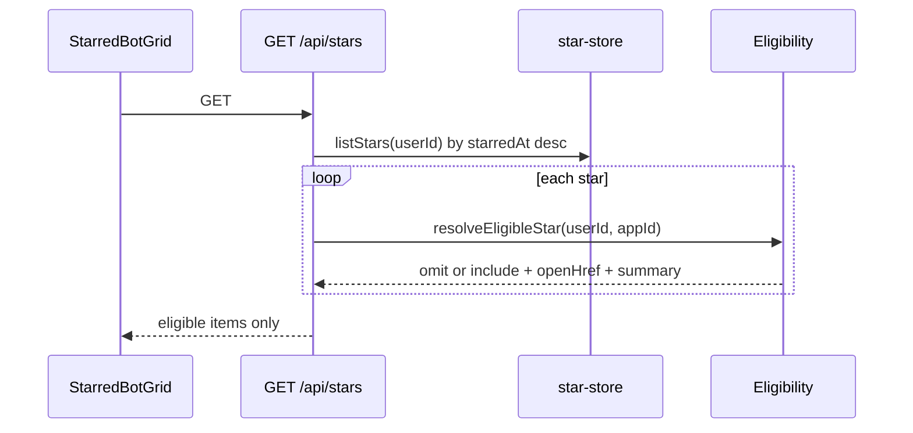

# Design Document: starred-bots

## Overview

This feature adds a Playlab-aligned personal **Starred** library so signed-in educators can pin bots they can currently access—bots they own and bots visible through Workspace membership (including peers’ bots)—and reopen them from a dedicated Starred view ordered by most recently starred.

**Users**: Teachers and educator-builders who browse My bots and Workspaces.

**Impact**: Activates the Library **Starred** navigation, removes the non-functional **Recently Used** placeholder, and adds account-scoped star preferences without changing bot ownership, Publish, Community, or Workspace ACL definitions.

### Goals

- Deliver star / unstar, Starred library page, sidebar navigation, and account-scoped persistence (requirements 1–7).
- Eligibility follows access: owned **or** Workspace-visible under existing educator-workspaces rules.
- Open owned bots in the editor; open non-owned accessible bots via existing peer non-edit inspect.
- Leave Community-only starring deferred.

### Non-Goals

- Recently Used / automatic recents.
- Starring Community gallery bots without ownership or Workspace visibility.
- Redefining Workspace roles, placements, or building permissions.
- Co-edit of peer bots; migrating off `@vercel/postgres`.

## Boundary Commitments

### This Spec Owns

- Account-scoped star preference data: `(userId, appId, starredAt)`.
- Star HTTP APIs and eligibility resolution (own **or** Workspace-visible).
- Starred library page UI and star toggles on My bots / Workspace bot lists.
- Library sidebar: enable Starred, remove Recently Used, active-state wiring.
- Auth proxy coverage for `/starred` and `/api/stars*`.

### Out of Boundary

- Workspace membership, placements, building-permission matrix, peer inspect implementation (consume only).
- Bot authoring, Publish/chat, Community ranking.
- Organization / Collections (`workspace-collections`).
- Changing `AppConfig` ownership or embedding stars on bot records.

### Allowed Dependencies

- Auth.js `auth()` / `session.user.id`.
- `lib/app-store` for owned bot load/list metadata.
- `lib/workspace-store` + `lib/workspace-api` for membership, placements, `assertWorkspaceAction` (visibility / peer inspect).
- `lib/workspace-ui/peer-preview` for peer open hrefs.
- Existing UI: `AppShell`, `AppCard`/`AppGrid`, `WorkspaceBotGrid`, empty-state patterns.
- Dual persistence pattern already used by apps/workspaces stores.

### Revalidation Triggers

- Change to Workspace visibility or peer-inspect semantics (permission (b) / roles).
- Change to editor access rules for non-owners.
- Introduction of Community starring as required behavior.
- Change to app identity / ownership model affecting `(userId, appId)` stars.

## Architecture

### Existing Architecture Analysis

- Personal bots: owner-scoped `lib/app-store` + `GET /api/apps` + `AppGrid`/`AppCard`.
- Workspace peer visibility: placements + `bots.viewOthers` / `bots.inspectPeer`; peer UI at `/workspace/{id}/bots/{appId}`.
- No exported “visible in any workspace” helper today; star eligibility must compose existing gates.
- Sidebar Starred / Recently Used are disabled placeholders; `/starred` not in `proxy.ts`.

### Architecture Pattern & Boundary Map

**Selected pattern**: Personal preference domain (`star-store` + `star-api`) + thin UI/shell wiring. Eligibility is a read-time composition over app-store and workspace ACL—not a second permission matrix.



**Steering compliance**: Store façades in `lib/`; route handlers thin; UI does not know Postgres vs JSON.

### Technology Stack

| Layer | Choice | Role in Feature | Notes |
|-------|--------|-----------------|-------|
| Frontend | Next.js App Router + React client grids | `/starred`, toggles, sidebar | Match dashboard empty/error patterns |
| Backend | Route handlers + `lib/star-api` | Auth, eligibility, CRUD stars | No new npm deps |
| Data | Dual-store (`@vercel/postgres` or `.data/stars.json`) | Persist stars | Same chooser as apps/workspaces |
| Auth | Auth.js session | Gate page + APIs | Extend `proxy.ts` |

## File Structure Plan

### Directory Structure

```
lib/star-store/
  types.ts              # StarRecord types
  store.ts              # Dual-store façade: list/add/remove
  store.selftest.ts

lib/star-api/
  eligibility.ts        # own OR workspace-visible; open target
  stars.ts              # list/star/unstar orchestration for handlers
  eligibility.selftest.ts
  stars.selftest.ts

lib/star-ui/
  nav.ts                # STARRED_HREF, active pathname helpers
  nav.selftest.ts

app/api/stars/
  route.ts              # GET list
app/api/stars/[appId]/
  route.ts              # PUT star, DELETE unstar

app/starred/
  page.tsx              # Auth-aware page shell
components/starred/
  StarredBotGrid.tsx    # Client list + empty/error states

components/dashboard/
  AppCard.tsx           # Star toggle props
  AppGrid.tsx           # Wire star state / mutations
components/workspace/
  WorkspaceBotGrid.tsx  # Star toggle on cards
components/app-shell/
  WorkspaceSidebar.tsx  # Enable Starred; remove Recently Used

proxy.ts                # Matcher: /starred, /api/stars*
proxy.selftest.ts       # Assert matcher strings
lib/workspace-ui/nav.ts # Optional: export STARRED alongside MY_BOTS if preferred single nav module
```

> Prefer `lib/star-ui/nav.ts` for `STARRED_HREF` to keep star feature cohesive; sidebar may import from there. Do not invent a second ACL module inside star-store.

### Modified Files

- `components/dashboard/AppCard.tsx` — optional `starred`, `onToggleStar`, busy/disabled
- `components/dashboard/AppGrid.tsx` — load starred set; call star APIs
- `components/workspace/WorkspaceBotGrid.tsx` — star control for visible placements
- `components/app-shell/WorkspaceSidebar.tsx` — Starred Link + active; delete Recently Used
- `proxy.ts` / `proxy.selftest.ts` — auth coverage

## System Flows

### Star toggle



### Starred list (filter ineligible)



**Flow decisions**: Lazy filter on read (no background job). Unstar is DELETE even if already ineligible (idempotent 200/204). Re-star refreshes `starredAt` for sort (Playlab “most recently starred”).

## Requirements Traceability

| Requirement | Summary | Components | Interfaces | Flows |
|-------------|---------|------------|------------|-------|
| 1.1–1.2 | Star owned / Workspace-visible | Eligibility, StarsAPI, star-store | PUT `/api/stars/:appId` | Star toggle |
| 1.3 | Unstar | StarsAPI, star-store | DELETE `/api/stars/:appId` | Star toggle |
| 1.4–1.5 | Starred indication | AppCard, WorkspaceBotGrid, StarredBotGrid | UI state | — |
| 1.6 | Deny inaccessible | Eligibility | 403 | Star toggle |
| 1.7 | No ownership side effects | StarsAPI | — | — |
| 2.1–2.3 | List / sort / empty | StarredBotGrid, StarsAPI | GET `/api/stars` | Starred list |
| 2.4–2.5 | Open editor vs peer | Eligibility open target, StarredBotGrid | `openHref` | Starred list |
| 2.6 | Load error | StarredBotGrid | non-200 handling | Starred list |
| 3.1–3.4 | Sidebar Starred; no Recently Used | WorkspaceSidebar, star-ui/nav | `STARRED_HREF` | — |
| 4.1–4.4 | Account persistence | star-store | dual-store | — |
| 5.1–5.3 | Auth + eligible-only list | proxy, StarsAPI, Eligibility | 401 / filter | Starred list |
| 6.1–6.4 | Deleted / inaccessible omitted | Eligibility, GET list | filter | Starred list |
| 7.1–7.4 | Toggles on My bots + Workspace; consistency | AppGrid, WorkspaceBotGrid, AppCard | PUT/DELETE | Star toggle |

## Components and Interfaces

| Component | Domain/Layer | Intent | Req Coverage | Key Dependencies | Contracts |
|-----------|--------------|--------|--------------|------------------|-----------|
| star-store | Data | Persist personal stars | 1, 4 | Postgres/JSON | Service |
| star-api eligibility | Domain | Access check + open target | 1, 2, 5, 6 | app-store, workspace-api | Service |
| star-api stars | Domain | List/star/unstar for HTTP | 1–6 | star-store, eligibility | Service |
| Stars routes | API | HTTP boundary | 1–6 | auth, star-api | API |
| Starred page + grid | UI | Library view | 2, 5, 6 | Stars GET | UI |
| AppCard / AppGrid | UI | My bots star toggle | 1, 7 | Stars API | UI |
| WorkspaceBotGrid | UI | Workspace star toggle | 1, 7 | Stars API | UI |
| WorkspaceSidebar | UI | Nav Starred / remove Recents | 3 | star-ui/nav | UI |
| proxy | Infra | Auth gate | 5 | — | Matcher |

### Domain / Data

#### star-store

| Field | Detail |
|-------|--------|
| Intent | Authoritative persistence for personal stars |
| Requirements | 1.1–1.3, 4.1–4.4 |

**Responsibilities & Constraints**
- Upsert/remove by `(userId, appId)`; list ordered by `starredAt` descending.
- Unique key is `(userId, appId)` only; `starredAt` is a column updated on star.
- No eligibility logic inside the store (keep persistence dumb).

**Dependencies**
- Outbound: `@vercel/postgres` or filesystem JSON (P0)
- Inbound: star-api (P0)

##### Service Interface

```typescript
type StarRecord = {
  userId: string;
  appId: string;
  starredAt: string; // ISO-8601
};

async function listStarsForUser(userId: string): Promise<StarRecord[]>;
async function starApp(userId: string, appId: string, at?: Date): Promise<StarRecord>;
async function unstarApp(userId: string, appId: string): Promise<void>; // idempotent
async function listStarredAppIds(userId: string): Promise<Set<string>>; // optional helper
```

- Invariants: at most one row per `(userId, appId)`; starring refreshes `starredAt`.

#### Eligibility (star-api)

| Field | Detail |
|-------|--------|
| Intent | Decide if user may star/see a bot and where Open goes |
| Requirements | 1.2, 1.6, 2.4–2.5, 5.3, 6.1–6.4 |

**Responsibilities & Constraints**
- **Owned**: `getAppById(appId, userId)` succeeds → eligible; open → `/app/{appId}/editor`.
- **Peer**: exists membership + placement in some Workspace the user belongs to **and** visibility allows seeing that placement (same rules as listing/inspecting peer bots) → eligible; open → `peerBotPreviewHref(workspaceId, appId)` for a chosen accessible workspace.
- Not Community-only: Community presence alone does not grant eligibility.
- Does not redefine building permissions; calls existing `assertWorkspaceAction` / placement list helpers.

##### Service Interface

```typescript
type StarOpenTarget =
  | { kind: "editor"; href: string }
  | { kind: "peer"; href: string; workspaceId: string };

type EligibleStar = {
  appId: string;
  title: string;
  description?: string;
  owned: boolean;
  open: StarOpenTarget;
  starredAt: string;
};

async function assertCanStar(userId: string, appId: string): Promise<
  { ok: true; owned: boolean } | { ok: false; reason: "not_found" | "forbidden" }
>;

async function resolveEligibleStar(
  userId: string,
  appId: string,
  starredAt: string
): Promise<EligibleStar | null>;
```

**Implementation Notes**
- Prefer extracting a small shared “visible placed bot for user” check colocated with workspace-api if duplication with `resolveVisiblePlacedBot` would drift; ownership of ACL semantics remains educator-workspaces.
- When multiple Workspaces expose the same peer bot, pick a stable rule (e.g. most recently joined Workspace, or lexicographic `workspaceId`) and document in code comments; UI only needs one valid peer href.

### API

#### Stars HTTP

| Method | Endpoint | Request | Response | Errors |
|--------|----------|---------|----------|--------|
| GET | `/api/stars` | — | `{ stars: EligibleStar[] }` ordered by `starredAt` desc | 401 |
| PUT | `/api/stars/[appId]` | — | `{ starred: true, starredAt }` | 401, 403, 404 |
| DELETE | `/api/stars/[appId]` | — | `{ starred: false }` | 401 |

Optional convenience for My bots/Workspace grids: GET may also power a lightweight `{ starredAppIds: string[] }` query via same list, or clients derive a Set from GET once per page load.

**Auth**: `auth()` required; no anonymous stars.

### UI

#### StarredBotGrid

- Loads GET `/api/stars`; empty dashed card + CTA text pointing to My bots / Workspaces; error banner on failure.
- Open uses `open.href` from payload (never invent editor URLs for `owned: false`).

#### AppCard / WorkspaceBotGrid star control

- Icon button toggles PUT/DELETE; optimistic UI allowed if reconciled on error.
- Surfaces that already show the bot may pass `starred` from a shared Set loaded once.

#### WorkspaceSidebar

- `Link` to `STARRED_HREF` (`/starred`) with `aria-current` / active styles like My bots.
- Remove Recently Used control entirely.

## Data Models

### Domain Model

- Aggregate: **UserStarSet** — preference rows for one user.
- Eligibility is not stored; computed at read/write gate time.

### Physical Data Model

**Postgres**

```sql
CREATE TABLE IF NOT EXISTS user_stars (
  user_id TEXT NOT NULL,
  app_id TEXT NOT NULL,
  starred_at TIMESTAMPTZ NOT NULL,
  PRIMARY KEY (user_id, app_id)
);
CREATE INDEX IF NOT EXISTS user_stars_user_starred_at_idx
  ON user_stars (user_id, starred_at DESC);
```

**JSON fallback** (`.data/stars.json`, override `STARS_DATA_FILE`):

```json
{
  "stars": [
    { "userId": "...", "appId": "...", "starredAt": "2026-07-21T16:00:00.000Z" }
  ]
}
```

**Integrity**: No FK cascade required; deleted apps simply fail eligibility and disappear from GET. Optional best-effort `unstar` on bot delete is nice-to-have, not required for Req 6.

## Error Handling

| Case | Behavior |
|------|----------|
| Unauthenticated | 401 API; page redirect via proxy to sign-in with `callbackUrl` |
| Star ineligible bot | 403; UI keeps prior star state |
| Bot missing | 404 on PUT; omit from GET |
| Store failure | 500; Starred page error state (not silent empty) |
| DELETE missing star | 200/204 idempotent success |

## Testing Strategy

### Selftests (primary)

| Area | File | Verifies |
|------|------|----------|
| star-store | `lib/star-store/store.selftest.ts` | upsert, refresh `starredAt`, list order, unstar idempotent (file backend) |
| eligibility | `lib/star-api/eligibility.selftest.ts` | own eligible; peer visible eligible; peer invisible denied; open targets editor vs peer |
| stars API logic | `lib/star-api/stars.selftest.ts` | list filters ineligible; star/unstar orchestration |
| nav | `lib/star-ui/nav.selftest.ts` | `STARRED_HREF`, active path rules |
| proxy | `proxy.selftest.ts` | matcher includes `/starred` and `/api/stars` |

### Manual / E2E checklist (post-impl)

1. Star owned bot on My bots → appears on `/starred` first; open → editor (1.1, 2.4, 7.1).
2. As Participant with (b) on, star peer bot on Workspace grid → `/starred` open → peer preview, not editor (1.2, 2.5, 7.2).
3. With (b) off as Participant, cannot star peer bot (1.6).
4. Delete owned starred bot → gone from Starred (6.1, 7.3).
5. Leave Workspace / unplace peer bot → peer entry omitted from Starred (6.2–6.3).
6. Sign in on second session → stars persist (4.1–4.2).
7. Sidebar: Starred works; Recently Used absent; active on `/starred` (3.1–3.3).
8. Unauthenticated `/starred` redirects to sign-in (5.1).

## Security & Privacy

- Stars are private to `userId`; list/toggle always session-scoped.
- Eligibility prevents starring bots the user cannot see.
- Peer open never grants PATCH/editor access.
- No star data on public Community responses.

## Supporting References

- `.kiro/specs/starred-bots/research.md` — discovery and decisions
- `.kiro/specs/educator-workspaces/design.md` — placements, permission (b), peer inspect
- Playlab Navigating / Starred Apps changelog — product alignment
