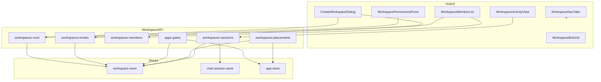
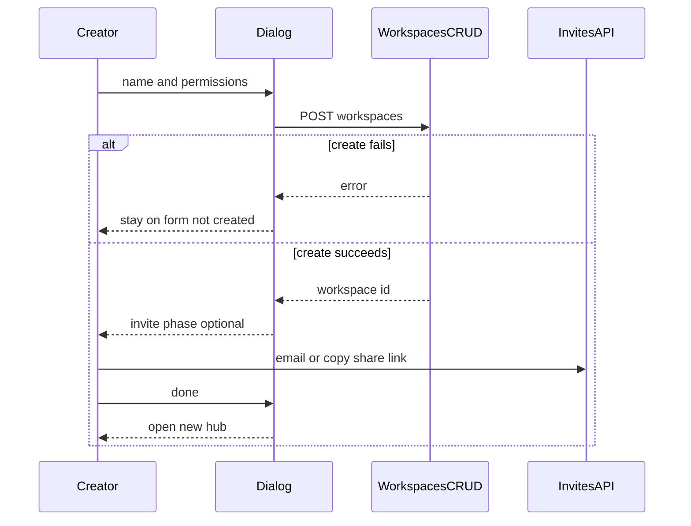
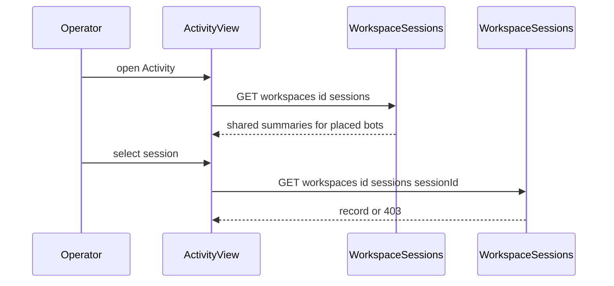
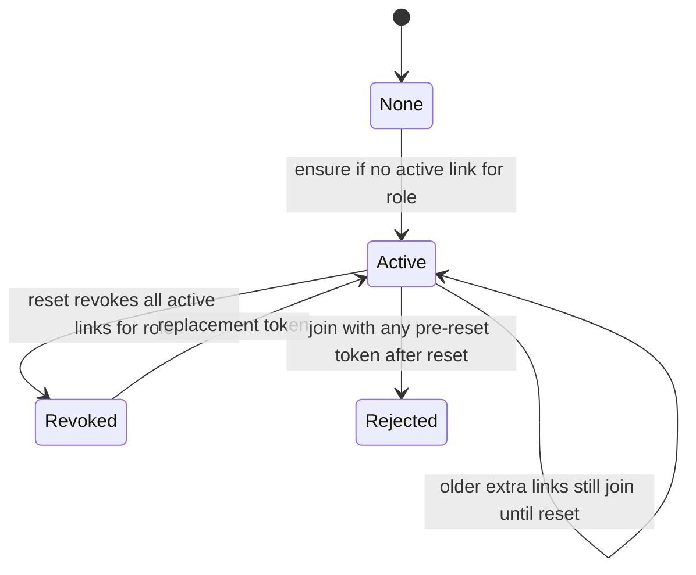

# Technical Design: workspace-hub-improvements

## Overview

**Purpose**: This feature improves the existing educator Workspace hub so Owners, Facilitators, and Participants see only the sections they can use, invite with a reusable share link, review shared chat sessions across placed bots, set a Workspace Assisted Authoring default, and create a Workspace with permissions and optional invite in a viewport-level dialog.

**Users**: Workspace Owners and Facilitators operate a course or cohort from Settings, Members, and Activity. Participants use Bots (and leave) without admin chrome. Creators set building permissions at create time.

**Impact**: Extends `educator-workspaces` hub navigation, invite cardinality, and settings; adds Workspace-scoped session list and transcript routes for operators; applies `assisted-authoring-mode` from a Workspace default on create-into and first place. Does not add a new product area.

### Goals

- Role-visible hub tabs: Participant sees Bots only; Owner/Facilitator see Bots, Settings, Members, Activity (no Invites tab).
- Members hosts email invite plus one current reusable invitation link per join role, with copy and reset, and pending email rows—not an Active invites link list.
- Workspace Activity lists shared sessions for currently placed bots and opens read-only transcripts; unshared sessions stay hidden.
- Workspace Assisted Authoring default (OFF for new Workspaces) applied only on create-into-Workspace and first placement; per-bot Settings still override.
- Viewport-portaled create dialog: name, four building permissions (default all off), optional invite after the Workspace exists.

### Non-Goals

- Renaming Owner, changing roles, or changing default building permission (b).
- Replacing per-bot Activity, My sessions, learner sharing toggle, or published-chat notice copy.
- Using the membership/placement event feed as Activity.
- Session deletion, analytics, AI analysis, Organization, Collections.
- New npm dependencies.

## Boundary Commitments

### This Spec Owns

- Hub tab model, visibility by role, and resolution of legacy `?tab=invites` / disallowed tabs.
- Invitation-link cardinality: one active link invite per `(workspaceId, role)`; reset/replace; Members composition; pending email rows.
- Workspace-scoped shared session **list** and **transcript** APIs for hub Activity (`GET /api/workspaces/:workspaceId/sessions` and `GET /api/workspaces/:workspaceId/sessions/:sessionId`). An Owner or Facilitator may read a **shared** session whose bot is **currently placed** in **that** Workspace.
- `Workspace.assistedAuthoringModeDefault` persistence and apply-on-create-into / apply-on-first-place.
- Viewport-portaled create dialog, create POST accepting building permissions, Participant leave on Bots.
- Short role-explanation copy and hover/`?` control.

### Out of Boundary

- Session recording, sharing toggle, per-bot owner list/export, My sessions, and `GET /api/sessions/:sessionId` reader rules (`bot-activity-sessions`). That personal/owner transcript path stays participant-or-bot-owner only.
- Assisted Authoring ON/OFF editor behaviors (`assisted-authoring-mode`).
- Invite join URL shape `/workspace/invite/:token`, email accept-on-sign-in, Owner delete/transfer (`educator-workspaces`).
- `GET /api/workspaces/:id/activity` event feed (must not be reused for chat Activity).
- Student Publish, Community, peer inspect/duplicate, permission (b) default value (stays off).

### Allowed Dependencies

- `@/auth`; `lib/workspace-store`, `lib/workspace-api`, `lib/workspace-ui`; `lib/chat-session-store` (read sessions; do not change personal transcript authz in `lib/chat-session-api`); `lib/app-store` (update `assistedAuthoringMode` on place/create-into); `components/sessions/*`.
- React `createPortal` (already in React 19). No new packages.
- Dependency direction: types/store → API modules → routes → UI. UI never imports Postgres/file details. `lib/chat-session-api` does not import `workspace-store`. Chat-session store does not take a `workspaceId` column; placement remains the Workspace source of truth.

### Revalidation Triggers

- Transcript read rules for Workspace Activity (`GET /api/workspaces/:workspaceId/sessions/:sessionId`).
- Invite uniqueness (one active link per role) or join token format.
- Workspace schema field `assistedAuthoringModeDefault`.
- Hub tab IDs or `?tab=` resolution.
- Members list authorization (Participants no longer receive the roster).

## Architecture

### Existing Architecture Analysis

- Hub is one client page (`WorkspaceHub`) with `?tab=`. Tabs are a static list; role is unused for visibility. Legacy `/workspace/:id/settings` redirects into the hub.
- Invites: `createInvite` always inserts; links are already many-joiner; no one-per-role invariant. UI lists all active invites.
- Chat sessions: `listSessionsForApp` is per-`appId` and shared-only. Transcript allows participant always, bot owner only if `shared`. No workspace query.
- `placeWorkspaceBot` is owner-only and does not mutate `AppConfig`. Create-into-Workspace uses `createDefaultBotFields()` (`assistedAuthoringMode: false`) then `placeApp`.
- Create dialog is name-only, mounted under sidebar `overflow-y-auto`, so `fixed` overlay clips.

### Architecture Pattern & Boundary Map

Selected pattern: **hybrid extension** of existing façades plus small new UI slices (gap analysis Option C).



**Key decisions**

- Chat Activity uses **new** `GET /api/workspaces/:workspaceId/sessions` for the list and `GET /api/workspaces/:workspaceId/sessions/:sessionId` for the transcript, not the event-feed route and not `GET /api/sessions/:sessionId`.
- Session rows stay keyed by `appId`; Workspace list loads current placements then `listSharedSessionsForAppIds`.
- Personal/owner transcript (`GET /api/sessions/:sessionId`) is unchanged: participant or bot owner of a shared session only.
- Invitation links: **ensure** a current link per role when none exists; Members shows that URL. Extra active links from before this feature stay valid until **Reset**, which revokes every active link for that role and creates one replacement.
- Create dialog: **portal** to `document.body`; **two-phase** in one dialog (create, then optional invite).
- Assisted Authoring default applies only when a **new** placement is created, not on idempotent re-place.

### Technology Stack

| Layer | Choice / Version | Role in Feature | Notes |
|-------|------------------|-----------------|-------|
| Frontend | Next.js 16 App Router, React 19, Tailwind CSS 4 | Hub tabs, Members invite, Activity, create portal | `createPortal`; no new deps |
| Backend | Next.js route handlers, Node.js runtime | CRUD, invites, workspace sessions, transcript gate | Existing `auth()` pattern |
| Data | Vercel Postgres + JSON file façades | Workspace column + invite cardinality; session query by app ids | `ADD COLUMN IF NOT EXISTS`; both backends |

## File Structure Plan

### Directory Structure (new)

```
lib/workspace-api/
└── workspaces-sessions.ts          # List and get shared sessions for placed bots; activity.viewFacilitation
lib/workspace-ui/
├── role-explanations.ts            # Short Owner/Facilitator/Participant copy + tooltip ids
└── share-link.ts                   # Client parsers for link-by-role, copy, reset, pending emails
components/workspace/
├── WorkspaceActivityView.tsx       # Hub Activity: SessionBrowseLayout + list/transcript
├── WorkspaceShareLinkControl.tsx   # Role select, shown URL, copy, reset
└── WorkspaceRoleHint.tsx           # Hover or ? for role names
app/api/workspaces/[workspaceId]/sessions/
├── route.ts                        # GET paginated shared sessions for current placements
└── [sessionId]/route.ts            # GET one shared transcript if bot is currently placed
```

### Modified Files

**Hub navigation (1.x, 6.x)**

- `lib/workspace-ui/tabs.ts` — tab union `bots | settings | members | activity`; `visibleWorkspaceTabs(role)`; `resolveWorkspaceTab(..., role)` maps `invites` → `members` for operators and disallowed tabs → `bots` for Participants.
- `lib/workspace-ui/tabs.selftest.ts` — invert legacy `?tab=activity` → bots; assert invites → members.
- `components/workspace/WorkspaceNavTabs.tsx` — render only visible tabs; receive `role`.
- `components/workspace/WorkspaceHub.tsx` — compose Activity; leave on Bots for Participants; no Invites tab.
- `app/workspace/[workspaceId]/settings/page.tsx` — keep redirect; invites query still lands on Members via resolve.

**Members and invites (2.x, 6.x)**

- `lib/workspace-store/store.ts` — `ensureActiveLinkInvite` (create only if none), `resetActiveLinkInvite` (revoke all active links for that role, then create one); both Postgres and file.
- `lib/workspace-api/workspaces-invites.ts` — GET returns `{ linkByRole, pendingEmails }` after ensure-if-missing; POST email; POST reset; DELETE pending email; GET must not revoke existing links.
- `lib/workspace-api/workspaces-members.ts` — GET requires `members.manage` (Participants 403); include `pendingEmailInvites` for operators.
- `lib/workspace-ui/invites.ts` / `invites.selftest.ts` — drop Active invites list helpers; share-link parsers.
- `components/workspace/WorkspaceInvitePanel.tsx` — replace with Members-composed email form + `WorkspaceShareLinkControl` (or slim the panel).
- `components/workspace/WorkspaceMemberList.tsx` — pending rows; `WorkspaceRoleHint` on roles; embed invite controls.

**Activity (3.x)**

- `lib/chat-session-store/store.ts` + `types.ts` — `listSharedSessionsForAppIds(appIds, { limit, offset })`.
- `lib/workspace-api/workspaces-sessions.ts` — list plus `getWorkspaceSessionTranscript`; do not change `lib/chat-session-api/transcript.ts`.
- `lib/workspace-api/workspaces-sessions.selftest.ts` — operator allow/deny, unshared, unplaced, Participant 403.
- `components/sessions/SessionList.tsx` + `session-display.ts` — `nameMode: "workspace"` shows bot name and participant.
- `lib/workspace-ui/activity.ts` — do not bind hub Activity to the event feed.

**Assisted Authoring default (4.x)**

- `lib/workspace-store/types.ts` — `assistedAuthoringModeDefault: boolean`.
- `lib/workspace-store/store.ts` — persist; missing/null → `false`.
- `lib/workspace-api/workspaces-crud.ts` — POST optional `buildingPermissions`; PATCH `assistedAuthoringModeDefault`; create always default OFF.
- `lib/workspace-api/workspaces-placements.ts` — on **first** place, `updateApp` mode from Workspace default.
- `lib/workspace-api/apps-gates.ts` — create-into-Workspace sets mode from Workspace default then places.
- `components/workspace/WorkspacePermissionsForm.tsx` + `lib/workspace-ui/settings.ts` — ON/OFF default control.

**Create dialog (5.x, 7.x)**

- `components/workspace/CreateWorkspaceDialog.tsx` — portal; permissions; two-phase invite; no AA control.
- `components/app-shell/WorkspaceSidebar.tsx` — still opens dialog; clipping fixed by portal.
- `lib/workspace-ui/nav.ts` / `create.selftest.ts` — create body includes permissions.

**Leave (1.6)**

- `components/workspace/WorkspaceBotGrid.tsx` or hub header — Participant/Facilitator leave using existing DELETE self-leave.

Self-tests next to each changed `lib/*` module; update `hub.selftest`, `members.selftest`, `settings.selftest`, `activity.selftest` (hub **does** render chat Activity, still must not render event feed as that tab).

## System Flows

### Create then optional invite



Invite APIs run only after create succeeds. Skipping invite is valid. Partial invite failure after create still leaves the Workspace created (5.5 honors invites that succeeded; 5.7 applies to create failure only).

### Workspace Activity transcript



ListAPI: `activity.viewFacilitation`, current placements, `listSharedSessionsForAppIds`. Transcript uses the same module: same gate, `shared === true`, and `session.appId` in **this** Workspace’s current placements. `GET /api/sessions/:sessionId` is not used by hub Activity.

### Invitation link lifecycle



## Requirements Traceability

| Requirement | Summary | Components | Interfaces | Flows |
|-------------|---------|------------|------------|-------|
| 1.1–1.5, 1.7 | Role tabs; invites alias; hide roster | Tabs, NavTabs, Hub | `visibleWorkspaceTabs`, `resolveWorkspaceTab` | — |
| 1.6 | Participant leave | BotGrid or hub leave | existing DELETE self-leave | — |
| 2.1–2.7, 2.9, 2.12 | Share link UX and uniqueness | ShareLinkControl, InvitesAPI, store | GET linkByRole, POST reset | Link lifecycle |
| 2.8 | Pending emails on Members | MemberList, MembersAPI | `pendingEmailInvites` | — |
| 2.10–2.11 | Accept and invalid invite | existing join | unchanged join routes | — |
| 3.1–3.6, 3.8–3.9 | Workspace chat Activity | WorkspaceActivityView, SessionsAPI, SessionList | GET workspaces sessions | Activity transcript |
| 3.7 | Deny Participant | SessionsAPI, tabs | `activity.viewFacilitation` | — |
| 3.3–3.4 | Transcript | WorkspaceSessionsAPI | GET workspaces id sessions sessionId | Activity transcript |
| 4.1–4.2, 4.5, 4.7–4.8 | Default field in Settings | Crud, PermissionsForm, store | PATCH assistedAuthoringModeDefault | — |
| 4.3–4.4, 4.6 | Apply on create-into/first place; bot override | apps-gates, placements, app-store | `updateApp` mode | — |
| 5.1–5.8 | Create dialog | CreateWorkspaceDialog, Crud, ShareLinkControl | POST workspaces with permissions | Create then invite |
| 6.1–6.4 | Role hints | RoleHint, role-explanations.ts | copy constants | — |
| 7.1–7.4 | Permission (b) default and listing | create defaults, placements filter | existing (b) | — |

## Components and Interfaces

| Component | Domain/Layer | Intent | Req Coverage | Key Dependencies | Contracts |
|-----------|--------------|--------|--------------|------------------|-----------|
| WorkspaceTabs | workspace-ui | Role-visible tab ids and URL resolve | 1.1–1.5 | nav hrefs P0 | State |
| WorkspaceInvitesAPI | workspace-api | Ensure/reset share links; pending emails | 2.1–2.12 | workspace-store P0 | API |
| WorkspaceSessionsAPI | workspace-api | Shared session list and transcript for placements | 3.1–3.8 | placements + session-store P0 | API |
| WorkspaceStore | workspace-store | AA default; one active link per role | 2.6, 2.9, 4.x | dual persistence P0 | Service |
| AppsGates / Placements | workspace-api | Apply AA default on first place and create-into | 4.3, 4.4 | app-store P0 | Service |
| WorkspaceActivityView | UI | Hub Activity browse | 3.x | SessionList/Transcript P0 | State |
| WorkspaceShareLinkControl | UI | Role → URL → copy/reset | 2.4–2.7, 2.9 | InvitesAPI P0 | State |
| CreateWorkspaceDialog | UI | Portaled create + invite phase | 5.x, 7.1 | Crud + Invites P0 | State |
| WorkspaceRoleHint | UI | Hover or ? copy | 6.x | role-explanations P1 | State |

Presentation-only pieces (NavTabs, MemberList pending rows, Settings AA toggle) follow existing hub patterns; contracts live in the helpers above.

### Domain: workspace-ui

#### WorkspaceTabs

| Field | Detail |
|-------|--------|
| Intent | Canonical hub tabs and role-aware resolution |
| Requirements | 1.1, 1.2, 1.3, 1.4, 1.5 |

```typescript
export type WorkspaceTab = "bots" | "settings" | "members" | "activity";

export function visibleWorkspaceTabs(role: WorkspaceRole): readonly WorkspaceTab[];
export function resolveWorkspaceTab(
  pathname: string,
  tabParam: string,
  workspaceId: string,
  role: WorkspaceRole
): WorkspaceTab;
```

- Preconditions: `role` is the signed-in membership role.
- Postconditions: Participants never resolve to `settings`, `members`, or `activity`. Operators map `invites` to `members`. Label for `activity` is `Activity`.
- Invariants: `invites` is not a `WorkspaceTab`.

#### Role explanations

```typescript
export const WORKSPACE_ROLE_EXPLANATIONS: Record<
  WorkspaceRole,
  { title: string; summary: string }
>;
```

Copy states 6.4 distinctions; UI uses hover or `?` only (6.1, 6.2). Display names stay Owner / Facilitator / Participant (6.3).

### Domain: workspace-api / store

#### WorkspaceInvitesAPI

**Contracts**: API

| Method | Endpoint | Request | Response | Errors |
|--------|----------|---------|----------|--------|
| GET | `/api/workspaces/:id/invites` | — | `{ linkByRole, pendingEmails }` after ensure-if-missing | 401, 403 |
| POST | same | `{ kind: "email", email, role }` | `{ invite }` | 400, 401, 403 |
| POST | same | `{ kind: "resetLink", role }` | `{ invite }` new link for role | 400, 401, 403 |
| DELETE | same | `{ inviteId }` | `{ ok: true }` pending email revoke | 401, 403, 404 |

`linkByRole`: `{ facilitator: WorkspaceInvite, participant: WorkspaceInvite }` — each `kind: "link"`, not revoked.

**Service**

```typescript
function ensureActiveLinkInvite(
  workspaceId: string,
  role: WorkspaceInviteRole
): Promise<WorkspaceInvite>;

function resetActiveLinkInvite(
  workspaceId: string,
  role: WorkspaceInviteRole
): Promise<WorkspaceInvite>;
```

- Preconditions: caller passed `members.manage`.
- Postconditions: ensure creates a link for a role only when that role has **zero** active link invites, then returns the canonical shown invite (newest `createdAt` if several already exist). Copy and GET never insert a second link and **never revoke**. Reset sets `revokedAt` on **all** active link invites for that role, creates one replacement, and returns it; any token from before that reset → 410 and existing invalid-invite copy (2.11).
- Legacy extras: Workspaces that already have multiple active links per role keep them joinable until the operator resets that role. The UI still shows a single URL (`linkByRole`).

GET `/api/workspaces/:id/members` requires `members.manage` (1.7, 2.12). Response adds `pendingEmailInvites: WorkspaceInvite[]` (active `kind: "email"`). Self-leave DELETE stays allowed for non-owners without listing the roster (1.6).

#### WorkspaceSessionsAPI

**Contracts**: API

| Method | Endpoint | Request | Response | Errors |
|--------|----------|---------|----------|--------|
| GET | `/api/workspaces/:id/sessions` | `limit`, `offset` | `{ sessions: SessionSummary[], hasMore }` | 401, 403, 404 |
| GET | `/api/workspaces/:id/sessions/:sessionId` | — | `{ session: ChatSessionRecord }` | 401, 403, 404 |

Gate for both: `activity.viewFacilitation` on **this** Workspace. List: current placements, then `listSharedSessionsForAppIds(appIds, { limit, offset })` ordered by `updatedAt` desc. Empty placements → empty list (3.5). Unplaced bots excluded (3.6). Must not read the event-feed store (3.8).

Transcript: load session by id; allow only if `shared === true` and `session.appId` is in this Workspace’s **current** placements. Participant 403 (3.7). Unshared or unplaced or unknown id → 403 or 404 without leaking existence of unshared rows (prefer 403 when the caller is an operator but the session is unshared or not placed here). Re-check placement at read time (unplace race). Do not call or extend `getSessionTranscript` in `lib/chat-session-api`.

#### Workspace CRUD extensions

```typescript
type Workspace = {
  id: string;
  name: string;
  buildingPermissions: BuildingPermissions;
  assistedAuthoringModeDefault: boolean;
  createdAt: string;
  updatedAt: string;
};

function createWorkspaces(
  userId: string | null,
  body: { name?: unknown; buildingPermissions?: unknown }
): ApiResult<{ workspace: Workspace }>;
```

Create: `assistedAuthoringModeDefault` always `false` (4.2, 5.8). `buildingPermissions` omitted → all-off defaults (5.3, 7.1). PATCH may include `assistedAuthoringModeDefault`; changing it does not rewrite bots (4.5). Participant PATCH → 403 (4.7). Save failure → error, not optimistic success (4.8).

#### Apply Assisted Authoring default

Called only when a placement row is **newly** inserted (`placeWorkspaceBot` and `placeAppIntoWorkspaceAfterCreate` when no existing placement):

```typescript
function applyWorkspaceAssistedAuthoringDefault(
  workspaceId: string,
  appId: string
): Promise<void>;
```

Sets `AppConfig.assistedAuthoringMode` to the Workspace default (`false` if field missing). Bot Settings PATCH remains the override (4.6). Idempotent re-place does not re-apply.

### Domain: chat-session

#### listSharedSessionsForAppIds

```typescript
function listSharedSessionsForAppIds(
  appIds: readonly string[],
  opts: { limit: number; offset: number }
): Promise<ListPage<SessionSummary>>;
```

Filters `shared === true` and `appId` in `appIds`. Empty `appIds` → empty page. JSON and Postgres paths must match ordering (`updatedAt` desc, then `id` for stability).

Workspace Activity UI loads transcripts only via `GET /api/workspaces/:workspaceId/sessions/:sessionId`. `GET /api/sessions/:sessionId` stays participant-or-bot-owner (`bot-activity-sessions`). Per-bot `GET /api/apps/:appId/sessions` stays owner-only.

`SessionNameMode` adds `"workspace"`: primary bot name, secondary participant or Anonymous, plus existing surface badges (3.2). My sessions and per-bot Activity keep current modes.

### Domain: UI (summary)

- **WorkspaceActivityView**: `SessionBrowseLayout`; fetches list and transcript from workspace session routes; empty copy per 3.5; no edit/delete (3.9).
- **WorkspaceShareLinkControl**: select Facilitator/Participant; show current URL; copy; reset. No Active invites list (2.7). Same control in create dialog phase 2 (5.4).
- **CreateWorkspaceDialog**: `createPortal(..., document.body)`; `max-w` large enough for four toggles; phase 1 name+permissions; phase 2 invite optional; navigate to hub on Done (5.1–5.7).
- **WorkspaceRoleHint**: used on invite role controls and Members role labels.

## Data Models

### Domain Model

- **Workspace** aggregate gains `assistedAuthoringModeDefault` (boolean, default false). Source of truth for **future** create-into/place apply, not for bots already placed.
- **WorkspaceInvite** unchanged shape. Invariant: at most one active (`revokedAt` empty and not expired) `kind: "link"` per `(workspaceId, role)`.
- **Pending email invite**: active `kind: "email"` rows shown as not-yet-joined on Members; still consumed on accept as today.
- **Placement** remains the membership of a bot in a Workspace; Activity list is a join of placements × shared sessions. No `workspaceId` on `chat_sessions`.

### Logical Data Model

- `workspaces.assisted_authoring_mode_default BOOLEAN NOT NULL DEFAULT FALSE` (Postgres `ADD COLUMN IF NOT EXISTS`).
- JSON workspace objects: missing key → `false`.
- Invite table: no unique index required. Serialize ensure/reset per workspace id in the existing store write lock / file mutex. After Reset, at most one active link per role; before Reset, extras may remain.

### Data Contracts

- GET workspace and PATCH responses include `assistedAuthoringModeDefault`.
- GET invites operator payload: `linkByRole`, `pendingEmails`.
- GET members operator payload: `members`, `pendingEmailInvites`.
- GET workspace sessions: `SessionSummary[]` (includes `appName`, `participantName`, `surface`, `createdAt`, `shared` always true).

## Error Handling

| Case | Response |
|------|----------|
| Participant opens admin tab URL | Hub shows Bots; no admin content (1.4) |
| Participant GET members/invites/sessions | 403 |
| Invalid create name | 400; Workspace not created |
| Reset/copy without manage | 403 |
| Join after reset | 410 + existing “no longer valid” |
| Transcript unshared or unplaced | 403 |
| AA default save failure | 4xx/5xx; UI error, form not marked saved |
| Session list store failure | 500; Activity error state, no fake rows |

Do not log session transcript bodies or invite tokens in client analytics.

## Testing Strategy

Self-tests (`npx tsx …`) aligned to acceptance criteria:

- **Tabs**: `visibleWorkspaceTabs` per role; `resolveWorkspaceTab` invites→members; Participant activity/settings/members→bots; label Activity (1.1–1.5).
- **Invites**: ensure does not stack; GET does not revoke extras; copy shown token; reset invalidates all prior active tokens for that role; pending email in members payload not in a link list (2.3–2.9).
- **Members GET**: Participant 403; operator sees pending emails (1.7, 2.8, 2.12).
- **Sessions list**: only shared; only current placements; empty copy path; facilitation-only (3.1, 3.4–3.7).
- **Transcript**: operator placed shared 200; operator unshared 403; operator after unplace 403; Participant 403; `GET /api/sessions/:id` still 403 for a Facilitator who is not the bot owner or participant (3.3, 3.4, 3.7).
- **AA default**: new WS false; create-into uses default; first place updates bot; second place no rewrite; PATCH default no rewrite of existing bots; Participant cannot PATCH (4.1–4.8).
- **Create body**: permissions overlay; omitted stays all-off including (b) (5.2, 5.3, 7.1).
- **Role copy**: explanations include 6.4 facts (6.1–6.4).
- **Placement listing**: (b) off Participant own-only (7.2–7.4) — existing tests remain.

**Integration**: create → permissions persist → ensure two role links → email pending row; place bot → mode matches default; Activity list then transcript.

**E2E / UI (manual checklist)**: Participant hub has only Bots + leave; operator Members share-link copy; create dialog not clipped by sidebar; Activity across two placed bots; sharing-off hidden.

## Security Considerations

- Workspace Activity transcripts use a separate route: require **shared**, **current placement in that Workspace**, and **facilitation on that Workspace**. Do not widen `GET /api/sessions/:sessionId`. Do not use historical placement.
- Participants must not obtain roster or invite tokens via API (not only UI hide).
- Reset invalidates leaked cohort URLs; tokens remain unguessable (existing entropy).
- Applying AA default uses owner-authenticated place/create-into; do not allow non-owners to PATCH another user’s bot mode through Workspace membership.

## Performance & Scalability

- `listSharedSessionsForAppIds`: one query with `app_id = ANY(...)` in Postgres; file path filters in memory. Avoid N+1 `listSessionsForApp` per bot.
- Pagination `limit`/`offset` required; default limit aligned with owner Activity (existing page size).
- Ensure-if-missing and reset are O(invites for one workspace), not global.

## Migration Strategy

1. Add `assisted_authoring_mode_default` (default false). Existing Workspaces behave as OFF for new apply events (4.2 semantics).
2. No offline invite rewrite. Extra active links stay valid until Reset for that role.
3. Deploy API authz (members GET 403 for Participants) together with hub UI so old Members tab clients do not silently break mid-release.
4. Rollback: column default false is compatible; workspace session routes can be removed without changing personal transcript authz.

No feature flag. Old `?tab=invites` bookmarks keep working via resolve.
